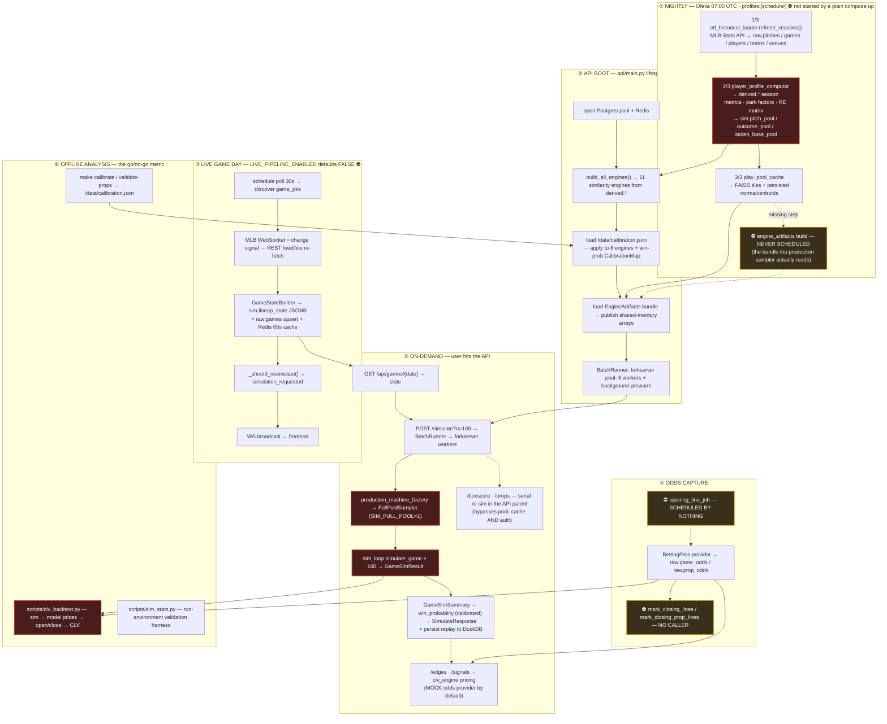

# MASTER BUG REGISTER — 2026-07-23

**273 known findings, consolidated from every review to date, organized by module.**

This is the single working document for the remediation program. It is written to be used by a reader with
**no prior context**: every finding states what is wrong in plain language, the concrete fix, and
`file:line` evidence with the measured numbers that prove it.

---

## How to use this document

Work **one module at a time**, top to bottom within a module. Each finding is one row:

| Column | Meaning |
|---|---|
| **ID** | The source's own identifier (`2.1` = audit, `C4`/`D-1`/`E-1` = remediation plan, `C-B1`/`D-B1`/`B-B2` = adversarial review, `SIM-NNN` = backlog ticket). |
| **Sev** | critical / high / medium / low — post-verification severity. |
| **Status** | See taxonomy below. |
| **What's wrong** | Plain-language defect. Understandable without any source document. |
| **Fix** | The concrete change — not "fix it". |
| **Evidence** | `file:line` plus the **measured numbers**. These are the most valuable content; they are quoted verbatim from the reviewer who measured them. |

### Status taxonomy

| Status | Count | Meaning |
|---|---|---|
| `FIXED-MASTER` | **12** | Merged to `master` and verified green. Nothing to do. |
| `FIXED-BRANCH` | **49** | Implemented on branch `wave1-remediation` — **NOT merged**, blocked by the review below. |
| `BLOCKER` | **24** | A defect **in the `wave1-remediation` code itself**. Must be fixed before that branch can merge. |
| `OPEN` | **181** | A real known bug never addressed anywhere. The main backlog. |
| `DEFERRED` | **7** | Known, consciously not being done yet (reason recorded). |

### Where the code actually is right now

- **`master`** = `0a52d13`. Green on all CI (unit 2258, regression 53, e2e 12, integration 21, ruff + mypy).
- **`wave1-remediation`** = 7 commits ahead, 37 files, +4515/−304. Full suite green on the branch
  (unit 2344, regression 53, e2e 12, integration 24) — **and that suite detects none of the 24 BLOCKERs.**
  This is the single most important fact in this document: *green CI here proves very little.*

---

## The five things to understand before touching anything

1. **Nothing in Wave 1 is live.** The derived-SQL fixes change no number until the ~5.7-hour profile
   recompute runs; the calibration seams do nothing until a refit; the odds fixes do nothing until a
   re-backfill. The branch is code, not effect.
2. **Two Wave 1 "fixes" are regressions vs `master`.** `D-B1` writes a hard `0.0` into six batter-engine
   features for 10–13% of all batters (switch hitters), a −7σ outlier where master had a merely-mild
   error. `E-B1` makes the win-probability curve emit exactly `1.0`/`0.0`, which silently deletes the
   moneyline market from the betting card and can price a 95% favourite at 44%.
3. **The CLV instrument can currently both manufacture a fake edge and hide a real one, simultaneously.**
   The historical **~49% beat-close figure is not evidence about the model** — it is evidence about the
   instrument. Do not act on it in either direction until the measurement layer is repaired and re-run.
4. **Green CI is not a safety signal in this repo.** `tests/conftest.py` pins every realism flag OFF while
   production runs them ON; the golden gate covers 5 of 11 engines and none that drive the production
   sampler; the `__new__` bypass leaves every engine's DuckDB SQL contract untested. Several new tests are
   *structurally incapable* of failing against the bug they name.
5. **The nightly chain does not build what production reads.** `engine_artifacts.py` calls itself "the
   nightly builder"; nothing schedules it. And the scheduler service is behind
   `profiles: ["scheduler"]`, so a plain `docker compose up` runs no nightly job at all.

---

## Suggested order of work

Modules are ordered here by *blast radius*, not by size:

| # | Module | Findings | Why this order |
|---|---|---|---|
| 1 | [`pipeline/batch/player_profile_computor.py`](#pipeline) | — | Highest blast radius in the repo: its columns feed all 11 engines, the league-average fallbacks, and the actor embeddings that weight the production sampler. Contains `D-B1`. One shared ~5.7-hr recompute gates everything here — batch the fixes. |
| 2 | [`simulation/`](#simulation) | 65 | The simulator itself. Contains the four confirmed production bugs and both Track C blockers. |
| 3 | [`similarity/` + `betting/` + `scripts/`](#similarity-betting-scripts) | 68 | The model and the money. Contains the CLV instrument and all 7 measurement blockers. |
| 4 | [`pipeline/` (rest)](#pipeline) | 55 | Ingestion + odds provenance. The odds re-backfill gates any CLV re-read. |
| 5 | [`api/` + `db/` + `frontend/` + tests/CI + ops](#api-db-frontend-ops) | 85 | Service, storage, UI, and the operational risk that breaks the business rather than the code. |

**Cross-module gate:** the terminal CLV re-run is blocked on *all* of — the simulator fixes, the profile
recompute, the leakage fix, and the measurement-layer repair. Anything less and the re-run is
uninterpretable again.

---

## Process flow — what runs when

How the parts compose during a normal day. Bug-dense stages are marked; the ⛔ markers are stages that
**do not run at all** despite documentation claiming otherwise.

**Reading the diagram:** red = the highest bug-density stages (the profile computor, the full-pool
sampler, the sim loop, the CLV backtest). Amber = wiring that exists in code and is documented as running,
but is scheduled or called by nothing.

### The two chains that matter

- **Data chain (nightly → boot → request):** `raw.pitches` → `derived.*` → engines + artifacts → sampler →
  simulated game → prop/win-prob PMF → price. A wrong column at the far left (module 1) silently changes
  every number at the far right. This is why `player_profile_computor.py` is first in the work order.
- **Money chain (sim → price → scoreboard):** `simulate_game` → `GameSimSummary` → `prop_distributions` /
  `win_probability` → `clv_engine` → `clv_backtest`. Every one of the 7 measurement blockers sits on this
  chain, which is why its output cannot currently be trusted in either direction.

---

## Source documents

| Document | What it contributed |
|---|---|
| `docs/audit/2026-07-13-analytics-firm-comprehensive-audit.md` | The 129-finding audit (97 confirmed, 0 refuted) across 10 specialist roles + adversarial verification. |
| *(2026-07-14 code walkthrough)* | 8 net-new defects the audit missed — the profile-SQL wrong-denominator/inverted/handedness-blind cluster, the pitcher-similarity redistribution, and two run-attribution bugs. Folded into the plan below. |
| `docs/audit/2026-07-14-remediation-plan.md` | The dependency-ordered fix plan (waves, tracks, ticket map). |
| `docs/audit/2026-07-23-adversarial-review-wave1.md` | The 4-reviewer adversarial review of `wave1-remediation`; all four returned BLOCK. Source of every `BLOCKER` row. |
| `BACKLOG.md` / `CHANGES.md` | Ticket status and the closed-item history. |

---
---

# MODULE 1 — `simulation/`

*65 findings · 17 FIXED-BRANCH · 7 BLOCKER · 40 OPEN · 1 DEFERRED*

# MASTER BUG REGISTER — cluster `simulation/`

Sources abbreviated: **AUD** = `docs/audit/2026-07-13-analytics-firm-comprehensive-audit.md` · **PLAN** = `docs/audit/2026-07-14-remediation-plan.md` · **ADV** = `docs/audit/2026-07-23-adversarial-review-wave1.md`. Branch `wave1-remediation` is 7 commits ahead of `master` (`0a52d13`), 37 files, +4515/−304, full suite green — **and the whole suite detects none of the BLOCKER rows below.**

---

### simulation/sim_loop.py

4,099 lines. The single most-affected file in the platform: all four confirmed production-simulator bugs, the entire Track C fix batch, both Track C merge blockers, and the whole open realism backlog live here.

| ID | Sev | Status | What's wrong | Fix | Evidence |
|---|---|---|---|---|---|
| **2.1 / C1** (AUD 2.1, PLAN C1, ADV "verified NOT a problem") | critical | FIXED-BRANCH | With `SIM_MANAGER=1` (ON in production since 2026-06-04) a pulled starter came back the next half-inning. `_maybe_pull_starter` mutated only `state.pitcher_id`, but `_set_half_matchup` re-reads `home_pitcher_id`/`away_pitcher_id`, which were set once at game build and never updated — so the pulled starter returned with his saved pitch count, re-tripped the pull gate, and burned a fresh reliever roughly every half-inning; once the 6-arm pen emptied, the *removed* pitcher threw again (illegal re-entry). Every pitcher K/BB/ER/OUTS prop PMF — all traded markets — was built on this carousel. | Repurpose `home/away_pitcher_id` from "starter" to "current pitcher": on a pull, write the reliever into the **defending team's** slot so `_set_half_matchup` resumes the reliever. | master `sim_loop.py:3216` (`_maybe_pull_starter`) + `:2734/2737/2750` (`_set_half_matchup`). Branch fix `sim_loop.py:3358-3372`, `_set_half_matchup` now at `:2855`, `_maybe_pull_starter` at `:3326`; semantics documented `game_state.py:249-256`. **Measured/claimed effect: pitchers/game ~9.25 → ~4–5. The celebrated SIM-434 validation stat "pitchers/game 2.0→9.25, realistic" is arithmetically an artifact of this bug** (a ~290-pitch game cannot legitimately produce 9 pitchers with a 75-pitch pull floor). ADV attacked `state.defense` correctness in both callers, pull-on-last-out, top-vs-bottom, and other readers of the repurposed fields (`pitcher_decisions.py`, `api/routes/games.py`, `BatchRunner`, `sim_stats.py`) — **held**. |
| **2.2 / C2** (AUD 2.2, PLAN C2) | high | FIXED-BRANCH (incomplete — see C-B1/C-B2) | Turning on `SIM_MANAGER` silently zeroed **all** stolen bases. The validated engine-backed steal path is only reachable when the manager green-light is ≤ 0; with any real manager profile green is 0.04–0.12, so control routed to `resolver.resolve_steal`, and production wires no resolver — the base-class stub returns `attempted=False` unconditionally. **Production games have contained zero steal attempts since the 2026-06-04 enablement.** The "runs −0.10/team, no distortion" validation was consistent with losing ~0.6 SB/game; the validation table omitted SB/CS even though `sim_stats` reports them. | Fall back to `_full_pool_steal_decision` when the resolver stages nothing; add a flag-ON regression asserting ~0.7 attempts/game. | Branch fix at `sim_loop.py:3088-3100`; fallback method `_full_pool_steal_decision` at `:3234`; the pre-existing `green <= 0` branch at `:3079-3083`. Constant `_STEAL_ATTEMPT_K = 0.38` at `:3232`. |
| **C-B1** (ADV, BLOCKING) | high | **BLOCKER** | The C2 fallback was placed *after* the green-light Bernoulli gate, but `_full_pool_steal_decision` is already calibrated to standalone MLB volume (`_STEAL_ATTEMPT_K = 0.38`). Multiplying by `green` makes the effective rate `green × MLB`. **The bug C2 claims to fix is still there, one order of magnitude smaller.** | Call the fallback *before* the green draw, **or** fold `green` into `attempt_p` inside `_full_pool_steal_decision` rather than using it as an independent gate. | `sim_loop.py:3086,3100`. Production ships `steal_order_rate_per_1b_opp = 0.08` (`production_factory.py:490`) → `green ∈ [0.04, 0.12]`. **Measured over 40,000 identical opportunities: `manager=None` → 0.0764 attempts/opp; production profile (SIM_MANAGER ON) → 0.0080. Ratio 0.104.** |
| **C-B2** (ADV, BLOCKING) | high | **BLOCKER** | `attempted=False` is the documented return for BOTH "nothing wired" and "the engines decided *not* to run". The fallback cannot distinguish them, so it hard-codes an override of the decision three of the eleven similarity engines exist to make. | Return a sentinel `None` from the stub, or gate the fallback on `type(self.resolver) is PlayResolver`. | `sim_loop.py:3088-3100`; `PlayResolver.resolve_steal` contract at `:647-655`. **Measured with a resolver deliberately returning `attempted=False` over 300 green-lit spots: pre-fix 0/300 steals staged, post-fix 103/300. No test covers this.** |
| **2.3 / C3** (AUD 2.3, PLAN C3) | high | FIXED-BRANCH (see C-N2/C-N3/C-N7) | Double plays recorded 2 outs but **no code path ever removed the doubled-off runner** (the docstring claiming "double plays erase the trail runner" was implemented nowhere). A 0-out GIDP with a runner on 1st left that runner standing on first with two outs — a physically impossible state carrying a real player id that then fed steal/situation logic and could score. Same defect in the per-tile fallback resolver. | New shared `_resolve_double_play` clears the retired forced runner in both paths before the run commit, followed by `assert_consistent()`. | master `sim_loop.py:1519` (full-pool DP early-return) and `:2363` (per-tile). Branch: `_resolve_double_play` at `sim_loop.py:2336-2371`, called from `_resolve_in_play` at `:2489-2491`. **Estimated ~+0.03–0.05 R/team-game of artificial inflation that *masks* the real conversion deficit and corrupts per-runner R / ER attribution.** |
| **C-N3** (ADV, non-blocking) | high | OPEN *(new in branch; reviewer classed NON-BLOCKING, but one shape is strictly worse than master on the production path — consider promoting)* | The C3 runner-selection cascade retires the **wrong** runner in three shapes: the `elif b.third is not None: retired = 3` branch fires for (a) `strikeout_double_play` with R1+R3 — erases R3 when a strike-'em-out-throw-'em-out retires the *stealing* runner; (b) `sac_fly_double_play` with R3 — erases R3 **and scores no run**, strictly worse than pre-fix, on the production path; (c) a grounded DP with 1B empty — retires R3, the highest-value runner, on a play with no force. | Select the retired runner by DP *shape*: force-out chain for grounded DPs, the runner actually going on a strike-'em-out-throw-'em-out, and score-then-retire for a `sac_fly_double_play`. | `sim_loop.py:2359-2371` (the `grounded`/`third`/`second`/`first` cascade). |
| **C-N2** (ADV, non-blocking) | medium | OPEN *(new in branch)* | C3 makes the recorded `re_end` *more* wrong: `advance_state()` conserves runners (`new_on_base = old + reached − runs`) and has no notion of a runner retired on the play, so physically removing the doubled-off runner desyncs the RE24 end state. | Teach `run_resolution.advance_state` about a retired-runner delta (see the `run_resolution.py` section) and pass it from the DP branch. | `sim_loop.py:2336-2371` + `simulation/run_resolution.py`. **Measured across 8 DP shapes: 4/8 consistent pre-fix → 2/8 post-fix.** |
| **C-N7** (ADV, non-blocking) | low | OPEN *(new in branch)* | The `assert_consistent()` guard added after the DP removal is vacuous — it cannot detect a bad DP state. | Either add real base-out invariants to `Bases.assert_consistent` or drop the misleading guard. | `sim_loop.py:2371`; `game_state.py:148-156` — the check only rejects negative runner ids. |
| **2.4 / C4** (AUD 2.4, PLAN C4) | high | FIXED-BRANCH (see C-N5/C-N6) | Reach-on-error was converted into an out — **plausibly the largest single piece of the run gap.** Pool `field_error` rows carry `result_hits=0`; `_full_pool_fielding` deliberately ignored pool outs and inferred `outs = 0 if hits > 0 else 1`, so *every drawn error became a one-out field_out*. MLB ROE ≈ 0.5–0.6/team-game. **Invisible to rate-stat validation because ROE is not a hit in MLB accounting either — the signature is exactly "rate stats right, runs low", the tracked SIM-429 symptom.** | Special-case error-family events: batter reaches, `outs=0`, `is_error=True` routed through the existing `_force_on_reach` + SIM-414 unearned-run machinery; guard the hit credit with `and not is_error`; mirror in the per-tile path. | Branch: `_ERROR_EVENTS` frozenset `sim_loop.py:278-285`; per-tile branch in `PlayResolver.field_ball` `:608-628`; full-pool branch in `_full_pool_fielding` (`:1412`) at `:1431-1447`; reach routing `:2467-2473`; hit/H-allowed guards `:2702-2712` and `:2743-2749`. **Predicted +0.25–0.35 R/team-game.** ADV verified the AB/H/ER/RBI accounting — **held**. |
| **C-N5** (ADV, non-blocking) | medium | OPEN *(new in branch)* | C4 records an RE24 run value of exactly **0.0** for every reach-on-error: `result_hits=0` makes the batter reaching first invisible to `advance_state`, so the run-value ledger says the play was worth nothing. | Give the error event a `reached` credit in `advance_state` (or pass an explicit reached-count) so RE24 reflects the batter on 1B. | `sim_loop.py:1431-1447` + `run_resolution.advance_state`. **True value ≈ +0.38; pre-fix was −0.24; post-fix is 0.0.** |
| **C-N6** (ADV, non-blocking) | low | OPEN *(new in branch)* | Latent run-loss on the per-tile path if a caller supplies a sample carrying `result_runs` alongside an error event. Not production-reachable today. | Propagate `result_runs` through the per-tile error branch. | `sim_loop.py:608-628`. |
| **C5** (PLAN C5, `source: review`) | medium | FIXED-BRANCH (see C-N4) | `runs_scored = int(result_runs)` **overwrote** while outs used `+=`, so a terminal pitch that commits twice (a steal of home resolving, then the scoring PA on the same pitch) silently lost the steal run from the linescore and from pitcher R/ER. | Accumulate: `result.runs_scored = int(result.runs_scored or 0) + int(result_runs)`. | master `sim_loop.py:1606`; branch `:1667`. Team score was already correct; only pitcher R/ER and `runs_scored` were wrong. ADV verified it cannot double-count (a fresh `PlayResult` per pitch) — **held**. |
| **C-N4** (ADV, non-blocking) | low | OPEN *(new in branch)* | C5 mis-credits an RBI (and ER) for a run scored on a steal of home. MLB Rule 9.04(b): no RBI on a stolen base. Latent — nothing stages a steal from 3B today, which also makes C5's stated benefit latent. | Exclude steal-of-home runs from the RBI/ER credit path. | `sim_loop.py:1667` feeds `runs` into `bat.rbi += runs` at `:2722`. |
| **C6** (PLAN C6, `source: review`) | low | FIXED-BRANCH (incomplete — see C-N1) | The RE24 start state was read **after** base mutation: `_resolve_walk` / `_full_pool_out_advancement` mutate `state.bases` before `_commit_run_delta` reads `state.runners_state` as the RE24 "start", so `re_start`/`re_end`/`run_resolution_method` were untruthful for run-conversion calibration. | Add `runners_state_override` / `outs_override` to `_commit_run_delta`; callers snapshot the pre-mutation base-out and pass it. Must land with C3/C4 (their new pre-commit mutations need the same snapshot). | Branch: signature `sim_loop.py:1613-1656`; walk snapshot `:1976-1980` → `:2010-2014`; in-play snapshot `:2450-2456` → `:2508-2512`. |
| **C-N1** (ADV, non-blocking) | medium | OPEN *(new in branch)* | C6 is materially incomplete: three callers still mutate the bases and then commit with **no** override — `_apply_sac_fly_bias` (mutates 31 lines *before* the snapshot — a placement bug in the fix itself), `_resolve_strikeout`'s dropped-third-strike path, and `_resolve_steal_outcome` (two sites). | Move the in-play snapshot above `_apply_sac_fly_bias`, and thread overrides through the D3K and steal-outcome commits. | master/branch cites `:2318` mutation vs `:2457` snapshot (branch `_apply_sac_fly_bias` at `:2290`, snapshot at `:2450`); `_resolve_strikeout` D3K `:2057` (branch `:2040+`); `_resolve_steal_outcome` `:1891,:1919` (branch `:1856+`). **Measured sac-fly case: reported `re_start` 0.27 vs true 0.96; RE24 value 0.84 vs true 0.15.** Blast radius is display-only (`snapshots.py:246` → play-by-play), not scoring/props/CLV. |
| **C7** (PLAN C7, `source: review`) | low | FIXED-BRANCH (see C-N8) | `simulate_game` seeded four RNGs (loop, sampler, `_pa.sampler`, full-pool) with the *same* integer, so the four generators produced identical draw sequences — perfectly correlated pitch/advancement/steal streams, corrupting prop-PMF variance and joint structure. | `ss = np.random.SeedSequence(seed); c = ss.spawn(4)`; seed each generator from a distinct child. Preserves per-`(game, seed)` determinism. | Branch `sim_loop.py:3862-3873` + `:3906-3930`. ADV verified determinism preserved and no golden references `simulate_game` — **held**. |
| **C-N8** (ADV, non-blocking) | low | OPEN *(new in branch)* | C7 wires **3** streams, not 4: `machine.sampler IS machine._pa.sampler`, so child[1] is assigned then immediately overwritten by child[2]; child[1] is never consumed and `machine._pa.rng` is never reseeded. | Spawn 3 children for the 3 distinct RNG holders, or reseed `machine._pa.rng` separately. | `sim_loop.py:3906-3930`. |
| **C-N10** (ADV, "merge gate, not a defect") | high | **BLOCKER** (revalidation gate) | Track C shifts the run environment materially, and `/data/calibration.json` plus the win-prob reliability curve were both fit on the **pre-fix** environment. Merging without refitting ships a simulator calibrated to a model that no longer exists. | Refit calibration (`make calibrate` + `make validate-props --write-calibration`) after C lands, and run the ≥400-sim × ≥20-game validation batch. | **Measured: synthetic MLB-ish mix, 300 games, 7.653 → 8.207 R/G (+7.2%).** Direction helps the documented "runs 10–12% low" gap. |
| **C8** (AUD 2.5, PLAN C8) | medium | OPEN | HBP, wild pitches, passed balls, balks and pickoffs are **absent entirely** — whole free-baserunner / hit-free-advancement channels missing. The dropped-third-strike edge can never fire in production: it is gated on an optional `resolver.dropped_third_strike` hook that no production resolver implements. | Add HBP/WP/PB/balk/pickoff channels; wire a real D3K signal (catcher-RBF) into production. | `sim_loop.py:2076-2095` — `hook = getattr(self.resolver, "dropped_third_strike", None); if hook is None: return False`, and no `def dropped_third_strike` exists anywhere in `simulation/`. **~0.15–0.25 R/team-game.** |
| **C9** (AUD 2.5, PLAN C9) | medium | OPEN | A runner on 1st **never** advances on a non-DP ground out (`new_first` is never reassigned), and force-outs/fielder's choice retire the wrong player (the batter is always the out). Systematic under-advancement into scoring position; the advancement constants read low vs Retrosheet. | Advance R1 on productive ground outs; model the FC correctly (retire the lead forced runner); recalibrate the constants against Retrosheet. Gated on the C4 re-measure. | `_full_pool_out_advancement` at `sim_loop.py:1547-1601`: constants `0.28` (3rd→home on a ground out) and `0.35` (2nd→3rd) at `:1584-1592`. |
| **C10** (AUD 2.5, PLAN C10) | medium | OPEN | Times-through-the-order and fatigue only *time the pull* — they never degrade the pitch-outcome distribution. Combined with i.i.d. season-aggregate sampling this removes hit **clustering**; runs are convex in baserunners, so the same hit rate yields fewer runs. This is a sequencing mechanism that per-channel rate calibration structurally cannot fix. | Apply TTO/fatigue as a monotone tilt on the pitch-outcome distribution. | `pitcher_fatigue` defined `sim_loop.py:417`, consumed **only** at `:3348` (the pull decision); `tto_effectiveness` defined `:453`, consumed **only** at `:3429` (reliever selection). Neither touches the draw. |
| **C11** (AUD 2.5, PLAN C11) | medium | OPEN (blocked on D-2) | The batted-ball draw is pitcher-blind given contact: a groundball sinkerballer and a flyball pitcher produce identical contact distributions vs the same batter. | Condition the batted-ball draw on the pitcher's GB/FB profile via the existing `_f_pitcher` machinery. **Consumes the pitcher GB/FB column that Track D's D-2 fixes — D must land first.** | `full_pool_sampler.battedball_new_pa:428-459` — weight is `f_bat · f_sit · recency` (+ optional platoon mask) with no pitcher factor; caller `sim_loop.py:1431-1433`. |
| **C12** (AUD 2.5, PLAN C12) | low | OPEN | Manager small-ball is decorative. Sac-bunt calls record a decision and do nothing (the docstring defers the resolution to "SIM-319's", which never implemented it); `pitch_out_signalled` is set and never read; a hit-and-run only *suppresses* the steal-initiate rather than biasing toward contact. The frontend play-by-play narrates strategy that never happens. | Make the three mechanics real, **or** stop emitting the decorative decisions the frontend narrates. | `_maybe_sac_bunt` `sim_loop.py:3486-3510`; `pitch_out_signalled` written at `:3064`, read nowhere in `simulation/`; hit-and-run consumption is a bare `if mgr.hit_and_run_signalled: return` at `:3052-3053`. |
| **AUD-HFA** (AUD Theme 2.5, ML index "HFA routed 100% through home-batting BABIP") | medium | OPEN | Home-field advantage is implemented as 100% home-batter singles at a knowingly overshot magnitude — the measured retune (0.025 → ~0.017) was never applied. The entire HFA loads one-sidedly onto home-batter H/TB PMFs, exactly the markets the CLV read labels "trustworthy", and it stacks additively with the park factor on the same channel. | Split HFA across channels and apply the measured retune. | `_apply_home_field_bias` `sim_loop.py:2193-2235`; env override `SIM_HOME_FIELD_BIAS` read at `:2183`; applied at `:2435` immediately before `_apply_park_factor` at `:2441`. **Measured overshoot (CLAUDE.md §2, 4×400-sim harness): delta R = +0.198 vs target +0.13.** |
| **AUD-PARK-HR** (AUD Theme 2.5) | high | OPEN | The park factor models no HR/XBH channel — it flips out↔single only, so **HR PMFs are perfectly park-invariant** while HR props are the most park-elastic traded market. `derived.park_factors` already computes per-event HR/1B/2B/3B factors with L/R splits; the sim consumes only `factor_type='R'`. | Consume the per-event park factors (HR channel first). | `_apply_park_factor` `sim_loop.py:2236-2260`; `_PARK_FACTOR_CAP` / flip constant documented at `:382-384`; scalar threaded as `state.park_run_factor` (`game_state.py:281-287`, `sim_loop.py:3961`). |
| **AUD-J1** (AUD Theme 8, PLAN SIM-477/J1) | medium | OPEN | The half-inning-constant pitcher factor is recomputed **every plate appearance** because the matchup refresh key wrongly includes `batter_id` — ~6–7 redundant full-pool O(N) passes per PA. | One-line early return / split the key so `new_half_inning` fires only on a pitcher or hand change. Byte-identical. | `sim_loop.py:1367` — `key = (state.pitcher_id, hand, state.batter_id)` → `fp.new_half_inning(...)` at `:1371`. |
| **AUD-QA-PRODPATH** (AUD Theme 4 / QA index, PLAN F-01) | high | OPEN | The four core production sim methods — `_full_pool_outcome`, `_full_pool_fielding`, `_full_pool_out_advancement`, `_full_pool_steal_decision`, ~250 lines shaping every production pitch — have **zero test references**. `tests/conftest.py:33-53` pins `SIM_FULL_POOL` and every realism flag OFF suite-wide; no test anywhere enables them; production runs the exact inverse. The conftest comment claiming tests "opt in explicitly" is aspirational — none does. | Production-config regression lane: a `simulate_game` golden with `SIM_FULL_POOL=1` + all flags ON over a committed toy artifact bundle. Regenerate as the **closing** step of Track C (else it freezes the bugs). | `sim_loop.py:1358` / `:1412` / `:1547` / `:3234`; `tests/conftest.py:33-53`. |
| **AUD-ARCH-SIMLOOP** (AUD Architect index) | medium | OPEN | `sim_loop.py` holds ~7 distinct concerns in one class (count machine, resolver, full-pool draw, manager model, boxscore accumulation, steal machinery, run commit). Now 4,099 lines. The extraction pattern is already proven elsewhere in the repo. | Extract the manager model and the boxscore accumulator first. | `simulation/sim_loop.py` (whole file). |
| **F-13 / AUD gap-audit** (AUD "Validation evidence", PLAN SIM-459) | high | OPEN *(ownership: `scripts/sim_stats.py`, but the inert consumers are here)* | The designated validation harness **structurally cannot exercise `SIM_PARK_FACTOR` or `SIM_FIELDER_RBF`**: `_sim_kwargs` drops the already-resolved `home_defense`/`away_defense` and never passes `park_run_factor`, so both consumers in this file are provably inert under it — any A/B toggling them compares two identical no-ops and tautologically reports "no distortion". | Fix the harness to pass the defense maps + park factor; then re-run flag enablement at the pre-registered **≥400 sims × ≥20 games** bar, one flag at a time. | Consumers `_apply_park_factor` `sim_loop.py:2236`, fielder-RBF nudge in `_full_pool_fielding` `:1448+`; harness `scripts/sim_stats.py::_sim_kwargs`. **All five production realism flags were enabled at 3–4 games, all effects combined, the day after the ≥400×≥20 bar was set — at that power the manager's "runs unchanged −0.10/team" is consistent with −0.26..+0.06.** |

---

### simulation/full_pool_sampler.py

The production draw. 573 lines; every per-PA weight decision passes through here.

| ID | Sev | Status | What's wrong | Fix | Evidence |
|---|---|---|---|---|---|
| **E-B2** (ADV, BLOCKING) | high | **BLOCKER** | Two additions with **zero consumers** cost +22% per plate appearance on the production hot path. The ESS block upcasts the whole ~935K-row weight vector to float64 **every PA** and runs **unconditionally** (the `isEnabledFor(DEBUG)` guard covers only the log line); `_last_ess` is read by nothing outside tests and `ess_temper` is never set by any production path. `_mean_fill` does a boolean-compress copy plus a redundant second `.astype(float32)` although the mask and count are pool-constant and already cached in `_pool_meta`. | Compute ESS float32-native (`sum²/dot`) and gate it behind the debug/temper flag; cache `_mean_fill`'s mask, count and fill in `_pool_meta`. | `full_pool_sampler.py:352-368` (ESS, cited `:356-359`) and `:233-236` (`_mean_fill`). **Benchmarked branch vs a scratchpad subclass restoring master's bodies, 500K-row pool: 22.59 → 27.54 ms/PA (+4.95, +22%). Scaled to the production ~935K pool: +9.26 ms/PA → +0.77 s per iteration at ~83 PA — a 40–50% per-iteration regression against the documented 1.5–1.9 s. n=100 `/simulate` ≈ 38 s becomes ≈ 55–65 s.** The float64 upcast alone is 6.4 ms vs 0.35 ms float32-native — **18× cheaper**. |
| **E-B3** (ADV, BLOCKING) | high | **BLOCKER** | Four sampler-weight changes (E-1, E-CAL-ARSENAL, E-MISSING-1.0, E-ZFILL) all move `FullPoolSampler`'s per-PA weight vector and land at once with **no run-environment validation and no golden gate**. Compounding: E-MISSING-1.0 is live on merge while E-ZFILL / E-1 / E-CAL-ARSENAL bite only on the next `engine_artifacts` rebuild — **production passes through a third, never-validated hybrid state.** | Run the CLAUDE.md §11-required multi-game × ≥400-sim batch before merge; add a full-pool sampler golden; sequence the artifact rebuild so there is no hybrid state. | Regression fixtures cover only `baserunner_steal / catcher / manager / pitcher_steal / situation` — **no golden coverage of the pitcher engine, the batter engine, or the full-pool sampler.** |
| **E-MISSING-1.0** (AUD Theme 3, PLAN E-MISSING-1.0) | medium | FIXED-BRANCH | Pool rows with no profile were given factor weight **1.0** — the self-similarity maximum — so unprofiled call-ups were ~2× over-sampled relative to the 0.50-median profiled row. | Substitute the profiled-rows mean instead of 1.0. | New `_mean_fill` at `full_pool_sampler.py:214-236`; applied in `_f_pitcher` `:264-268`, `_f_batter` `:314-320`, `battedball_new_pa` `:443-449`. |
| **E-CAL-SIGMA** (AUD Theme 3, PLAN E-CAL-SIGMA) | medium | FIXED-BRANCH (wiring only — residual OPEN) | The sampler used hard-coded `sit_sigma=2.0`, `batter_sigma=3.0`, `platoon_off_weight=0.6` that were **never fitted**, bypassing the similarity-calibration layer that "Calibration is LIVE" claims to cover. | `resolve_sampler_params` resolves them with precedence env > `CalibrationReport.sampler` block > locked default, threaded from `production_factory` and logged as provenance. **The values are still unfitted — fitting them to the 0.50-median target remains OPEN.** | `full_pool_sampler.py:38-99`; consumer `production_factory.py:385-390`. |
| **E-CAL-BATTER / E-N2** (AUD Theme 3, PLAN E-CAL-BATTER; ADV E-N2 non-blocking) | medium | OPEN (branch adds an **unreachable** seam) | The batter factor is a uniform-weight RBF over **all** numeric embedding columns, discarding the engine's weighted 4 sub-scores and reliability weights. The branch added a `weights` seam to fold `sqrt(w)` into the z-scores — but `EngineArtifacts.load` builds `actor_emb[actor]` with a fixed key set that **never includes `weights`**, so `bemb.get("weights")` can never fire. A future implementer would ship a silent no-op. | Export a reliability-weighted batter embedding restricted to the engine's feature set from the build side, **and** add `weights` to the loader's key set. (Blocked by E-ZFILL.) | Seam at `full_pool_sampler.py:271-290` (`_batter_vecs_z`); loader key set `pipeline/batch/engine_artifacts.py:821-837`. |
| **E-ESS** (AUD Theme 3, PLAN E-ESS) | low | FIXED-BRANCH (correctness) / **BLOCKER** (cost — see E-B2) | The product-of-kernels weight had no effective-sample-size diagnostic or tempering, so correlated factors double-count evidence with no visibility. | Emit per-PA ESS `(Σw)²/Σw²`; optional fitted tempering β behind a flag. | `full_pool_sampler.py:352-368`. ADV verified **E-ESS is byte-neutral to the draw** — held. Its runtime cost is E-B2. |
| **AUD-SITKERNEL** (AUD Theme 2.5 + ML index) | high | OPEN | The situation kernel treats the runners **bitmask** and the raw inning as unstandardized Euclidean dimensions. With `sit_sigma=2.0`, runner-on-2nd vs bases-empty retains weight **0.92** — RISP conditioning is an ~8% down-weight, i.e. essentially noise; and loaded(7) is *closer* to 3rd-only(4) than to 1st+2nd(3). **This is a concrete causal candidate for the "batted-ball-with-RISP" run-conversion gap.** | Exact stratification on `(outs, runners_state)`, copying the proven in-repo count-bucket pattern, instead of a Euclidean kernel over a bitmask. | Kernel `_f_situation_baseout` `full_pool_sampler.py:327-333`; the state vector is built in `sim_loop.py:1375-1377` as `[outs, runners_state, inning, score_diff]`. |
| **AUD-J2/J7** (AUD Theme 8, PLAN SIM-477) | medium | OPEN | All 12 count-bucket CDFs are built eagerly in float64 (~600 MB churn/game) though a PA visits only 3–5; plus redundant `.astype` copies at 4 sites. No cross-iteration memoization although 100 iterations replay the same game through one warm sampler. | Lazy CDF construction (byte-identical — no RNG in construction); a bounded LRU on `(hand, pitcher, batter) → product` eliminating 3+ O(N) passes on 99 of 100 iterations (exact). | `full_pool_sampler.py:369-370` (`self._bucket_cdf = [...]` list comprehension over all 12 buckets). |
| **AUD-PERF-DEAD** (AUD Perf index) | low | OPEN | `_f_situation` is a dead hot-path method — defined and never called (`_f_situation_baseout` superseded it). | Delete. | `full_pool_sampler.py:321` (def), zero callers in the repo. |

---

### simulation/prop_validation.py

Fits the win-prob reliability curve that is written into `/data/calibration.json` and loaded at boot **and** per CLV worker. Live-money path.

| ID | Sev | Status | What's wrong | Fix | Evidence |
|---|---|---|---|---|---|
| **E-B1** (ADV, BLOCKING) | critical | **BLOCKER** | The new isotonic reliability curve emits exactly **1.0 / 0.0** and flat-extrapolates both tails. The isotonic path anchors at `[0.0, uy[0]]` / `[1.0, uy[-1]]` — the *fitted end-block values* — instead of `[0,0]` / `[1,1]`. Terminal PAVA blocks are frequently a single observation, so those values are hard 0.0/1.0. The `min_bin_count` 1→2 hardening protects only `fit_reliability_curve`, which is **no longer the default**. End to end: an ordinary 83-of-100 sim (`p_home = 0.8267`) maps to 1.0/0.0; `prob_to_american` rejects 0/1; the error is *caught* by `betting.py::_safe_report` and `clv_backtest.py:990` → **the moneyline market silently disappears from the betting card and the CLV scoreboard for every lopsided game.** Where it stops short of degenerate it is worse because it is silent: seed 0, n=60 → `p=0.95` maps to **0.4444** (a 95% favourite priced at 44% — the model bets the dog). **This is a regression vs master.** | Clamp fitted `y` into `[eps, 1−eps]`, and/or restore `[0,0]`/`[1,1]` anchors, and/or require a minimum count in terminal isotonic blocks. | `prop_validation.py:322-328` (endpoint anchoring, cited `:324-326`) and `:754` (`build_validation_report` switched the shipped curve to this fitter). Writer `write_reliability_curve_to_calibration_report` at `:762`; loaded at `api/main.py:236` and `scripts/clv_backtest.py:1154`. **Measured `P(map(0.90) == 1.0)`, 200 trials/row — n=60: 0.620 NEW vs 0.020 OLD; n=120: 0.610 vs 0.000; n=400: 0.615 vs 0.000; n=2378 (full 2024): 0.640 vs 0.000. It does not wash out with sample size.** |
| **E-RELCURVE (bin floor)** (AUD Theme 3, PLAN E-RELCURVE) | medium | FIXED-BRANCH (ineffective — superseded by the isotonic default) | `min_bin_count=1` accepted 1-game anchors, injecting hard 0/1 observed rates into the map. | Default raised 1 → 2. **But `fit_reliability_curve` is no longer the default fitter, so the hardening protects a path production no longer takes.** | `prop_validation.py:224-227` + `:245-252`. |
| **E-RELCURVE (fit ⊂ eval)** (AUD Theme 3) | medium | FIXED-BRANCH (partial) — see E-N4 | The fitted map's quality was never evaluated anywhere: ECE was in-sample, on the same data the curve was fit on. | Added `winprob_oos_ece` — fit on a train split, score the calibrated predictions on a held-out test split. | `prop_validation.py:330-370`; field `PropValidationReport.winprob_oos_ece` at `:640-644`; wired at `:753`. |
| **E-N4** (ADV, non-blocking) | medium | OPEN *(new in branch)* | `winprob_oos_ece` returns `nan` and `to_json` emits the non-standard `NaN` literal, which breaks `JSON.parse`, `jq` and DuckDB `read_json`. It also uses one fixed split (seed 407, 30%) — a high-variance point estimate that describes a *train-fold* curve while the **shipped** curve is fit on all data. | Emit `null` (or omit) instead of `NaN`; use repeated/k-fold splits; describe the shipped curve, not a train-fold one. | `prop_validation.py:330-370`, `:753`. |

---

### simulation/prop_distributions.py

Builds the prop PMFs that price every traded player prop.

| ID | Sev | Status | What's wrong | Fix | Evidence |
|---|---|---|---|---|---|
| **B-B1** (ADV, BLOCKING) | critical | **BLOCKER** | SIM-450's tail smoothing converts *skipped* markets into *placed* bets at near-maximal fake edges. The Poisson tail uses **λ = the sample mean**, so when the sim never observed the event λ→0 and the "floor" is meaningless — but nonzero, which is exactly enough to escape the degenerate guard that used to skip the market. `+0.1912` is *exactly* `1 − fair_under`, the maximum edge the market allows, in the region where the simulator has **zero information**. The stated intent ("a possible-but-unsampled value should not price to a hard 0.0") is **not achieved**; 2e-11 is not a floor. All that changed is that the safety guard was bypassed. | Use a real floor: a genuine Laplace/Beta pseudo-count over the dense support, or a parametric tail fitted to the shape rather than λ = observed mean; keep (or restore) a degenerate-information guard so a zero-information market is still skipped. | `prop_distributions.py:131` (`lam = max(float(lam), 1e-9)`) and `:172-173` (the mixture `probs = (1−w)*empirical + w*poisson`). **Measured (100 iterations, batter with zero simulated HRs, real market +400/−550): `p_over(0.5)` 0.0 → 1.9999999990e-11; `prop_edge_report` `ValueError` → SKIPPED becomes PLACED with `edge=+0.1912`, `ev=+0.1818`; MC gate SE = 5e-7 clears trivially. Same for a K line above the sampled max: `edge = +0.1370`.** |
| **B.PROP-TAIL** (AUD 1.EX.degenerate, PLAN B.PROP-TAIL / G13) | high | FIXED-BRANCH (defective — see B-B1) | Prop PMFs had **no tail smoothing**: a possible-but-unsampled prop (e.g. `P(K≥12)`) priced to hard 0.0, fabricating a maximal edge or getting silently dropped — "the model's biggest claimed edges never enter the scoreboard". | Dense integer support `0 .. max(observed, mean+4·std) + pad` mixed with a light Poisson tail at 2% weight; opt-in via `tail_smoothing=True`. | `prop_distributions.py:116-176` (`TAIL_SMOOTHING_WEIGHT=0.02`, `TAIL_SMOOTHING_PAD=6`, `_poisson_pmf`, `_smoothed_pmf`), threaded through `from_samples` `:331-390`, `from_boxscores` `:445`, `from_results` `:515`. ADV verified the smoothed PMF sums to 1.0 and `p_over+p_under+p_push == 1` at every integer and half-integer line across 5 prop shapes (**0 violations**), and central-mass distortion is defensible (**worst `p_over` shift at a real book line 0.26pp, typical 0.00–0.13pp, TVD 0.0001–0.0043**) — held. |
| **B-N9** (ADV, non-blocking) | high | OPEN *(new in branch)* | Prop-model **parity break**: the CLV backtest builds `tail_smoothing=True` while production and `validate_props.py` build the **unsmoothed** PMF. SIM-447 fixed win-prob parity; SIM-450 broke prop parity in the same change set. **Any prop edge the backtest reports is not achievable from the numbers the API serves.** | Build both surfaces with the same setting (once B-B1's smoothing is trustworthy). | `scripts/clv_backtest.py:1246` vs `api/routes/games.py:1701` and `scripts/validate_props.py:227`. |

---

### simulation/win_probability.py

| ID | Sev | Status | What's wrong | Fix | Evidence |
|---|---|---|---|---|---|
| **E-RELCURVE (monotonization)** (AUD Theme 3, PLAN E-RELCURVE) | medium | FIXED-BRANCH | `CalibrationMap.from_report` monotonized anchors with a **running max**, which can only ratchet the curve UP: a spurious mid-curve spike before a dip was frozen at its inflated value and the low tail dragged up to meet it. | Replace with pool-adjacent-violators (PAVA) isotonic regression, which pools violators in both directions and pulls such a spike down. Dependency-free (no sklearn import in this hot, widely-imported module). | New `_isotonic_fit` `win_probability.py:120-146`; consumed in `from_report` at `:216-218`. ADV verified PAVA is correct (exact block means, both directions, idempotent, preserves [0,1], legacy back-compat holds) — **held**. |
| **AUD-1.4** (AUD 1.4, PLAN B-1.4) | high | FIXED-BRANCH *(fix lives in `scripts/clv_backtest.py`; listed here because this file owns the seam)* | The CLV backtest called `win_probability(summary)` bare → `IDENTITY_CALIBRATION`, while production threads the fitted reliability curve. The raw win prob has **ECE 0.171** — the curve was fitted precisely because it is biased. This is the SIM-387 bug class re-introduced in the new scoreboard. | Load the `CalibrationReport` in worker init, pass `calibration_map`, stamp the map name into the report params. | `scripts/clv_backtest.py:876` (master) vs `api/routes/betting.py:332-333`; the map seam is `CalibrationMap.from_report` here. The script's own docstrings (lines 37/842) claimed the opposite. |

---

### simulation/batch_runner.py

| ID | Sev | Status | What's wrong | Fix | Evidence |
|---|---|---|---|---|---|
| **G1a** (AUD Theme 5, PLAN SIM-460) | high | OPEN | **One dead worker bricks `/simulate` until container restart**: there is no timeout on `fut.result()` and no `BrokenProcessPool` handling anywhere; the container healthcheck hits `/health`, which never touches the pool. The documented OOM-deadlock failure mode has no detection or recovery. | Add a result timeout + `BrokenProcessPool` recovery (rebuild the pool) and a pool-exercising readiness probe. | `batch_runner.py:1097-1099` — `for fut in as_completed(futures): results[idx] = fut.result()` with no `timeout=` and no except. (The prewarm path *does* pass `timeout=deadline` at `:956`.) |
| **G2** (AUD Theme 5, PLAN SIM-460) | high | OPEN | Per-request `n_iterations` **resizes the shared pool**. `resolve_max_workers` clamps workers to `min(base, n_iterations)`, and `_get_pool` shuts down and rebuilds the pool whenever the requested size differs. So `n=1` runs a full-pool production game **in the API parent** (violating the code's own "parent never holds this object" invariant), and `1 < n < 6` tears down and rebuilds the prewarmed pool while blocking all concurrent requests. | Decouple the fixed worker count from per-request `n`. | `batch_runner.py:801-812` (`resolve_max_workers`), `:875-886` (`_get_pool` teardown/rebuild), `:718-719` + `:756` (the synchronous in-process `max_workers <= 1` path). |
| **AUD-J8/J3** (AUD Theme 8, PLAN SIM-478) | medium | OPEN | Workers return full `GameSimResult` objects rather than compact per-game arrays, so the parent-side unpickling/aggregation is a serial bottleneck — the residual share of the ~38 s plateau. The parent also holds a permanent private duplicate of every published shared array plus the whole bundle pinned in the lifespan frame (hundreds of MB of OOM headroom). | Return compact records; drop the parent's private duplicates (clear the registry-guard order first, per the verifier's caveat). | `batch_runner.py:1097-1099`; shared-array publish seam `_pool_kwargs` at `:837-857`. |
| **AUD-LOW-MP** (AUD Architect index) | low | OPEN | Duplicated multiprocessing-context plumbing between `batch_runner` and `scripts/clv_backtest.py`. | Extract one shared helper. | `batch_runner.py:_pool_kwargs` (`:837`) vs the same construction in `scripts/clv_backtest.py`. |
| **AUD-BYTEID** (AUD QA index) | medium | OPEN *(ownership shared with `scripts/clv_backtest.py`)* | "Byte-identical" claims across the codebase are verified manually, not by any gate; the parallel-CLV byte-identity claim is **strictly false at report level** (`as_completed` ordering) — only count aggregates are order-insensitive, and exactly that invariant is untested. (Note: `batch_runner` itself writes `results[idx]`, so *its* ordering is safe; the false claim is the CLV script's.) | Add determinism + flag-off byte-identity gates; correct the claim to "aggregate-identical". | `batch_runner.py:1097-1099`; `scripts/clv_backtest.py` parallel path. |

---

### simulation/production_factory.py

| ID | Sev | Status | What's wrong | Fix | Evidence |
|---|---|---|---|---|---|
| **F-04a** (AUD Theme 4, PLAN SIM-454) | high | OPEN | Two bare `except Exception: return None` blocks — the full-pool sampler builder and the fingerprint-deriver builder — swallow **any** failure with **no log**. Combined with the engines' log-and-skip and calibration's degrade-to-identity-at-INFO, a corrupt artifact volume serves HTTP-200 prices from a different model, undetectable live or forensically. | ERROR-log both blocks; **fail boot in production** when the full-pool bundle can't load; stamp provenance (flags, calibration hash, artifact build id, sampler path) on `/ready`, `/metrics`, `SimulateResponse` and the backtest JSON. | `production_factory.py:172-174` (deriver) and `:394-395` (sampler). The branch adds a third at `:326` (`_load_calibration_report_quiet`) with the same silent-degrade shape. |
| **E-CAL-SIGMA wiring** (PLAN E-CAL-SIGMA) | medium | FIXED-BRANCH | The factory hardcoded the sampler's constructor defaults with no calibration seam and no provenance. | Load the `CalibrationReport` best-effort, resolve params via `resolve_sampler_params`, log `params=` + `provenance=`, pass as kwargs. | `production_factory.py:309-327` (loader) and `:385-390` (resolve + construct + log). ADV verified `CALIBRATION_REPORT_PATH` **is** on the app service so the seam is reachable — held. |
| **SIM-427-residual** (CLAUDE.md §2 open work; AUD 2.2 context) | medium | OPEN | The SIM-434 manager decision model runs on a **league-flat default profile**, not the real per-team SIM-427 profiles that were computed for all 10 seasons. That default is also the source of the `green ∈ [0.04, 0.12]` band that C-B1 measures against. | Wire the real per-team manager profiles into the decision model. | `production_factory.py:490` — `"steal_order_rate_per_1b_opp": 0.08` in the synthetic default profile. |

---

### simulation/run_resolution.py

The single place a play's RE24 run value and base-out delta are computed. Two of Track C's non-blocking defects are really *this* file's missing vocabulary.

| ID | Sev | Status | What's wrong | Fix | Evidence |
|---|---|---|---|---|---|
| **C-N2 (root)** (ADV) | medium | OPEN *(new in branch)* | `advance_state()` conserves runners (`new_on_base = old + reached − runs`) and has **no notion of a runner retired on the play**, so C3's physical removal of the doubled-off runner desyncs the recorded `re_end`. | Add a retired-runner delta to `advance_state` and pass it from the DP branch. | `simulation/run_resolution.py::advance_state`; caller `sim_loop.py:1631-1656`. **Measured across 8 DP shapes: 4/8 consistent pre-fix → 2/8 post-fix.** |
| **C-N5 (root)** (ADV) | medium | OPEN *(new in branch)* | A reach-on-error passes `result_hits=0`, so the batter reaching first is invisible to `advance_state` and every ROE records an RE24 run value of exactly **0.0**. | Give the error event an explicit `reached` credit. | `simulation/run_resolution.py::advance_state`; ROE branch `sim_loop.py:1431-1447`. **True value ≈ +0.38; pre-fix −0.24; post-fix 0.0.** |

---

### simulation/game_state.py

| ID | Sev | Status | What's wrong | Fix | Evidence |
|---|---|---|---|---|---|
| **C1 (semantics)** (PLAN C1) | critical | FIXED-BRANCH | `home_pitcher_id` / `away_pitcher_id` documented as "starter" but must now mean "current pitcher" for the C1 fix to hold. | Redocument the two fields; the manager pull writes them. | `game_state.py:249-256` (new doc block), fields at `:257-259`. |
| **C-N7 (root)** (ADV) | low | OPEN *(new in branch)* | `Bases.assert_consistent()` is a lightweight id check only — it rejects negative runner ids and nothing else, so it cannot detect an illegal base-out state (the guard C3 relies on). | Add real base-out invariants, or stop treating it as a correctness guard. | `game_state.py:148-156`. |
| **C-N9-adjacent** (AUD §11 "GameState.park is a dead field", superseded) | low | DEFERRED | The audit's §11 line "`GameState.park` is a dead field (run environment is park-blind)" predates SIM-411: `park_run_factor` is now threaded and consumed. The **live** residual is the missing HR/XBH channel (filed under `sim_loop.py` as AUD-PARK-HR), not a dead field. | No action on the field itself; fix the consumer. | `game_state.py:281-287`; consumer `sim_loop.py:2236-2260`. |

---

### simulation/results.py

| ID | Sev | Status | What's wrong | Fix | Evidence |
|---|---|---|---|---|---|
| **G3 / J4** (AUD Theme 5 + Theme 8, PLAN SIM-461 / SIM-479) | high | OPEN | `/boxscore` and `/props` re-simulate N games **serially in the API parent**, bypassing the pool, the cache and auth (~150–220 s at n=100 vs the pool's ~38 s; an unauthenticated compute-DoS surface at n ≤ 2000). The workers **already pickle back full boxscores** — `GameSimSummary.from_results` simply drops them. Retaining them removes the entire serial path. | Retain pooled boxscores on the summary and build prop sets from them; add `require_auth` to both routes. | `results.py:141-160` (`GameSimSummary.from_results`); boxscore types re-exported at `:52-53`, `:250-251`; routes in `api/routes/games.py`. |

---

### simulation/score_fusion.py (+ simulation/fingerprints.py)

| ID | Sev | Status | What's wrong | Fix | Evidence |
|---|---|---|---|---|---|
| **AUD-ARCH-FUSION** (AUD Architect index) | medium | OPEN | ~480 lines of score-fusion code are **dead in production by their own documentation** — `ScoreFusion` is imported only by `fingerprints.py`, and the fingerprint deriver is explicitly bypassed on the production full-pool path (`production_machine_factory` passes `fingerprint_deriver=None`, SIM-402). | Delete, or make the ML owner's keep/drop decision explicit and record it. | `score_fusion.py` (480 lines); sole importer `fingerprints.py:100`; `fingerprints.py:56` already says "Kept (not deleted) pending an ML-owner decision"; deriver construction `production_factory.py:155-174`. |

---

### simulation/pitcher_decisions.py

| ID | Sev | Status | What's wrong | Fix | Evidence |
|---|---|---|---|---|---|
| **C-N9** (ADV, non-blocking) | low | OPEN *(new in branch)* | Doc drift: the module header still states `GameState` does **not** carry `home_pitcher_id` / `away_pitcher_id` — the exact fields C1 repurposed as the current-pitcher ledger. A future reader will trust the wrong contract. | Update the header block. | `pitcher_decisions.py:12-20`. |

*(No other findings. The W/L/S implementation per MLB Rule 9.17(b)/9.19 including sub-5-IP starter reassignment is documented as a verified strength; ADV confirmed C1 introduced no readers here that break.)*

---

### simulation/play_pool_sampler.py

| ID | Sev | Status | What's wrong | Fix | Evidence |
|---|---|---|---|---|---|
| **AUD-QA-INVERSION** (AUD Theme 4) | high | OPEN *(cluster-level, recorded here because this is the path CI actually runs)* | This per-tile FAISS k-NN sampler is the **unit-test default and the fallback**; production runs `SIM_FULL_POOL=1`. CI therefore certifies a configuration production never runs, and the golden regression gate imports **nothing** from `simulation/`. | The production-config regression lane (F-01/F-02) plus a `simulate_game` golden with the full-pool path enabled. | `tests/conftest.py:33-53` pins `SIM_FULL_POOL` + all realism flags OFF suite-wide; `simulation/play_pool_sampler.py` is the resulting exercised path. |

*(The per-tile mirrors of the DP and reach-on-error defects live in `PlayResolver` inside `sim_loop.py`, not in this file — see C3/C4.)*

---

### simulation/snapshots.py

| ID | Sev | Status | What's wrong | Fix | Evidence |
|---|---|---|---|---|---|
| **C-N1 (blast radius)** (ADV) | low | OPEN | The incomplete C6 RE24 provenance surfaces here: `re_start` / `re_end` / `run_resolution_method` are rendered into the play-by-play, so wrong values are user-visible (display-only — not scoring, props, or CLV). | Fixed by completing C-N1 in `sim_loop.py`. | `snapshots.py:246`. **Sac-fly case: reported `re_start` 0.27 vs true 0.96; RE24 value 0.84 vs true 0.15.** |

---

### simulation/ — files with no findings in the three sources

`constants.py`, `linescore.py`, `lineup_resolver.py`, `matchup_provider.py`, `play_recorder.py`, `fingerprints.py` (apart from being the sole importer of the dead `score_fusion.py`), and `validation/replay_chi_squared.py` carry **no** findings in the audit, the remediation plan, or the adversarial review. `lineup_resolver.py` is called out as a *strength* (correct DH / defensive-substitution semantics, plus SIM-363 catcher resolution). Record them as clean-as-of-2026-07-23 rather than unexamined-and-assumed-clean: the audit read the code.

---

### simulation/ — dependency notes

**Ordering inside the cluster.**

1. **The two Track C blockers gate everything else in this cluster.** C-B1 (steal fallback placed after the green gate) and C-B2 (fallback overriding a deliberate resolver decision) both sit in the same ~15 lines of `sim_loop.py:3086-3100`. Fix them together in one edit; C-B1's fix changes steal volume by ~10×, so it must precede any `sim_stats` re-measure.
2. **C3 must land with the `run_resolution.py` work (C-N2) and C-N3.** As merged today, C3 physically removes a runner that `advance_state()` cannot account for (4/8 → 2/8 consistent DP shapes) and picks the wrong runner in three shapes, one of which (`sac_fly_double_play` with R3) is **strictly worse than master on the production path**. Landing C3 without C-N2 + C-N3 trades one wrong state for another.
3. **C4 must land with C-N5** (`advance_state` reached-credit) or every reach-on-error is recorded at RE24 value 0.0 — which silently defeats the granular run-conversion calibration C4 exists to enable.
4. **C6 must land with C-N1** (move the in-play snapshot above `_apply_sac_fly_bias`; add overrides to the D3K and steal-outcome commits) or the provenance is truthful for only some plays — worse than uniformly wrong, because it looks trustworthy.
5. **C7 must land with C-N8**: only 3 of the 4 declared streams are actually seeded, so the "four independent streams" claim in the code comment is false as merged.
6. **E-B2 must be fixed before any perf claim is made** — it silently gives back a large share of the SIM-430/436 epic (215 s → 38 s), taking n=100 `/simulate` to ≈55–65 s.
7. **E-B1 must be fixed before `make validate-props --write-calibration` is ever run again** — that command is what writes the defective curve into `/data/calibration.json`, which is then loaded at boot *and* per CLV worker. Running it on the branch as-is poisons the live calibration file.
8. **B-B1 must be fixed before the CLV re-run** — otherwise the terminal gate measures a scoreboard that manufactures 13–19pp edges where the simulator has zero information.

**What must land together / cross-cluster.**

- **Track C is one ticket (SIM-439) by design**, because C7 changes every seeded game and forces exactly **one** golden regeneration.
- **C11 (pitcher-conditioned contact) is blocked on Track D's D-2** (the pitcher GB/FB rate is computed with an outs-only denominator today).
- **E-B3's hybrid state**: E-MISSING-1.0 is live the moment the branch merges, while E-ZFILL / E-1 / E-CAL-ARSENAL only bite on the next `engine_artifacts` rebuild. Either merge and rebuild atomically, or hold the sampler-weight changes until the rebuild is scheduled.
- **`full_pool_sampler.py`, `pipeline/batch/engine_artifacts.py`, and `similarity/engines/{pitcher,batter}_similarity.py` are one atomic unit** for E-1 / E-CAL-ARSENAL / E-CAL-BATTER / E-ZFILL. E-CAL-ARSENAL additionally introduces an **undocumented nightly ordering dependency** (`make calibrate` must precede the `engine_artifacts --what pitcher_sim` build, which has no Makefile target — E-N3).

**Revalidation this cluster forces.**

- **Golden/fixture regeneration** — mandatory, and it must be the **closing** step of Track C, not the opening one (regenerating first freezes the bugs into the fixtures). Today there is **no `simulate_game` golden for any configuration**, and the regression gate covers 0 of pitcher / batter / fielder / pitch-pitch / batted-ball — the five engines that weight the production draw. Creating that golden is part of the batch.
- **Calibration refit** — non-optional. **Track C moves the run environment 7.653 → 8.207 R/G (+7.2%) over 300 games** (C-N10), and `/data/calibration.json` plus the win-prob reliability curve were both fit on the pre-fix environment. Track D independently invalidates the same file (its sigmas were fit on the pre-fix distributions of `first_pitch_take_rate`, `whiff_rate`, `pull_rate`, `oppo_rate`, `gb_rate` — D-N6). **One** refit, after C **and** D land, per the plan's "one recompute, one calibration, one re-run" rule.
- **≥400-sim × ≥20-game validation batch** — the project's own pre-registered bar (set 2026-06-03), never met for any of the five production realism flags and not met for this branch either (E-B3). Run it per-fix for C1/C2/C3/C4 to confirm the predicted per-channel moves (pitchers/game ~4–5; ~0.7 steal attempts/game; no phantom runners; **+0.25–0.35 R/team-game from C4 alone**), and once more combined.
- **The harness itself must be fixed first** (F-13/SIM-459): `scripts/sim_stats.py` drops the resolved defense maps and never passes `park_run_factor`, so it structurally cannot exercise `SIM_PARK_FACTOR` or `SIM_FIELDER_RBF`, and the promised per-channel breakouts (RISP, advancement, DP rate, per-pitcher ERA/K9/BB9/WHIP) **do not exist in the code** — grep matches only the docstring. Without this, no Track C re-measure is readable at the channel level.
- **Do NOT re-run the CLV backtest for an edge read** until the whole plan's terminal gate (SIM-481), after C + D + E-LEAK + all of B are in and CI-green.

---

### simulation/ — hollow or missing tests

**Tests that cannot fail against the bug they name** (all verified by ADV to pass against pre-fix code):

| Test | Why it is hollow |
|---|---|
| `tests/unit/test_sim439_steal_fallback.py:90` (`test_no_manager_stub_resolver_can_still_steal`) | Uses `manager=None` → `green == 0` → exercises the pre-existing SIM-426 branch, **not** C2. Its comment "pre-fix: never" is **false**. |
| `tests/unit/test_sim439_steal_fallback.py:207` (`test_steals_are_recorded_in_a_full_game`) | Same — `manager=None`. Comment "pre-fix: zero" is **false**. |
| `tests/unit/test_sim439_rng_independence.py:164` (`test_spawn_gives_distinct_reproducible_streams`) | Tests numpy's `SeedSequence.spawn` only; touches **zero** project code. |
| `tests/unit/test_sim439_re24_provenance.py:96` (`test_bases_loaded_walk_scores_a_forced_run_from_the_pre_state`) | Bases-loaded → loaded, so `re_start` is identical with and without the override; the test cannot distinguish the bug. |
| `tests/unit/test_sim439_reach_on_error.py:162` (`test_run_after_the_errors_missed_out_is_unearned`) | Hand-builds `PlayResult`s; tests SIM-414 inning reconstruction, not C4. |
| `tests/unit/test_sim44x_track_e.py::test_isotonic_reliability_curve_is_monotone_and_nonempty` | Clips `pred` so **12.5% of samples sit at exactly 0.0 and 12.1% at 1.0** — the curve spans the full domain and **E-B1's failure mode is structurally impossible in the test**. This is why ~2,400 tests are green over a live-money defect. |
| `tests/unit/test_sim44x_track_e.py::test_redistribution_factor_is_unity` | Asserts `x = 1.0; assertAlmostEqual(x, 1.0)` — a tautology over a local literal, touching no engine code. |

**Behaviours with NO coverage at all:**

- **The four core production sim methods** — `_full_pool_outcome` (`sim_loop.py:1358`), `_full_pool_fielding` (`:1412`), `_full_pool_out_advancement` (`:1547`), `_full_pool_steal_decision` (`:3234`) — ~250 lines shaping every production pitch, **zero test references**. `tests/conftest.py:33-53` pins `SIM_FULL_POOL` and every realism flag OFF suite-wide and **no test anywhere enables them**; the conftest comment claiming tests "opt in explicitly" is aspirational.
- **No `simulate_game`-level golden exists for ANY configuration**, let alone the production one (full-pool + flags ON).
- **No golden coverage of the full-pool sampler, the pitcher engine, or the batter engine** — the regression gate pins 5 of 11 engines (`baserunner_steal`, `catcher`, `manager`, `pitcher_steal`, `situation`), none of which weight the production draw, and it imports nothing from `simulation/`. The `ci.yml` header claiming "all 9 engines" is wrong on both counts.
- **C-B2 has no test**: nothing anywhere injects a resolver that deliberately returns `attempted=False`, so the branch's override of three similarity engines' decision is invisible.
- **No moved-line / DP-shape / steal-of-home coverage**: no test covers C-N3's three wrong-runner DP shapes, C-N4's steal-of-home RBI, or C-N5's ROE run value.
- **`PERF_STRICT` hard-gates an rng stub, weekly** — no benchmark exercises `FullPoolSampler` at all, which is exactly why E-B2's +22%/PA regression passed CI. The "authoritative DB-backed perf job" the bench file promises was never built.
- **Byte-identity and flag-off-identity are asserted only in prose**, never by a gate — the regression lane CLAUDE.md credits runs no simulation.
- **The `__new__` constructor-bypass pattern** leaves every engine's DuckDB SQL contract untested (build-smoke mocks return empty rows and assert `profile_count == 0` *passes*) — the exact gap that shipped SIM-408's 4 dead engines under green CI. A `:memory:` DuckDB schema-contract test closes this in the unit lane.

---
---

# MODULE 2 — `pipeline/`

*55 findings · 2 FIXED-MASTER · 11 FIXED-BRANCH · 2 BLOCKER · 37 OPEN · 3 DEFERRED*

### `pipeline/batch/player_profile_computor.py`

*(5,238 lines. Highest blast radius in the repo: every column below feeds the 11 similarity engines, the league-average fallbacks, the actor embeddings that weight the production full-pool sampler, and the sim pools. Any change here forces the ~5.7-hour recompute — see dependency notes.)*

| ID | Sev | Status | What's wrong | Fix | Evidence |
|---|---|---|---|---|---|
| **D-B1** | critical | BLOCKER | The Wave-1 handedness fix for pull/oppo keys the signed-spray `CASE` on `bat_hand` (the roster/declared side, `'S'` for switch hitters) instead of the per-PA resolved side `stand`. The numerator `CASE` returns NULL while the denominator has no `bat_hand` filter, so the rate is `0/N` = **exactly 0.0** (not NULL) for every switch hitter. This is a **regression vs master**: the old wrong-sign expression returned a plausible 0.4589; the fix turns a mild error into a −7σ outlier. | Key on `stand`, or reuse the idiom already in the same file at `:4645` — `CASE WHEN bat_hand IN ('L','R') THEN bat_hand ELSE stand END`. Add a `'S'` fixture + a CHECK/NULL sentinel. | `player_profile_computor.py:1888,1892,1942,1945,1974,1977`. Ground truth from `raw.pitches`: `bat_hand='S'` is **10.4–13.3% of rows in every season 2017-2026**; `stand='S'` is **0.000%**; **183 of 184 switch hitters are 100% `'S'`**. Real 2024 data (≥100 BIP): S-hitters n=**39**, `pull_rate` **0.0000** new vs **0.4700** if keyed on `stand`; `oppo_rate` **0.0000** vs **0.2477** (L: 0.4587/0.2610 and R: 0.4282/0.2807 unchanged). **416 batter-seasons zeroed = 9.2–12.9% of qualified batters, every season**, across 6 columns. `pull_rate` (reliability weight **0.760**) and `oppo_rate` (**0.792**) are the two highest-weighted of the 8 `BATTED_BALL_FEATURES` (`batter_similarity.py:139-140`), a sub-score worth **35%** of the batter composite. 2024 population: pull mean 0.4431/sd 0.0597, oppo 0.2704/sd 0.0510 → hard 0.0 is **z = −7.4 and −5.3**. `_v()` does `v or 0.0` so no NULL escape; EB shrinkage (α≈0.99) does not rescue it. Weighted RBF → batted-ball similarity vs a league-average batter collapses to **≈0.004** (typical 0.4–0.7) while switch hitters become **≈1.0** similar to each other. Adversarial review Track D. |
| **D-1** | high | FIXED-BRANCH | Pitcher `whiff_rate` was `SUM(type='C')/COUNT(*)` — `'C'` is a **called** strike, so the column named "whiff" stored called-strike rate. It is a `COMMAND_FEATURES` input to the pitcher engine. Fixed on branch to the swinging set `M/O/S/T/W`. | Landed: numerator → `type IN ('M','O','S','T','W')` (per-pitch SwStr%, consistent with `csw_rate`). Still needs the per-pitch-vs-per-swing decision with the ML owner (see D-N2). | `player_profile_computor.py:1628-1631` (branch `a19921b`). Plan `D-1` (source: 2026-07-14 review, net-new — not in the audit). Adversarial verifier attacked and it held: all 5 codes exist, are disjoint, cannot exceed 1.0; the old value **16.48%** was unambiguously the called-strike rate. |
| **D-2** | medium | FIXED-BRANCH | Pitcher GB/FB/LD rates divided by `SUM(type='X')` — balls-in-play **outs only** — while the numerator counted all batted balls including hits, so the rate could exceed 1.0. (The batter version 20 lines down was already correct.) | Landed: denominator → `type IN ('D','E','X')`. | `player_profile_computor.py:1651-1660`. Plan `D-2`. Verified by the adversarial reviewer: `bb_type` is non-NULL *only* on `D/E/X` (no numerator leakage), **zero rates >1.0 across 448 pitchers**, league **GB% 65.59% → 42.49%** vs MLB ≈**42.6%**. xFIP unaffected (uses a count, not a rate). |
| **D-3** | medium | FIXED-BRANCH | `first_pitch_take_rate` used the **swing** predicate (`type NOT IN ('B','C','H','P','*B')`), so the column stored first-pitch *swing* rate — the exact inverse of its name. It is a batter-engine DISCIPLINE feature and a league-average fallback. | Landed: inverted to the no-swing complement `type IN ('B','C','H','P','*B')`. | `player_profile_computor.py:1845-1850`. Plan `D-3`. Verified: take+swing = **1.0000** (exact complement); league first-pitch take **69.42%**. |
| **D-4** | medium | FIXED-BRANCH (but see D-B1) | Pull/oppo used a fixed `spray_angle` sign (correct only for RHB); the platoon splits had **no `p_throws` filter at all** so `pull_rate_vs_l ≡ pull_rate_vs_r`; and both split legs plus the barrel splits used the wrong `type='X'` (outs-only) denominator. | Landed: handedness-signed angle + `p_throws` on both legs + `type IN ('D','E','X')` denominators. **The sign convention is proven correct; the keying column is not (D-B1).** | `player_profile_computor.py:1884-1892` (overall), `1942-1950` (vs L), `1974-1982` (vs R). Plan `D-4`. **Sign convention settled empirically via `hit_location`:** mean `spray_angle` = −35.24 at 3B, −30.26 at LF, +0.57 at CF, +31.19 at RF, +42.84 at 1B → negative = left field, so `R:+spray, L:−spray` makes pull negative. The new code is right and the `_build_outcome_pool` comment ("positive = pull") is **wrong**. Platoon symmetry verified: `p_throws` applied consistently in all 22 expressions. |
| **D-M1** | medium | FIXED-BRANCH | The run-expectancy matrix anchored each half-inning on `MAX(pre-PA score)`, which misses runs scored on the inning's **last** PA. RE24 feeds DP run value, OF arm runs, and run-conversion provenance. | Landed: anchor on the post-event score `MAX(bat_score + runs_on_pitch)`. | `player_profile_computor.py:486-540` (`build_run_expectancy_matrix`). Plan `D-M1`. **D-N4 sizing correction:** over 39,543 half-innings only **141 (0.36%)** are affected; mean **0.0045** runs/half-inning recovered; RE states move **+0.003 to +0.021 (0.8–4.1%)**. New values track canonical MLB RE24 *better*. Double-count and `MAX`-safety attacked and held (**0 of 39,543** half-innings differ from the last-PA value). |
| **D-N3** | medium | OPEN | The **identical inversion D-3 fixed is left in place two lines away**: `z_swing_rate` uses the take predicate, so it computes Z-**take**. And `zone_take_rate` counts only `type='C'` (called strikes), missing other taken pitches. Neither is in the Wave-1 diff. | Invert `z_swing_rate` to the swing complement; widen `zone_take_rate` to the full taken set `B/C/H/P/*B` in-zone. Land with the same recompute as D-1..D-4. | `player_profile_computor.py:1857-1858` (+ `:1924-1926` vs L, `:1956-1958` vs R) and `:1625-1626`. Measured: `z_swing_rate` = **32.50%** vs a true Z-Swing% of **67.50%**; `zone_take_rate` = **28.97%** vs a true **32.50%**. Adversarial review D-N3. |
| **D-N1** | medium | OPEN | After the D-1 fix, **three mutually inconsistent swinging-strike sets live in one file**: pitcher `whiff_rate` = `M,O,S,T,W`; batter `whiff_rate` = `M,O,S,T` (no `W`); `_build_outcome_pool` classifies `T` as a **foul**. The fix corrected one and left two. | Pick one canonical swinging-strike set, define it as a module constant, and use it in all three places. | `player_profile_computor.py:1631` (pitcher) vs `:1861-1863`, `:1927-1929`, `:1959-1961` (batter) vs `:4688` (`WHEN TRIM(type) IN ('F','T','L') THEN 'foul'`). Measured: `W` accounts for **43,802 real rows, +1.41pp** on the batter metric. Adversarial review D-N1. |
| **D-N2** | medium | OPEN | Including foul-tip `T` in the whiff set is an undocumented judgment call, and the pitcher metric is now **per-pitch (SwStr%)** while the batter metric with the same column name is **per-swing (Whiff%)**. | Document the choice, or split into two distinctly-named columns; get the ML/Baseball owner to pick the anchor. | `player_profile_computor.py:1631` vs `:1861-1863`. Measured: `M,O,S,W`/pitches = **11.10%** (matches MLB SwStr% ~11.0–11.5%); with `T` = **12.06%** (above it). Conversely CSW with `T` = **28.54%** (matches MLB ~28.5%). The two anchors disagree; the commit picked csw-consistency silently. Adversarial review D-N2. |
| **D-N7** | low | OPEN | New collinearity created by D-1: `COMMAND_FEATURES` holds both `csw_rate` and `whiff_rate`, and post-fix `csw_rate ≡ called_strike_rate + whiff_rate` **exactly** — so the whiff component is double-weighted in the pitcher composite. | Drop one, or replace `csw_rate` with `called_strike_rate` so the two features are orthogonal. Needs ML owner sign-off. | `player_profile_computor.py:1631` + `csw_rate` in the same SELECT. Adversarial review D-N7. |
| audit-DE-4 | high | OPEN | **No data-quality gate anywhere on the derived side.** `run()` executes ~22 steps with zero post-step assertions, and there is **not one `raise` statement in the 5,238-line file**. This is exactly how the DP-rate `= 0.0` bug shipped for months and cost a 5.7-hour recompute. | Add a domain-anchored `_validate_outputs()` at the end of `run()` that **raises** on out-of-band DP-rate / K-rate / BABIP / row-count / park-factor values. Plan ticket SIM-456 / F-06. | `player_profile_computor.py:1146-1226` (the `run()` step list); `grep -c "raise " → 0`. Audit Data Engineer table row 4 (high, confirmed). |
| audit-DE-5 | medium | OPEN | The nightly computor has **no transactions or checkpoints**: each step does `DELETE FROM … WHERE season IN (…)` then re-`INSERT`, so a crash mid-run leaves the derived/sim tables empty for those seasons with no rollback and no resume point. | Wrap each step in a transaction (or write to a shadow table + atomic swap); record a per-step checkpoint so a failed run resumes. | `player_profile_computor.py:536, 1297, 1598, 4211, 4487, 4617, 4733, 4847` (DELETE→INSERT windows). Audit Data Engineer table row 5 (medium, confirmed). |
| audit-GAP-outcomepool | high | OPEN | The `sim.outcome_pool` load is a **positional `INSERT … SELECT * FROM bip`** that depends on hand-applied DuckDB column order. A column-order divergence silently writes `venue_id` values into `fielder_player_id` (both nullable INTEGER — type-checks fine, no error). The in-code comment acknowledges the hazard. | Replace with an explicit column list on the INSERT. Plan ticket SIM-457 / F-09..F-12. | `player_profile_computor.py:4736` (`INSERT INTO sim.outcome_pool`) → `:4820` (`SELECT * FROM bip`); acknowledging comment at `:4805`. Audit gap-audit row (high, unverified¹ — the gap auditor cited it line-level; the independent re-check was lost to a rate limit). |
| E-LEAK (a) | critical | OPEN | **Look-ahead leakage, producer half.** `recency_weight` is materialized into `sim.pitch_pool` / `sim.outcome_pool` against `_canonical_ref_season` = the newest season **ever** recorded, so a 2024 replay up-weights 2025/26 plays at **2.0** vs **1.5** for its own season. Actor profiles are also full-season aggregates keyed `{player}:{season}` (within-season lookahead on every profile). | Anchor recency to the *simulated* season for backtests; emit prior-season / season-to-date actor profiles for replays. Plan tickets SIM-446 / E-LEAK (nothing landed on the branch). | `player_profile_computor.py:905-935` (`recency_weight`, PEAK 2.0 / DECAY 0.75 / 2 recent seasons), `:937` (`_canonical_ref_season`), `:4604,4612` (pitch pool), `:4731` (outcome pool). Audit 1.3 (critical, confirmed) + plan `E-LEAK`. Consumer half → `engine_artifacts.py:65-72`. |
| D-M2 | medium | DEFERRED | Park factors are computed as **venue-vs-league**, not a home/road differential, so the home team's own offense is confounded into "the park". | Rebuild on the home/road-differential construction. Deferred: needs Baseball-Analyst sign-off and coordination with the park-factor consumer fix. Plan ticket SIM-442 — not started. | `player_profile_computor.py:1348` (`_compute_park_factors`). Plan `D-M2` (source: review, net-new). |
| D-M3 | medium | DEFERRED | `spin_axis` is a **circular** quantity (0–360°) treated as a linear dimension in the pitcher GMM and the pitch-to-pitch FAISS index — 359° and 1° read as maximally distant. | sin/cos encode (or drop the feature). Deferred: triggers a pitch-pitch FAISS rebuild + arsenal re-check on top of the recompute. Plan ticket SIM-442 — not started. | Produced at `player_profile_computor.py:4667` area (pool builder `spin_axis` passthrough); consumed in `engine_artifacts.py:_GEOM_COLS` (`spin_axis` is geom column 5 of 10). Plan `D-M3`. |
| audit-BR-parkchannel | high | OPEN (producer side already correct) | The audit's "park factor models no HR/XBH channel" is a **consumer** defect — the producer here already computes per-event HR/1B/2B/3B/BB/K/GB/FB/R factors **with L/R splits**; the sim reads only `factor_type='R'`. Recorded here so the fixer knows no new ETL is needed. | No change in this file. The fix is in the sim's park-factor consumer (`simulation/` cluster). | `player_profile_computor.py:1553-1563` (`UNPIVOT … FOR factor_type IN ('HR','1B','2B','3B','BB','K','GB','FB','R')`, each with `factor_vs_l`/`factor_vs_r`). Audit Theme 2.5 / Baseball Analyst table (high, confirmed). |

---

### `pipeline/batch/engine_artifacts.py`

*(The production sim's actual data source. The full-pool sampler in every worker reads this bundle — not the DuckDB tables.)*

| ID | Sev | Status | What's wrong | Fix | Evidence |
|---|---|---|---|---|---|
| **E-LEAK (b)** | critical | OPEN | **Look-ahead leakage, consumer half.** The artifact bundle is scoped to the newest 3 DB seasons, so a 2024 backtest samples 2025/26 plays; for pre-2024 replay games (the reliability curve spans 2017-2026) **every sampled play is future data**. All headline validation numbers — win-prob ECE 0.047, "bettable" H/HR/TB ECE 0.02–0.05, and the entire CLV read — were produced under this leakage. A correct expanding-window splitter exists (`recency_walk_forward.py`) but no production/validation path calls it. | As-of-date artifact bundles: `last_n_seasons(as_of)` must exclude seasons > as_of; route the validation and CLV paths through as-of bundles. Plan ticket SIM-446. **Nothing landed on the branch.** | `engine_artifacts.py:65-72` (`last_n_seasons`, `RECENCY_FLOOR_SEASONS = 3` → 2024/25/26); actor keys `{id}:{season}` built from full-season derived tables at `:344-354`. Audit 1.3 (critical, confirmed). |
| **E-B3** | high | BLOCKER | Four sampler-weight changes (E-1, E-CAL-ARSENAL, E-MISSING-1.0, E-ZFILL) land at once with **no run-environment validation and no golden gate**. Worse, they activate at different times: E-MISSING-1.0 is live the moment the branch merges, while E-ZFILL / E-1 / E-CAL-ARSENAL bite only on the next `engine_artifacts` rebuild — so production passes through a **third, never-validated hybrid state**. | Run the CLAUDE.md-mandated multi-game × ≥400-sim batch before merge; sequence the artifact rebuild with the merge so no hybrid state exists; add golden coverage for the pitcher/batter engines and the full-pool sampler. | Regression fixtures cover only `baserunner_steal / catcher / manager / pitcher_steal / situation` — **no golden coverage of the pitcher engine, batter engine, or the full-pool sampler**. CLAUDE.md §11 requires ≥400 sims × multi-game before reading R-level moves; none was run. Adversarial review Track E, E-B3. |
| **E-CAL-ARSENAL** | medium | FIXED-BRANCH | The pitcher-similarity matrix was baked **without** `apply_calibration`, so it hard-coded the default `ARSENAL_SCALE 4.10` instead of the fitted **4.0655** — the sampler then trusted an uncalibrated matrix as calibrated. | Landed: `_apply_calibration_to_pitcher_engine()` applies the persisted `CalibrationReport` before scoring, and stamps a `calibration_id` provenance key into the npz. | `engine_artifacts.py:175-215` (new helper) + `:227` (call site) + `:264` (`calibration_id` npz key). Audit Theme 3 (medium, partial) / plan `E-CAL-ARSENAL`. Verified reachable: `CALIBRATION_REPORT_PATH` **is** on the app service; an absent report logs WARNING and stamps `calibration_id="default:no-report"`; the extra npz key does not break `load` or the shared-memory publish. |
| **E-ZFILL** | medium | FIXED-BRANCH | Actor embeddings 0-filled missing values **before** z-scoring, while mean/std are the column nanmean/nanstd — so a missing `max_exit_velo` became **z ≈ −21**, crushing that player's RBF affinity to ~0 everywhere. | Landed: `_embedding_stats()` mean-fills before persisting so a missing feature lands at z = 0. | `engine_artifacts.py:286-303` (new `_embedding_stats`) replacing `vecs=np.nan_to_num(mat)` at `:360`. Audit Theme 3 (medium, partial) / plan `E-ZFILL`. |
| **E-N5** | low | OPEN | (New on `wave1-remediation`; reviewer graded non-blocking.) E-ZFILL's mean-fill **contradicts the engines' own missing-data convention**: `RBFSimilarity.score` does `np.nan_to_num(diff, nan=0.0)`, which *masks* the dimension, whereas mean-fill *penalizes* a missing-feature candidate whenever the query sits far from that column's mean. Two conventions now live in one codebase. Also `np.nanmean` on an all-NaN column emits a RuntimeWarning on every nightly build. | Pick one convention repo-wide (mask vs impute) and document it; suppress/guard the all-NaN warning. | `engine_artifacts.py:298-301` vs `similarity/…RBFSimilarity.score`. Adversarial review E-N5. All-NaN-column path itself verified safe. |
| **E-N2** | medium | OPEN | The E-CAL-BATTER seam is **unreachable**: `EngineArtifacts.load` builds `actor_emb[actor]` with a fixed key set (`key_index`, `vecs`, `mean`, `std`, `features`) that never includes `weights`, so the sampler's `bemb.get("weights")` can never fire. A future implementer would ship a silent no-op. | Add `weights` to both branches of the loader's `actor_emb` dict (and write it in the builder) as part of E-CAL-BATTER. | `engine_artifacts.py:821-837` (both the shared-view branch and the full-npz branch); the branch docstring at `:305-320` explicitly defers E-CAL-BATTER. Adversarial review E-N2. |
| **E-CAL-BATTER** | medium | DEFERRED | The batter factor in the production sampler is a **uniform-weight RBF over every numeric column** of `derived.batter_season_metrics`, discarding the batter engine's weighted 4-sub-score structure and its reliability weights. Deferred on the branch because it depends on E-ZFILL landing first. | Restrict the batter embedding to the engine's selected features and export a reliability-weighted `weights` array; requires E-N2's loader fix to have any effect. Plan ticket SIM-444. | `engine_artifacts.py:328-334` (`feats` = every numeric non-id, non-season, non-`sample_*` column) + the deferral docstring at `:305-320`. Audit Theme 3 (medium, partial) / plan `E-CAL-BATTER`. |
| **E-N3** | medium | OPEN | (New on `wave1-remediation`.) E-CAL-ARSENAL introduces an **undocumented nightly ordering dependency** — `make calibrate` must now run *before* the `engine_artifacts --what pitcher_sim` build — but there is **no Makefile target for engine artifacts at all**, and nothing enforces the order. Also `apply_calibration` runs before any W₂ cache exists, so the `finite_distances()` median fallback inside it is dead code. | Add a `make engine-artifacts` target, document/enforce the calibrate→artifacts order, and wire both into the nightly chain. | `engine_artifacts.py:227`; `Makefile` has `profile-computor`, `play-pool-cache`, `calibrate`, `validate-props` — **no engine-artifacts target**; `deploy/ofelia/config.ini` schedules one job (`nightly-ingest` → `scripts/nightly_ingest.sh`, 3 steps). Adversarial review E-N3. |
| audit-DE-3 | high | OPEN | Engine artifacts — the production sim's real data source — are **unversioned, non-atomically published, and absent from the nightly chain** even though the module calls itself "the NIGHTLY BUILDER". Files are written in place with `np.save` / `np.savez_compressed` / a rewritten `manifest.json`, and the loader does **no cross-file consistency check**, so a worker cold-loading mid-rebuild can pair new geometry with old metadata. | Version + atomic (tmp + rename) publish; loader cross-file version/consistency check; add the artifact build to `nightly_ingest.sh`. Plan ticket SIM-455 / F-05. | `engine_artifacts.py:11` ("this module is the NIGHTLY BUILDER"), `:97-98,144-145,259,360` (in-place writes), `:107,161` (manifest rewritten in place), `:648-649,842` (loader reads only `manifest["seasons"]`); `scripts/nightly_ingest.sh` = refresh_seasons → player_profile_computor → play_pool_cache (**engine_artifacts absent**). Audit Data Engineer table row 3 (high, confirmed). |
| audit-GAP-schemalag | critical | OPEN | **Schema lag silently reverts validated realism while the flags stay ON.** The loader deliberately degrades on a pre-0012 bundle (missing `p_throws` / `venue_id` / `fielded_by_position` / `fielder_player_id` → platoon mask None, fielder nudge no-op) **with no log and no metric**, so a restored or rebuilt bundle produces sims that no longer match the calibration they were fitted with. The *builder* fails loudly on the same condition — the loud-builder / silent-loader asymmetry is where the drift hides. | Log/raise on a missing realism column when the corresponding flag is ON; expose the bundle schema version on `/ready`. | `engine_artifacts.py:701-728` (`avail` / `opt_cols` silent-omit block). Audit gap-audit DuckDB row 1 (critical, unverified¹). |
| audit-PERF-J9 | low | OPEN | The nightly still serializes the **legacy ~2 GB pitcher-sim dict to JSON** inside the npz alongside the dense matrix that replaced it (SIM-430). | Drop the `sims=json.dumps(sims)` key once no loader reads it. Plan ticket SIM-478 / J9. | `engine_artifacts.py:259-263` (`sims=json.dumps(sims)` written next to `pitcher_sim_matrix`). Audit Performance table row 9 (low, unverified-by-design). |
| audit-PERF-J5 | medium | OPEN | **Object-dtype categorical pool columns defeat the shared-memory seam** — `outcome_type`, `events`, `p_throws` stay per-worker Python objects instead of being published as shared arrays, so every worker holds a private copy. | int8-encode the categoricals in the builder and publish them through the SIM-403b shared-view seam. Plan ticket SIM-478 / J5. | `engine_artifacts.py:462` (in-code comment: "SIM-413's `p_throws` is object-dtype and stays per-worker (loaded from parquet)"); meta parquet columns at `:101-103,147-157`. Audit Performance table row 4 (medium, confirmed). |
| audit-PERF-J6 | medium | OPEN | **Derived structures are rebuilt per worker with Python-level loops** at load time instead of being baked into the artifact — repeated cost × N workers on every cold start. | Bake the derived indices/maps into the artifact files. Plan ticket SIM-478 / J6. | `engine_artifacts.py:810-837` (per-worker `{k: i for i, k in enumerate(keys)}` key-index rebuild per actor), `:729-745`. Audit Performance table row 5 (medium, confirmed). |

---

### `pipeline/bettingpros_odds_provider.py`

*(Source of the entire 2,378-game 2024 odds backfill that the CLV scoreboard reads.)*

| ID | Sev | Status | What's wrong | Fix | Evidence |
|---|---|---|---|---|---|
| **1.1** | critical | FIXED-BRANCH | Event resolution keyed on `str(game["gameDate"])[:10]` — a **UTC** timestamp — instead of `officialDate`. Every CT/MT/PT night game resolved to the *next* calendar day, and the nickname suffix-match then paired it with the following day's game between the same teams. Double-headers always took game 1's odds for game 2. | Landed (SIM-448): `officialDate` with a UTC fallback; DH disambiguated by **nearest scheduled time to first pitch**; a matched event >2h from first pitch is rejected (skip, not persist). | Was `bettingpros_odds_provider.py:138`; now `:167-181` (`_resolve_game_meta`) + `:216-260` (`_choose_event`) + `_FIRST_PITCH_TOLERANCE_S = 2*3600` at `:60`. **Empirically demonstrated against the live 2024 backfill:** the identical-open-AND-close signature appears in **26.1% of CT, 43.3% of MT, and 43.2% of PT** same-matchup pairs vs **0.1% for ET** (baseline) → plausibly **25–35% of the 2,378-game backfill carries the wrong game's reference lines**; **3 of 5 DH pairs confirmed identical**. Audit 1.1 (critical, confirmed) / plan `1.1` / adversarial "verified NOT a problem: `officialDate` is the correct field with a safe fallback and the DH nearest-scheduled pick picks the nightcap correctly." |
| **1.8** | high | FIXED-BRANCH (provider side only) | The historical "closing line" was the max-`updated` line scanned across **all** books, per selection independently (so over/under legs could come from different books at different lines and then be de-vigged as one market), pulled ~15 months post-game with **no `updated ≤ first-pitch` guard**, with `updated` discarded and every row persisted as `book='consensus'`. The 49% headline rides on this proxy. | Landed on the provider: `_pick_line` now **returns** `(cost, line, updated, book_id)`; the closing scan skips any line whose `updated` is after first pitch; `prefer_book_id` pins one book across both legs. **Not delivered end-to-end** — see B-N3 and the two rows below. | `bettingpros_odds_provider.py:288-383` (`_pick_line`); guard at `:337-341`; book pin at `:332,359`. Audit 1.8 (high, confirmed) / plan `1.8`. |
| **B-N4** | medium | OPEN (new on `wave1-remediation`; reviewer non-blocking) | `get_odds` records the **wrong market's provenance**: the `_stamp` closure writes into one shared `result["updated"]/["book_id"]` and is called successively for moneyline → runline → total, so a row persisted as `market_type='moneyline'` can carry the *total's* stamp. Defeats the migration's "pin one book for both legs" purpose. | Stamp provenance per market (return per-market dicts, or stamp only the market being persisted). | `bettingpros_odds_provider.py:432-436` (the `_stamp` closure) called at `:441, 450, 459`. Adversarial review B-N4. |
| **B-N6** | high | OPEN (new; unverified assumption) | `_parse_iso` assumes a tz-naive BettingPros `scheduled` is **UTC**. If it is actually US/Eastern-local, every candidate lands 4–5h off, the new ±2h guard rejects **100% of events**, and a re-backfill silently writes **zero** odds. The tests bake the assumption in rather than testing it. | **Check one real BettingPros payload before running the re-backfill.** Then either confirm UTC or convert; add a guard that errors loudly if the rejection rate exceeds a threshold. | `bettingpros_odds_provider.py:63-84` (`_parse_iso`, `if dt.tzinfo is None: dt = dt.replace(tzinfo=UTC)`); guard at `:239-248`. Adversarial review B-N6. |
| **B-N7** | medium | OPEN (new) | The ±2h guard **false-negatives on suspended/resumed and rescheduled games** — MLB keeps the original `gameDate` while the book re-posts at the new time — so those games are silently dropped from the slate with only a warning, shrinking and biasing the backtest sample. | Fall back to `rescheduleGameDate`/`resumeGameDate` when present; count and report the guard's rejection rate as part of the backfill summary. | `bettingpros_odds_provider.py:239-248`. Adversarial review B-N7. (Note the live pipeline already reads `rescheduleGameDate`/`resumeGameDate` at `live_ingestion_pipeline.py:1262`.) |
| SIM-bettingpros-1 | high | OPEN | **The book pin is never actually applied in production.** `prefer_book_id` defaults to `None` and the only non-test construction path — `pipeline/odds_provider.py:215` `return BettingProsOddsProvider()` — passes nothing, so the backfill entry point (`scripts/load_historical_odds.py:254 get_odds_provider(...)`) still scans every book. The cross-book de-vig 1.8 was supposed to kill remains live. | Thread a `--book` / `ODDS_BOOK_ID` through `get_odds_provider` into the constructor, and make the historical backfill require it. | `bettingpros_odds_provider.py:121,125` (`prefer_book_id: int | None = None`); `pipeline/odds_provider.py:215`; only callers passing it are `tests/unit/test_sim435_historical_odds.py:116,124`. Code-verified this session (extends audit 1.8 / plan `1.8`, `1.EX.devig-books`). |
| audit-DE-7 | medium | OPEN | **No retry, no backoff, and no failure ledger** on the BettingPros HTTP surface — and a transient blip is **negatively cached** for the life of the provider (`_event_cache[game_pk] = None`, `_game_meta_cache[game_pk] = None`), so one flaky response silently drops that game from the entire backfill run. | Add bounded retry with backoff on `_http_get_json`; do not cache failures (or cache them with a short TTL); persist skipped games to a failure ledger the operator can re-run. | `bettingpros_odds_provider.py:~140-160` (`_http_get_json`, no retry), `:182,213` (None cached on the exception path). Audit Data Engineer table row 7 (medium, confirmed). |
| **B-N5** | high | OPEN | **A re-backfill does not repair the existing poisoned rows.** `scripts/load_historical_odds.py:172` skips persisting an empty quote, so any game the new ±2h guard now rejects simply **keeps its previously-persisted wrong-game row** as the latest row the backtest reads. No purge ships. Merging SIM-448 does *not* make the 2024 odds trustworthy. | Ship a purge/quarantine step (delete or flag the pre-fix `raw.game_odds`/`raw.prop_odds` rows) **before** the re-backfill, and re-audit the wrong-game signature back to the ET ~0.1% baseline. | `scripts/load_historical_odds.py:172-174` (`if not _has_line(odds): continue`) — cross-cluster file, pipeline consequence. Adversarial review B-N5. |

---

### `pipeline/live/live_ingestion_pipeline.py`

| ID | Sev | Status | What's wrong | Fix | Evidence |
|---|---|---|---|---|---|
| **SIM-438** | high | **FIXED-MASTER** | `_upsert_game_record` omitted `season` from its INSERT, but `raw.games.season` is `INTEGER NOT NULL` and half of all three composite FKs — so **every game the live pipeline had not seen before raised `NotNullViolationError` and was never created**. The failure was silent because the call site is fire-and-forget and the `ON CONFLICT DO UPDATE` path kept working for games the historical ETL had already loaded. | Fixed: `season = int(gd["season"])` with a game-date-year fallback. +3 integration tests (`tests/integration/test_sim438_live_game_upsert.py`), mutation-checked. | `live_ingestion_pipeline.py:1731-1747`; commit **`0a52d13`** (on `master`), 2026-07-23. Proved empirically against a migrated database, not by inspection. |
| SIM-live-1 | medium | OPEN | (Code-verified this session; not in any source doc.) The same UTC-date bug class as 1.1, in the game upsert: `_upsert_game_record` derives `game_date` from `gd["gameDate"][:10]` (a **UTC instant**) while the historical ETL writes `officialDate` into the same column — so a late CT/MT/PT game inserted by the live pipeline lands on the **next calendar day**, disagreeing with the ETL's convention for `raw.games.game_date`. | Use `gd["officialDate"]` (the schedule payload already carries it — the SIM-448 fixes read it from the same endpoint), with the UTC date only as a fallback. | `live_ingestion_pipeline.py:1729` (`game_date = date.fromisoformat(gd["gameDate"][:10])`) vs `etl_historical_loader.py:511,1365,1809` (`gameData.datetime.officialDate`). Same bug class as audit 1.1. |
| audit-DE-6 | medium | OPEN | The live slate is built from **server-local `date.today()`**, so West-Coast games fall off the slate (and pre-dawn UTC hosts see the wrong day entirely). | Use the MLB "official" slate date (ET-anchored), not the host's local date. | `live_ingestion_pipeline.py:417` (`get_todays_odds`) and `:1252` (`_sync_live_games`). Audit Data Engineer table row 6 (medium, confirmed). |
| audit-B-1.FWD | high | OPEN | **Forward CLV capture is dead wiring.** `mark_closing_lines` / `mark_closing_prop_lines` have **no production caller**, and the live pipeline itself is off by default (`LIVE_PIPELINE_ENABLED` default `false`). Every 2026 slate day is losing forward CLV reference data — the one dataset that is uniquely unrecoverable if not captured live. | Schedule an open-line capture (~08:00 ET) and a post-game `mark_closing_*` step via Ofelia; at minimum a daily current-slate backfill so no day is permanently lost. Plan ticket SIM-451 / `1.FWD`. | `live_ingestion_pipeline.py:1973` (`mark_closing_lines`) + the prop equivalent — referenced only by docstrings (`betting/clv_engine.py:57-58`, `live_ingestion_pipeline.py:1839,1934-1935`); `api/main.py:269` (`LIVE_PIPELINE_ENABLED` defaults false). Audit Theme 1 "forward capture is dead wiring" (high, confirmed) / Data Engineer table row 2. |
| audit-API-mockodds | high | OPEN | `GET /api/odds/{game_pk}` — **defined inside the pipeline layer** — always returns `MockOddsAPI.get_odds(game_pk)`, i.e. fabricated lines, regardless of `ODDS_PROVIDER`, while 2,378 games of real SIM-435 odds sit one table away. | Read `raw.game_odds`; gate the mock behind an explicit dev flag. Plan ticket SIM-462 / G4. | `live_ingestion_pipeline.py:399-409` (`odds_router` + the handler's own docstring: "this handler calls MockOddsAPI directly (it predates the SIM-370 seam)"). Audit Backend table row 4 (high, confirmed). |
| audit-ARCH-routers | medium | OPEN | **FastAPI routers are defined inside the pipeline layer** (`odds_router`, `ws_router`), inverting the intended dependency direction and dragging the web framework into ETL. | Move the routers to `api/routes/`; leave the pipeline as pure ingestion. | `live_ingestion_pipeline.py:77` (`from fastapi.routing import APIRouter`), `:399` (`odds_router`), `:2103` (`ws_router`). Audit Chief Architect table row 7 (medium, confirmed). |
| audit-DE-10 | low | OPEN | **Fire-and-forget `asyncio.create_task` with no held reference** — the tasks can be garbage-collected mid-flight and their exceptions are never observed (this is precisely why SIM-438 stayed silent for so long). | Hold task references in a set with a done-callback that logs exceptions. | `live_ingestion_pipeline.py:983, 1274, 1285, 1299` (and the acknowledging comment at `:1736`). Audit Data Engineer table row 10 (low, unverified-by-design). |

---

### `pipeline/etl/etl_historical_loader.py`

| ID | Sev | Status | What's wrong | Fix | Evidence |
|---|---|---|---|---|---|
| **D-5** | medium | FIXED-BRANCH | **RBI was always 0.** The loader read `runner.get("rbi")` at the runner **top level**, but the MLB StatsAPI puts the flag under `runner["details"]` (right next to `earned`, which the adjacent line reads correctly) — so `rbis_on_pitch` was populated with the default on every row of a 6.55M-row table. | Landed: `runner["details"].get("rbi", False)`. Test fixture that encoded the bug fixed + a positive and a negative assertion added. | `etl_historical_loader.py:767-773` (was `:769`); test at `tests/unit/test_etl_historical_loader.py:1620-1660`. Plan `D-5` (source: review, net-new). **Verified correct against the live MLB StatsAPI:** runner top-level keys are `[credits, details, movement]` (no `rbi`); `details` contains `rbi` as a bool. Corroborated in production: `SUM(earned_runs_on_pitch)` = **92.2% of runs** (MLB ≈ 92%), proving the sibling `details.earned` lookup works. |
| **D-N5** | medium | OPEN (scope caveat on D-5) | The D-5 fix is **inert until a full re-ingest**, and even then has **zero read consumers**: `rbis_on_pitch` is written and declared but **no query, engine, or sim path reads it**. | Either re-ingest ~21.6k games *and* wire a consumer, or accept that the column stays decorative and say so in the ticket. | Current production: `SUM(rbis_on_pitch) = 0` over all **6.55M rows**; grep finds no reader. Adversarial review D-N5. |
| audit-DE-8 | medium | OPEN | `_ensure_venue`'s two retry loops **never `break` on success**, so a successful call still runs the full `MAX_API_RETRIES` (3× the requests + sleeps); `if resp is None: raise` is a **bare re-raise with no active exception** (raises `RuntimeError`); and the Baseball-Savant HTML is parsed by unguarded `resp.text.find(...)` string surgery that will silently mis-slice if the page changes. | Add `break` after `raise_for_status()`; replace the bare `raise` with a real exception; parse the Savant payload defensively and fail loudly on a shape change. | `etl_historical_loader.py:1383-1440` (loops at `:1398` and `:1424`; bare `raise` at `:1410` and `:1437`; scrapes at `:1400-1401` and `:1425-1426`). Audit Data Engineer table row 8 (medium, confirmed). |
| audit-DE-9 | low | OPEN | `wind_speed` / `wind_direction` are read from `weather["speed"]` / `weather["direction"]` — keys the MLB feed does not provide (it exposes a single `wind` string like `"8 mph, L To R"`), so both columns are **always NULL**. | Parse the `wind` string, or drop the columns. | `etl_historical_loader.py:1845` (`wind = gd.get("weather", {})`), `:1864` (INSERT column list), `:1903-1904` (`wind.get("speed")`, `wind.get("direction")`). Audit Data Engineer table row 9 (low, unverified-by-design). |
| **SIM-437** | medium | **FIXED-MASTER** | The two ETL loaders carried duplicate `_to_float`/`_to_int`/`_to_bool`/`_to_str` coercion helpers; the consolidation into `pipeline/etl/coercion.py` also fixed a real latent NaN bug. It had been declared CLOSED while existing **only as uncommitted working-tree changes** that production executed via bind mounts — with the tracked loaders hard-importing the untracked `coercion.py`, so `git commit -am`, `git clean -fd`, or `git checkout .` each produced a broken master or destroyed the file. | Committed by explicit path. | Commit **`e59c322`** (on `master`), "chore(sim-437): commit the ETL type-coercion consolidation + ruff-format". `pipeline/etl/coercion.py` (62 lines) now tracked and imported by `etl_historical_loader.py` + `etl_sprint_speed_loader.py`. Audit gap-audit rows 1-3 (high, ⏳/✅) / plan Cluster A. |

---

### `pipeline/live/bullpen_availability_ingest.py`

| ID | Sev | Status | What's wrong | Fix | Evidence |
|---|---|---|---|---|---|
| **1.1 (b)** | high | FIXED-BRANCH | The **same UTC-date bug** as the odds provider: the roster/IL lookup keyed on `str(game["gameDate"])[:10]`, so every CT/MT/PT night game queried the **next day's** active roster and injured list. | Landed (SIM-448): `officialDate` with a UTC fallback. | Was `bullpen_availability_ingest.py:196`; now `:195-202`. Audit 1.1 ("Same bug in `bullpen_availability_ingest.py:196`", critical/confirmed) / plan `1.1`. **The already-completed SIM-433 ingest of 21,612 games ran under the bug** — the stored availability is wrong-dated for the same CT/MT/PT share and must be re-ingested (no purge ships). |
| audit-DE-7 (b) | medium | OPEN | Same as the odds provider: **no retry/backoff/failure ledger** on the MLB HTTP surface, and a transient failure is **negatively cached** (`_meta_cache[game_pk] = None`) for the run. | Bounded retry with backoff on `_http_get_json`; don't cache failures; persist skipped games. | `bullpen_availability_ingest.py:174-184` (`_http_get_json` / `_mlb_get`, no retry), `:208` (None cached on the exception path). Audit Data Engineer table row 7 (medium, confirmed — "BettingPros + bullpen HTTP"). |

---

### `pipeline/etl/opening_line_job.py`

| ID | Sev | Status | What's wrong | Fix | Evidence |
|---|---|---|---|---|---|
| audit-B-1.FWD (b) | high | OPEN | The opening-line capture job is **scheduled by nothing**. Its own docstring advertises a cron line and a `schedule_opening_line_job(...)` APScheduler helper, but the only scheduled job in the deployment is `nightly-ingest`. Combined with the uncalled `mark_closing_*` markers, the forward CLV reference data the docstrings describe is never captured. | Add an Ofelia job (~08:00 ET) calling `python -m pipeline.etl.opening_line_job`, plus a post-game closing-marker step. Plan ticket SIM-451 / `1.FWD`. | `opening_line_job.py:33-40` (documented invocation), `:487-523` (`schedule_opening_line_job`, no caller); `deploy/ofelia/config.ini` contains exactly one `[job-run "nightly-ingest"]` → `scripts/nightly_ingest.sh` (refresh_seasons → player_profile_computor → play_pool_cache). Audit Data Engineer table row 2 (high, confirmed). |

---

### `pipeline/odds_provider.py`

| ID | Sev | Status | What's wrong | Fix | Evidence |
|---|---|---|---|---|---|
| audit-B-mock | high | OPEN | The provider factory **defaults to the deterministic `MockOddsAPI`**, so anything that doesn't explicitly set `ODDS_PROVIDER=bettingpros` prices off fabricated lines — this is what feeds Kelly-sized "+EV" signals to the UI. It is also the latent poisoning vector for the odds table: the CLV backtest reads `raw.game_odds` with **no `is_mock`/source filter**, so one default-provider run would silently contaminate the backfill. | Gate the mock behind an explicit dev flag; add `AND is_mock = FALSE` (+ a pinned source) to both backtest odds reads. Plan tickets SIM-462 / G4 and `1.EX.mockfilter`. | `odds_provider.py:178` (default provider name), `:231-238` (`get_odds_provider` resolution order), `:215` (`return BettingProsOddsProvider()`); `RealOddsAPIProvider` at `:110-160` is a stub that raises. Audit Backend table row 4 + Betting Markets table row 9 (both confirmed). `is_mock` is `BOOLEAN NOT NULL DEFAULT TRUE`, so there is no NULL hazard in the filter. |
| SIM-oddsprovider-1 | high | OPEN | The factory constructs `BettingProsOddsProvider()` with **no `prefer_book_id`**, so the SIM-448 "pin one sharp book for both endpoints" capability is unreachable from every production entry point (see `SIM-bettingpros-1`). | Thread a book id (env or CLI) through `get_odds_provider` into the constructor. | `odds_provider.py:215`. Code-verified this session; extends audit 1.8. |

---

### `pipeline/batch/play_pool_cache.py`, `pipeline/etl/etl_sprint_speed_loader.py`, `pipeline/etl/venue_backfill_job.py`

No findings against these three files appear in any of the three source documents, and none were surfaced by code verification for this register. They are still **indirectly affected**: `play_pool_cache.py` materializes the FAISS tiles from the same DuckDB pools the D-track SQL rebuilds, so it must re-run inside the single recompute (and must re-run again if D-M3 lands, which forces a pitch-to-pitch FAISS rebuild).

---

### `pipeline/` — dependency notes

**Status convention used above.** `BLOCKER` is reserved for the three findings the 2026-07-23 adversarial reviewers graded **BLOCKING** in this cluster (D-B1, E-B3, plus B-B*-adjacent items owned elsewhere). New defects *introduced by* the `wave1-remediation` code that the reviewers graded **non-blocking** (B-N4, B-N6, B-N7, E-N3, E-N5) are recorded as `OPEN` and labelled "new on `wave1-remediation`" in the description — they are unfixed anywhere, but they are not the reviewers' merge gate.

**1 — The one recompute. Every derived-SQL change must land together, then run this chain exactly once.**
`D-1 + D-2 + D-3 + D-4 (with D-B1 fixed) + D-M1 (+ D-N1, D-N3, D-N7 if they land in the same batch)` → then, in strict order:

1. `make profile-computor` (all seasons, `--full-rebuild`) — **~5.7 hours**. This is the single most expensive step in the plan; running it per-finding is the trap to avoid.
2. `LeagueAverageProfiles.compute` — the league-average fallbacks read the changed columns directly (`player_profile_computor.py:5091-5094` averages `first_pitch_take_rate`, `z_swing_rate`, `whiff_rate`; `:5075` averages `ground_ball_rate`), so stale league averages would silently contradict the new per-player values.
3. **Engine-artifact rebuild** — `python -m pipeline.batch.engine_artifacts --what all`: actor embeddings (which carry `pull_rate`/`oppo_rate`/`whiff_rate`/`first_pitch_take_rate` straight into the sampler's batter factor), the pitcher-sim matrix, and the hand pools. **There is no Makefile target for this and it is not in `nightly_ingest.sh`** — it must be run by hand (E-N3, audit-DE-3).
4. `make play-pool-cache` — re-materialize the FAISS tiles. **If D-M3 (spin_axis) lands, this additionally forces a full pitch-to-pitch FAISS rebuild and an arsenal re-check.**
5. `make calibrate` — **only after Track C (the simulator bug batch) has landed**, so calibration is fitted once against a corrected simulator. `/data/calibration.json` sigmas were fitted on the *pre-fix* distributions of `first_pitch_take_rate`, `whiff_rate`, `pull_rate`, `oppo_rate`, `gb_rate` (D-N6) — every one of those distributions moves, so the current calibration is invalid the moment the recompute finishes.
6. `make validate-props --write-calibration` — refit the win-prob reliability curve. Track C independently shifts the run environment **7.653 → 8.207 R/G (+7.2%)** (C-N10), and the curve was fit on the pre-fix environment.
7. `python tests/regression/generate_fixtures.py --force` for the covered goldens — with the honest caveat that today's gate covers **0 of** pitcher / batter / fielder / pitch-pitch / batted-ball, i.e. none of the engines these columns actually feed (E-B3).

**2 — Ordering constraint inside step 3 (new, from E-CAL-ARSENAL).** `make calibrate` must now run **before** `engine_artifacts --what pitcher_sim`, because the matrix bakes the fitted arsenal scale. But step 5 says calibrate must run *after* the recompute and after Track C. The resolution is two calibration passes or an explicit re-bake: run the artifact build, calibrate, then **re-run `--what pitcher_sim`** so the baked matrix carries the final fitted scale. Nothing in the repo enforces or documents this today (E-N3).

**3 — Merge sequencing hazard (E-B3).** E-MISSING-1.0 goes live the instant the branch merges (it lives in the sampler), while E-ZFILL, E-CAL-ARSENAL, and E-1 only take effect on the next artifact rebuild. Merging without immediately rebuilding leaves production in a **third, never-validated hybrid weighting state**. Schedule the merge and the rebuild as one operation.

**4 — The odds fixes require a re-backfill, and a re-backfill does NOT purge the poisoned rows.** SIM-448 changes how *new* rows are resolved. The existing 2,378-game 2024 backfill was written under the UTC-date bug (**26.1% CT / 43.3% MT / 43.2% PT wrong-game signature vs 0.1% ET**), and `scripts/load_historical_odds.py:172` **skips persisting an empty quote** — so any game the new ±2h guard rejects simply keeps its old wrong-game row as the latest row the backtest reads (B-N5). Required order:
   1. **Verify the `scheduled` timezone against one real BettingPros payload** (B-N6) — if it is Eastern-local rather than UTC, the guard rejects 100% of events and the re-backfill writes zero odds.
   2. Wire `prefer_book_id` through `get_odds_provider` (SIM-oddsprovider-1) or the "pin one book" half of 1.8 is not actually delivered.
   3. Complete the DB side (B-N3: migration 0016 adds `updated`/`book_id` but `_persist_odds`/`_persist_prop_odds` don't write them and the CLV readers don't select them).
   4. **Purge or quarantine the pre-fix rows**, then re-backfill, then re-audit that the wrong-game signature falls to the ET ~0.1% baseline.
   5. Only then is the terminal season CLV re-read (SIM-481) meaningful.

**5 — The bullpen-availability ingest is in the same boat.** The SIM-433 ingest of **21,612 games** already ran under the same UTC-date bug, so the stored per-game roster/IL availability is wrong-dated for the same CT/MT/PT share. It needs a full re-ingest after SIM-448 merges; no purge or re-ingest step is scheduled anywhere.

**6 — E-LEAK is not addressed on the branch and gates every validation number.** Until as-of-date bundles land (`engine_artifacts.py:65-72` + the recency anchor at `player_profile_computor.py:937`), every ECE, trust label, and CLV figure — including any produced *after* the recompute — is measured with future data in the sample. Re-running calibration and validation before E-LEAK lands buys a *different* wrong number, not a right one.

---

### `pipeline/` — hollow or missing tests

**Tests that cannot fail against the bug they name**

- **`tests/unit/test_sim440_profile_sql.py` — 5 of its 7 tests execute copy-pasted SQL string literals that are never read from the computor.** Reverting the production query leaves them green. The copies have **already drifted at character level**: production emits `type IN ('D', 'E', 'X')` while the test literal is `('D','E','X')`, and the test defines its own `_SIGNED_SPRAY` constant (`:34-37`) duplicating the production expression. Only `test_dm1_re_matrix_counts_last_pa_runs` (`:261`) imports and drives real production code (`build_run_expectancy_matrix`); `test_d4_platoon_barrel_rate_denominator_includes_all_bip` (`:201`) partially does, via the imported `_barrel_case_sql` helper. (Adversarial review D-N8.)
- **No test anywhere inserts `bat_hand = 'S'`.** `pull_rate` appears in exactly one test file — the hollow one above — and its fixtures use only `'L'`/`'R'`. This is why D-B1 (a −7σ regression affecting 9.2–12.9% of qualified batters every season) is invisible to a fully green 2,344-test suite.
- **`tests/unit/test_sim448_officialdate.py` bakes in the unverified UTC assumption** (B-N6): the fixtures construct `scheduled` timestamps as UTC, so they can never detect that a real BettingPros payload might be Eastern-local — the failure mode that would make a re-backfill write zero odds.
- **The D-5 (RBI) test is self-fulfilling by construction** (D-N8): it hand-builds the runner dict in the shape the fix expects. It is corroborated by the independent live-API check, but the test itself proves nothing about the real feed.
- **The `__new__` constructor-bypass + empty-mock pattern leaves every engine's DuckDB SQL contract untested** — the build-smoke suite mocks connections to return empty rows and asserts `profile_count == 0` *passes*. This is the exact gap that produced SIM-408 (4 engines dead in production under green CI) and it still covers the derived tables this cluster produces. (Audit QA table row 4, high/confirmed; plan F-03 / SIM-453.)

**Behaviours with no coverage at all**

- The `player_profile_computor.run()` chain: **no post-step assertion, no range check, and zero `raise` statements in 5,238 lines** — the DP-rate-0.0 bug class can ship again tonight (audit-DE-4 / F-06).
- `sim.outcome_pool`'s positional `INSERT … SELECT * FROM bip` — no column-order contract test, so a silent `venue_id → fielder_player_id` transposition would type-check and pass CI.
- Engine-artifact **publish atomicity and versioning** — nothing tests a mid-rebuild cold load, and nothing tests the loader's silent pre-0012 degradation path (`engine_artifacts.py:701-728`), which by design produces a different model with no log line.
- The **E-CAL-BATTER `weights` seam** (E-N2) — no test asserts the loader surfaces `weights`, so a future implementer's work would be a silent no-op.
- **HTTP resilience** in `bettingpros_odds_provider.py` and `bullpen_availability_ingest.py` — no test covers retry, backoff, or the negative-caching of a transient failure.
- **`opening_line_job` scheduling** — no test or CI check asserts that the job the docstrings describe is actually wired into any scheduler; the same absence hides the uncalled `mark_closing_*` markers.
- The **live pipeline's date convention** — no test asserts `raw.games.game_date` agrees between the historical ETL (`officialDate`) and `_upsert_game_record` (`gameDate[:10]`), which is why SIM-live-1 is invisible.
- **No golden/regression coverage of the pitcher engine, batter engine, or the full-pool sampler**, which are precisely the consumers of every column and embedding this cluster produces (E-B3; audit QA table row 3).

---
---

# MODULE 3 — `similarity/` + `betting/` + `scripts/`

*68 findings · 20 FIXED-BRANCH · 7 BLOCKER · 40 OPEN · 1 DEFERRED*

# Master Bug Register — Section 03: `similarity/` · `betting/` · `scripts/` (the model and the money)

**Repo:** `C:/Users/grego/Documents/baseball_simulator_v2` · **branch under review:** `wave1-remediation`
(7 commits ahead of `master` `0a52d13`; 37 files, +4515/−304; NOT merged).

**Sources mined (all three, deduped into one row per finding):**
1. `docs/audit/2026-07-13-analytics-firm-comprehensive-audit.md` — 129 findings (97 confirmed). Prose Themes
   1/3 + the "Quantitative ML / Modeling", "Betting Markets Quant", "QA / Test" and gap-audit index tables.
2. `docs/audit/2026-07-14-remediation-plan.md` — the fix plan; carries net-new code-review items (`source: review`).
3. `docs/audit/2026-07-23-adversarial-review-wave1.md` — 4 adversarial reviewers on `wave1-remediation`, **all BLOCK**.

**Status taxonomy used here**
- `FIXED-MASTER` — merged to `master` + verified. *(none in this cluster)*
- `FIXED-BRANCH` — implemented on `wave1-remediation`, **not merged** (branch blocked by the adversarial review).
- `BLOCKER` — a **new** defect introduced by the `wave1-remediation` code; must be fixed before that branch merges.
- `OPEN` — a real known bug never addressed anywhere (includes new-on-branch defects the reviewers classed
  NON-BLOCKING, which are marked as such).
- `DEFERRED` — known, consciously not done (reason recorded).

**Totals for this section: 68 findings — FIXED-MASTER 0 · FIXED-BRANCH 20 · BLOCKER 7 · OPEN 40 · DEFERRED 1.**

> **Read `### The CLV measurement chain — read this first` at the bottom before working any row.** The single
> most important fact: the historical **~49% beat-close is not evidence about the model**, and the branch that
> was supposed to fix that can now *both* manufacture a fake edge *and* hide a real one.

---

## A. `similarity/` — the 11 engines, calibration, backtesting

### A.1 `similarity/engines/pitcher_similarity.py`

| ID | Sev | Status | What's wrong | Fix | Evidence |
|---|---|---|---|---|---|
| **E-1** (SIM-443) | high | FIXED-BRANCH | When a pitcher has no fitted GMM arsenal model, the engine used to multiply his command sub-score by `1/0.35 ≈ 2.857` before combining, which pushed nearly every such pitcher's overall similarity to the maximum 1.0 — i.e. a low-usage pitcher looked like a perfect match for *everybody*. The branch sets that factor to **1.0** (the composite becomes pure command). **The adversarial reviewer PROVED this is a RESTORATION, not a revert: SIM-346 was itself the regression, and its stated premise was factually false about the code it replaced.** | Keep `command_redistrib = 1.0`. **No modeling sign-off is needed for the arithmetic** — it is provably the convex renormalization over the one surviving sub-score, and 2.857 is provably broken. The unsafe part is merging without the ≥400-sim validation batch (see E-B3). | `pitcher_similarity.py:1441` (plan E-1). Pre-SIM-346 source at commit `e21cb24`: `remaining = WEIGHT_COMMAND + WEIGHT_RESULTS; composite[mask] = (WEIGHT_COMMAND/remaining)*command + (WEIGHT_RESULTS/remaining)*results` — a correct convex renorm over **two** survivors; SIM-067 deleted the results sub-score so `(WEIGHT_COMMAND/WEIGHT_COMMAND)*command == 1.0*command` was the **correct degenerate case**. SIM-346's premise ("that left the composite at `WEIGHT_COMMAND*command` (max 0.35)") is **factually false** — it multiplied by 1.0, not 0.35. Measured, 200k Monte-Carlo pairs, shipped `RBF_SIGMA_COMMAND = 1.0453`, 7 command features: command sub-score mean 0.4435 / median 0.4363 / sd 0.181 / frac clipped 0.000; FULL composite 0.4726 / 0.4777 / 0.130 / 0.000; **OLD no-arsenal (2.857×) 0.8996 / 1.0000 / 0.187 / clipped 0.669**; NEW no-arsenal (1.0×) 0.4435 / 0.4363 / 0.181 / 0.000. **`P(GMM-less candidate outranks a full-arsenal candidate) = 0.936`; GMM-less candidates occupied 100% of the top 1%** of a mixed ranking. |
| **E-1-RESIDUAL** | medium | OPEN | The **real** remaining modeling question is an inconsistency, not the arithmetic: E-1 handles a missing arsenal by *drop-and-renormalize*, while E-ZFILL and E-MISSING-1.0 (same change set) handle every other missing quantity by *mean-imputation*. With one sub-score instead of two the variance is higher, so GMM-less pitchers remain over-represented at the top of rankings. | Median-impute the arsenal sub-score instead of dropping it — this removes the over-representation entirely and makes Track E internally consistent. Needs the domain owner's decision, then a bundle rebuild. | Adversarial review, "E-1 — RESOLVED" section: sd **0.181 (one sub-score) vs 0.130 (full composite)**; GMM-less still **~4.5× over-represented in the top 1%**; ALT median-impute row = mean 0.4802 / median 0.4777 / **sd 0.063** / **0.0% top-1% over-representation**. "*Track E mean-imputes every other missing quantity and drop-renormalizes this one. That inconsistency is the real open modeling question, not the 2.857-vs-1.0 arithmetic.*" |
| **E-1-GLOBAL** (SIM-443) | medium | FIXED-BRANCH | `ARSENAL_SCALE` was a module-level mutable global that `apply_calibration` rewrote, so calibrating one engine instance silently changed scoring for every other instance in the process. | Store the fitted scale on the instance (`self._arsenal_scale`) and thread it through `score_all(arsenal_scale=…)` / `_score_pair`; stop mutating the module global. | Plan E-1 ("Also a module-global mutable `ARSENAL_SCALE`"). Adversarial "Verified NOT a problem": *"the `ARSENAL_SCALE` global→instance threading is COMPLETE (no path outside comments reads the global); the class-level default does not mask a missing `apply_calibration` (absent report logs WARNING + stamps `calibration_id="default:no-report"`); calibrating after `build()` is fine (scale read at query time; W2 is scale-independent)."* |
| **E-N3** | medium | OPEN *(new on branch; reviewer classed NON-BLOCKING)* | The new "calibrate the pitcher engine before baking the similarity matrix" step creates an **undocumented ordering dependency in the nightly chain** — `make calibrate` must run *before* the pitcher-sim artifact build, and that build has no Makefile target at all. Because calibration now runs before any W₂ cache exists, the intended `finite_distances()` median fallback is dead code. | Add the artifact build as an explicit, ordered nightly step (with a Makefile target); document/enforce `calibrate → build pitcher_sim`; either populate the W₂ cache first or delete the dead fallback. | Adversarial review E-N3: *"`make calibrate` must precede the `engine_artifacts --what pitcher_sim` build, which has no Makefile target. `apply_calibration` runs before any W2 cache exists, so the `finite_distances()` median fallback is dead."* |
| **D-N7** | medium | OPEN *(new consequence of the branch's Track D fix)* | The pitcher engine's `COMMAND_FEATURES` contains both `csw_rate` and `whiff_rate`. After the branch's whiff-rate SQL correction the two are exactly linearly dependent, so the whiff component is silently counted twice in the command sub-score. | Drop one of the two from `COMMAND_FEATURES`, or re-weight to remove the collinearity, and re-fit `sigma_command`. | Adversarial review D-N7: *"`COMMAND_FEATURES` holds both `csw_rate` and `whiff_rate`; post-fix `csw_rate ≡ called_strike_rate + whiff_rate` exactly, double-weighting the whiff component."* |
| **D-M3** | medium | OPEN | `spin_axis` is a **circular** quantity (0–360°, where 359° and 1° are 2° apart) but is fed to the GMM arsenal model and the pitch-to-pitch FAISS index as a plain linear number, so pitches on either side of the wrap-around are treated as maximally different. | sin/cos-encode the axis (or drop the feature); this triggers a pitch-pitch FAISS rebuild plus an arsenal re-check. Planned as part of SIM-442; not implemented on the branch. | Plan D-M3 (`source: review`): *"`spin_axis` (circular 0–360°) treated as linear in the GMM + FAISS. sin/cos encode (or drop); triggers a pitch-pitch FAISS rebuild + arsenal re-check."* Affects `pitcher_similarity.py` (GMM) and `pitch_pitch_similarity.py` (FAISS). |

### A.2 `similarity/engines/batter_similarity.py`

| ID | Sev | Status | What's wrong | Fix | Evidence |
|---|---|---|---|---|---|
| **E-EB** (SIM-445) | medium | FIXED-BRANCH | Empirical-Bayes shrinkage — the mechanism that pulls a small-sample batter toward the league average — is effectively switched off for batters, and the *calibrated* prior the calibration run computes is stored in the report but consumed by no engine. This is the same "computed but never applied" gap SIM-346 closed for `ARSENAL_SCALE`. | Thread `report.eb_n_prior_batter` into `EmpiricalBayesShrinkage` at build time (branch widens `n_prior` to `float` and sets `self._shrinkage`), **or** delete the dead report field. **Superseded in practice by E-N1 below — the branch's threading does not take effect on the production boot path.** | Audit ML table: *"EB shrinkage inert for batters; calibrated priors never consumed"*; Theme 3: `EB_N_PRIOR=5` under a 100-PA inclusion floor → **alpha ≥ 0.95**. Code: `batter_similarity.py:198-199` (`EB_N_PRIOR = 5`), `:705-706` (the in-file note), `:324` (`__init__(self, n_prior: float = EB_N_PRIOR)` on the branch). |
| **E-N1** | medium | OPEN *(new on branch; reviewer classed NON-BLOCKING)* | The E-EB fix is a **no-op on the only production boot path**: the app builds the engines first and applies calibration afterwards, but the shrinkage is computed *inside* `build()` and the resulting alpha is baked at load. Setting the prior after the fact changes nothing. | Pass the calibrated prior into `build()` (or re-run `_apply_shrinkage()` after `apply_calibration`), and add a test that asserts a changed prior actually changes `eb_alpha` through the real boot sequence. | Adversarial E-N1: *"`api/main.py` builds engines then calls `apply_calibration_to_engines` (`:236`), but `_apply_shrinkage()` runs inside `build()` (`batter_similarity.py:770`) and `eb_alpha` is baked at load (`:955`). Setting `self._shrinkage` afterwards changes nothing. The gap moved down one level rather than closing."* |
| **E-CAL-BATTER** | medium | DEFERRED | The production sampler scores batter similarity as a **uniform-weight** distance over *every* numeric column in the batter embedding, throwing away the engine's four weighted sub-scores and its per-feature reliability weights. So the thing that prices props does not use the batter model the team actually built and calibrated. | Restrict the exported batter embedding to the engine's selected features (DISCIPLINE / BATTED_BALL / PLATOON / POWER) and write a `weights` array of fitted reliability weights; the consumer math is unchanged. **Consciously deferred on the branch** — the builder ships only a docstring seam, because it depends on E-ZFILL's mean-fill landing first so a restricted-feature row with missing columns still z-scores sanely. | Plan E-CAL-BATTER (blocked by E-ZFILL). Branch `pipeline/batch/engine_artifacts.py` `build_actor_embeddings` docstring: *"SIM-445 (E-CAL-BATTER) FOLLOW-UP (seam only, not implemented here) … Deferred because it depends on the E-ZFILL mean-fill (below) landing first."* |
| **E-N2** | medium | OPEN *(new on branch; NON-BLOCKING)* | The consumer seam left behind for E-CAL-BATTER **can never fire**: the artifact loader builds the actor-embedding dict from a fixed key set that never includes `weights`, so a future implementer who writes the weights array would ship a silent no-op. | Add `weights` to the loader's key set (and a test that a non-uniform weights array changes the affinity), or remove the seam. | Adversarial E-N2: *"`EngineArtifacts.load` (`engine_artifacts.py:821-837`) builds `actor_emb[actor]` with a fixed key set that never includes `weights`, so `_batter_vecs_z`'s `bemb.get("weights")` can never fire."* |

> **Cross-cluster note (owned by the Track D / `pipeline/batch/player_profile_computor.py` section, recorded here for engine blast radius):** adversarial **D-B1** — the branch's handedness fix keys on `bat_hand`, which is `'S'` for switch hitters, zeroing `pull_rate`/`oppo_rate` and their four platoon splits for **416 batter-seasons (9.2–12.9% of qualified batters, every season)**. `pull_rate` (reliability weight **0.760**) and `oppo_rate` (**0.792**) are the two highest-weighted of the 8 `BATTED_BALL_FEATURES` at `batter_similarity.py:139-140`, a sub-score worth **35%** of the batter composite. A hard 0.0 is **z = −7.4 / −5.3**; weighted RBF batted-ball similarity vs a league-average batter collapses to **≈0.004** (typical 0.4–0.7) while switch hitters become **≈1.0** similar to each other. It is a **regression vs master** and a merge BLOCKER.

### A.3 `similarity/engines/situation_similarity.py`

| ID | Sev | Status | What's wrong | Fix | Evidence |
|---|---|---|---|---|---|
| **SIT-GEOM** (audit 2.5 / ML table) | high | OPEN | The situation engine measures "how similar are two game situations" by treating the **base-occupancy bitmask** and the **raw inning number** as ordinary continuous distances. A bitmask is not a number line: bases-loaded (7) comes out *closer* to third-only (4) than to first-and-second (3). The practical effect is that runners-in-scoring-position conditioning is essentially switched off — a concrete causal candidate for the tracked "runs ~10–12% low / batted-ball-with-RISP" gap. | Exact-stratify on `(outs, runners_state)` the way the count buckets already do (the proven in-repo pattern); standardize or drop raw inning. | Audit Theme 2.5: *"with sit_sigma=2.0, runner-on-2nd vs bases-empty retains weight 0.92 — RISP conditioning is an ~8% down-weight, i.e. essentially noise; loaded(7) is closer to 3rd-only(4) than to 1st+2nd(3)."* ML index: *"Situation kernel: bitmask+raw-inning Euclidean geometry → RISP conditioning ≈ noise"* (high, confirmed). Sampler side: `simulation/full_pool_sampler.py:325,333,454`. |

### A.4 `similarity/similarity_calibration.py`, `registry.py`, cross-engine

| ID | Sev | Status | What's wrong | Fix | Evidence |
|---|---|---|---|---|---|
| **E-CAL-SIGMA** | medium | OPEN | The two kernel widths that control how sharply the production sampler discriminates situations and batters are **hard-coded literals that were never fitted** to anything, while every other engine sigma goes through the calibration fit. | Fit `sit_sigma` / `batter_sigma` to the project's 0.50-median-similarity target; thread them from `production_factory`; record them in the run provenance. | Plan E-CAL-SIGMA. Still hard-coded on the branch: `simulation/full_pool_sampler.py:46-47` (`"sit_sigma": 2.0, "batter_sigma": 3.0`), `:105-106`, `:113-114`. |
| **CAL-BYPASS** | medium | OPEN *(partially addressed)* | "Calibration is LIVE" is true for the boot engines that serve `/similarity`, but **not for the path that prices props**: the production full-pool sampler largely bypasses the calibration layer (unfitted sigmas, an uncalibrated pitcher-sim matrix, an unweighted batter distance). | The three sub-fixes are E-CAL-ARSENAL (done on branch), E-CAL-SIGMA (open) and E-CAL-BATTER (deferred). Close all three, then stamp the calibration identity into the sampler's provenance. | Audit Theme 3, first bullet: *"hard-coded sit/batter sigmas never fitted; the pitcher-sim artifact is built without `apply_calibration` (bakes default ARSENAL_SCALE 4.10 vs fitted 4.0655); batter factor RBFs over all numeric columns with uniform weights, discarding the engine's sub-score structure/reliability weights."* ML index: medium, ◐ partial. |
| **E-ESS** | low | FIXED-BRANCH | The per-pitch sampling weight is a product of several similarity kernels; correlated factors double-count evidence and there was no diagnostic telling you how many pool rows are effectively contributing. The branch emits an effective-sample-size number per plate appearance. | Keep the diagnostic but make it cheap and optional — see **E-B2**, which is a BLOCKER on the *implementation*, not on the idea. | Plan E-ESS; audit ML index (low). Adversarial "Verified NOT a problem": *"E-ESS is byte-neutral to the draw."* |
| **F-02** | high | OPEN | The golden-file regression gate — the thing that is supposed to catch silent model drift — pins **5 of the 11 engines, and none of the 5 that weight the production draw** (pitcher, batter, fielder, pitch-pitch, batted-ball are all uncovered). It also pins module-default sigmas while production rebuilds scorers from `calibration.json` at boot, and the CI header claims "all 9 engines". | Extend the golden gate to pitcher/batter/fielder/pitch-pitch/batted-ball; fit the fixtures from the same calibration production loads; fix the false `ci.yml` header. Planned as SIM-452/F-02. | Audit QA index: *"Regression gate = 5/11 engines, none driving the production sampler"* (high, confirmed); Theme 4: *"imports nothing from simulation/, and pins module-default sigmas while production rebuilds scorers from calibration.json at boot. The ci.yml header ('all 9 engines') is wrong on both counts."* Adversarial E-B3 confirms the covered set: `baserunner_steal/catcher/manager/pitcher_steal/situation`. |
| **E-B3** | high | **BLOCKER** | Four separate changes that all move the production sampler's per-plate-appearance weight vector are being merged **at once, with no run-environment validation and no golden gate covering any of them**. Worse, they take effect at *different times*: one is live the moment the branch merges, the other three only bite on the next artifact rebuild — so production spends time in a third, never-validated hybrid state. | Before merge: run the project's own pre-registered bar (multi-game × ≥400 sims) on the combined change; add golden coverage for the pitcher engine, batter engine and the full-pool sampler; sequence the merge so the artifact rebuild and the code change land together. | Adversarial E-B3: *"E-1, E-CAL-ARSENAL, E-MISSING-1.0, E-ZFILL all move `FullPoolSampler`'s per-PA weight vector. Regression fixtures cover only `baserunner_steal/catcher/manager/pitcher_steal/situation` — no golden coverage of the pitcher engine, batter engine, or the full-pool sampler. CLAUDE.md §11 requires a multi-game × ≥400-sim batch before reading R-level moves; none was run. Compounding: E-MISSING-1.0 is live on merge while E-ZFILL/E-1/E-CAL-ARSENAL bite only on the next `engine_artifacts` rebuild — production passes through a third, never-validated hybrid state."* |
| **CAL-REFIT** | high | OPEN | The shipped `/data/calibration.json` sigmas **and** the win-probability reliability curve were fitted against the *pre-fix* simulator and the *pre-fix* profile distributions. The Wave-1 fixes move both, so on merge the live calibration describes a model that no longer exists. | Sequence exactly one recompute → one `make calibrate` + `make validate-props --write-calibration` **after** Tracks C/D/E land, then one CLV re-run. Do not merge Wave 1 and leave the old calibration in place. | Adversarial C-N10 (merge gate): *"Track C shifts the run environment: synthetic MLB-ish mix, 300 games, **7.653 → 8.207 R/G (+7.2%)**. Direction helps the documented 'runs 10-12% low' gap, but `/data/calibration.json` and the win-prob curve were fit on the pre-fix environment."* Adversarial D-N6: *"`/data/calibration.json` sigmas were fit on the pre-fix distributions of `first_pitch_take_rate`, `whiff_rate`, `pull_rate`, `oppo_rate`, `gb_rate`."* Plan §7: *"One recompute, one calibration, one re-run."* |

### A.5 `similarity/backtesting/`

| ID | Sev | Status | What's wrong | Fix | Evidence |
|---|---|---|---|---|---|
| **E-LEAK** (audit 1.3, plan SIM-446) | critical | OPEN | Every backtest and every calibration number is computed with **future data**. A 2024 replay samples plays from 2025 and 2026 and *up-weights* them, and player profiles are full-season aggregates of the season being replayed. A correct expanding-window splitter (`recency_walk_forward.py`) exists in this very directory and **no production or validation path calls it**. | As-of-date artifact bundles (`last_n_seasons(as_of)` excludes seasons > as_of); anchor recency weights to the simulated season; use prior-season / season-to-date actor profiles for replays; route the validation and CLV paths through as-of bundles. Not implemented on the branch (`git grep as_of` returns nothing in `engine_artifacts.py`, `clv_backtest.py`, `similarity/backtesting/`). | Audit 1.3: artifact bundle scoped to the newest 3 DB seasons (`engine_artifacts.py:65-72` → 2024/25/26); *"a 2024 replay weights 2025/26 plays at **2.0** vs **1.5** for its own season"*; profiles keyed `{player}:{game_season}`; *"For pre-2024 replay games (the reliability-curve fit spans 2017-2026) **every sampled play is future data**. All headline validation numbers — win-prob ECE 0.047, 'bettable' H/HR/TB ECE 0.02-0.05, and the CLV read — were produced under this leakage."* ML index: critical, ✅ confirmed. |

---

## B. Model & calibration plumbing (Track E — the files the engines feed)

*These live in `pipeline/batch/` and `simulation/` but are the model/calibration findings assigned to this
section; the engine rows above are meaningless without them.*

### B.1 `pipeline/batch/engine_artifacts.py`

| ID | Sev | Status | What's wrong | Fix | Evidence |
|---|---|---|---|---|---|
| **E-CAL-ARSENAL** (SIM-445) | medium | FIXED-BRANCH | The pitcher-to-pitcher similarity matrix that the production sampler trusts as "calibrated" was baked **without** applying the calibration report, so it used the locked default arsenal scale instead of the fitted one. | Call `apply_calibration(report)` on the engine inside `build_pitcher_sim_matrix` before scoring, and stamp a `calibration_id` into the npz for provenance (both done on the branch). | Audit Theme 3: *"the pitcher-sim artifact is built without `apply_calibration` (bakes default **ARSENAL_SCALE 4.10** vs fitted **4.0655**)"*. Branch: `engine_artifacts.py` `_apply_calibration_to_pitcher_engine()` + `calibration_id=np.asarray(calibration_id)` in the npz. Adversarial: *"`CALIBRATION_REPORT_PATH` IS on the app service so E-CAL-ARSENAL is reachable; the extra npz key doesn't break `load` or the shared-memory publish."* See **E-N3** for the ordering defect it introduced. |
| **E-ZFILL** (SIM-444) | medium | FIXED-BRANCH | Actor embeddings replaced missing values with a literal **0.0 before z-scoring**, so a player missing (say) `max_exit_velo` ended up ~21 standard deviations from the mean on that feature — which crushed his similarity to everyone, everywhere. | Mean-impute per column before persisting so a missing feature lands at z = 0 (branch adds `_embedding_stats()` computing nan-aware mean/std and a mean-filled `vecs`). | Audit Theme 3 / ML index: *"Embeddings 0-fill missing values BEFORE z-scoring: a missing `max_exit_velo` becomes **z ≈ −21**, crushing that player's affinity everywhere."* Branch docstring: *"a missing feature z-scored to a phantom ~-mean/std sigma (~-21σ for a rate stat)."* Adversarial: *"E-ZFILL all-NaN column is safe."* |
| **E-N5** | medium | OPEN *(new on branch; NON-BLOCKING)* | The codebase now has **two contradictory conventions for missing data**: `RBFSimilarity.score` *masks* a missing dimension (`np.nan_to_num(diff, nan=0.0)` — treats it as "no evidence"), while the new mean-fill *penalizes* a candidate with a missing feature whenever the query sits far from that column's mean. Both are defensible; having both in one codebase is not. Also `np.nanmean` on an all-NaN column warns on every nightly build. | Pick one convention, document it, and apply it in both places; suppress or guard the all-NaN warning. | Adversarial E-N5, quoting `RBFSimilarity.score`'s `np.nan_to_num(diff, nan=0.0)`. |
| **E-MISSING-1.0** (SIM-444) | medium | FIXED-BRANCH | A pool row for a player with **no profile at all** was given similarity weight **1.0** — the maximum, i.e. "perfect match". Unprofiled call-ups were therefore sampled roughly twice as often as a typical profiled player (whose median similarity is ~0.50). | Substitute the mean of the profiled rows for unprofiled candidates instead of 1.0 (branch `_mean_fill` in `full_pool_sampler.py:233-236`). | Audit Theme 3 / ML index: *"Missing profiles get factor weight 1.0 = self-similarity max — unprofiled call-ups are ~2× over-sampled vs the 0.50-median profiled row."* Adversarial: *"`_mean_fill`'s 'profiled' definition is right (opposite-hand pool pitchers legitimately score 0.0 and belong in the mean)."* |

### B.2 `simulation/full_pool_sampler.py`

| ID | Sev | Status | What's wrong | Fix | Evidence |
|---|---|---|---|---|---|
| **E-B2** | high | **BLOCKER** | The two new additions (the ESS diagnostic and the mean-fill) cost **+22% of the entire per-plate-appearance simulation budget** — and **nothing reads either output in production**. The team spent an entire epic taking `/simulate` from 215 s to ~38 s; this hands most of that back. | Make the ESS block conditional (the existing `isEnabledFor(DEBUG)` guard covers only the log line, not the computation) and compute it float32-native (`sum²/dot`); precompute the mean-fill mask/count once — they are pool-constant and already cached in `_pool_meta` — and drop the redundant second `.astype(float32)`. | Adversarial E-B2, `full_pool_sampler.py:356-359` (ESS) and `:233-236` (`_mean_fill`). Benchmarked branch vs a scratchpad subclass restoring master's bodies, 500K-row pool: **22.59 → 27.54 ms/PA (+4.95, +22%)**. Scaled to the production ~935K pool: **+9.26 ms/PA → +0.77 s per iteration** at ~83 PA — a **40–50% per-iteration regression** against the documented 1.5–1.9 s. **n=100 `/simulate` ≈ 38 s becomes ≈ 55–65 s.** ESS upcasts the whole ~935K weight vector to float64 every PA: **6.4 ms vs 0.35 ms for a float32-native `sum²/dot` — 18× cheaper**. `_last_ess` is read by nothing outside tests; `ess_temper` is never set by any production path. |

### B.3 `simulation/prop_validation.py` / `simulation/win_probability.py` (the reliability curve)

| ID | Sev | Status | What's wrong | Fix | Evidence |
|---|---|---|---|---|---|
| **E-B1** | critical | **BLOCKER** | The new isotonic reliability curve — the thing that turns a raw simulated win frequency into a *calibrated* probability, loaded at app boot and in every CLV worker — **emits literal 1.0 and 0.0 probabilities** and flat-extrapolates both tails. A 0 or 1 probability cannot be converted to an American price, the error is swallowed, and **the moneyline market silently disappears** from the betting card and the CLV scoreboard for every lopsided game. Where it stops short of degenerate it is worse, because it is silent: it can price a 95% favourite at 44% — the model then bets the dog. | Clamp fitted `y` into `[eps, 1-eps]`, and/or restore the `[0,0]` / `[1,1]` endpoint anchors, and/or require a minimum observation count in the terminal isotonic blocks. | Adversarial E-B1: `prop_validation.py:324-326` (endpoint anchoring) + `:754` (the shipped curve switched to this fitter). Anchors at `[0.0, uy[0]]` / `[1.0, uy[-1]]` — the *fitted end-block values* — instead of `[0,0]`/`[1,1]`; terminal PAVA blocks are frequently a single observation. Measured `P(map(0.90) == 1.0)`, 200 trials/row — n=60: **NEW 0.620** vs OLD 0.020; n=120: **0.610** vs 0.000; n=400: **0.615** vs 0.000; n=2378 (full 2024): **0.640** vs 0.000. *"It does not wash out with sample size."* End-to-end: an ordinary 83-of-100 sim (`p_home = 0.8267`) maps to **1.0/0.0**; `prob_to_american` (`clv_engine.py:156`) rejects 0/1; caught by `betting.py:_safe_report` and `clv_backtest.py:990`. **Seed 0, n=60 → `p=0.95` maps to 0.4444.** Written into `/data/calibration.json` by `write_reliability_curve_to_calibration_report` (`:762`), loaded at `api/main.py:236` and `clv_backtest.py:1154` — full live path. |
| **E-RELCURVE** (SIM-445) | medium | FIXED-BRANCH | The old reliability curve accepted **one-game bins**, "monotonized" with a running maximum that can only ratchet the curve *upward*, and was fitted on the same data it was evaluated on. | Replace the running-max with true PAVA/isotonic regression, raise the bin floor, fit on a held-out split and persist an out-of-sample ECE (all done on the branch). **But the shipped default path is the new isotonic fitter, so the `min_bin_count` 1→2 hardening protects a function that is no longer the default — see E-B1.** | Plan E-RELCURVE; audit ML index: *"Reliability curve: 1-game bins, running-max monotonization, fit⊂eval overlap"* (medium, ◐). Adversarial: *"PAVA is correct (exact block means, both directions, idempotent, preserves [0,1], legacy back-compat holds)"*; *"the `min_bin_count` 1→2 hardening protects only `fit_reliability_curve`, which is **no longer the default**"*; *"the OOS split is genuinely disjoint."* |
| **E-N4** | medium | OPEN *(new on branch; NON-BLOCKING)* | The new out-of-sample calibration score comes back as `nan` and is written into the JSON report as a bare `NaN` literal — which is **not valid JSON**, so it breaks `JSON.parse`, `jq` and DuckDB's `read_json` for anything downstream. It is also a single fixed split describing the *training-fold* curve while the shipped curve is fit on all the data. | Emit `null` (or omit) instead of `NaN`; repeat over several splits and report a mean ± spread; evaluate the curve that actually ships. | Adversarial E-N4: *"`winprob_oos_ece` returns `nan` and `to_json` emits the non-standard `NaN` literal (breaks `JSON.parse`, `jq`, DuckDB `read_json`). It also uses one fixed split (seed 407, 30%) — a high-variance point estimate describing a train-fold curve while the shipped curve is fit on all data."* |

---

## C. `betting/` — the pricing surface

### C.1 `betting/clv_engine.py`

| ID | Sev | Status | What's wrong | Fix | Evidence |
|---|---|---|---|---|---|
| **1.EX.push-loss** (SIM-447) | medium | FIXED-BRANCH | On a whole-number line (a total of exactly 9, an integer run line, an integer prop line) the outcome can land **exactly on the line** — a push, where the bettor gets their stake back. The expected-value and Kelly math charged that entire mass as a **full loss**, understating EV and stake. | Push-aware EV: `EV = p_win·b − p_lose + p_push·0`, with `p_lose = 1 − p_win − p_push`; thread `p_push` from the distribution into `expected_value` and into Kelly (done on branch, backward-compatible at `p_push = 0`). | Audit Theme 1 "also confirmed" + Betting index: *"Push mass charged as full loss in EV and Kelly (understates both — conservative, but wrong)"* (high, ✅). Adversarial: *"push-aware EV arithmetic exact (`new − old == p_push` to 1e-12; integer-total EV −0.041364 = the true −110 vig)."* |
| **B-N1** | high | OPEN *(new on branch; NON-BLOCKING)* | The push fix was applied to the half of the pipeline that **doesn't decide anything**. Side selection and the scoreboard both read `edge`, never `model_ev` — and `edge` is still not push-aware. The consequence: a *perfectly calibrated* simulator on a whole-number total reports a **negative edge on both sides**, so whole-number totals are systematically **never bet at all**. | Make `edge` push-aware (or gate `_pick_side` / `_row_for` on the push-aware EV). Add a test asserting a calibrated sim on an integer total produces a non-negative edge on exactly one side. | Adversarial B-N1: *"`_pick_side` gates on `.edge` and `_row_for` never reads `model_ev`. Worse, `edge` is still not push-aware: a perfectly calibrated sim on an integer total of 9 reports **edge = −0.0450 on BOTH sides** → whole-number totals are systematically never placed. The push fix is half done, on the half that doesn't gate."* |
| **B-N2** | low | OPEN *(new on branch; NON-BLOCKING)* | Kelly still treats a push as a loss, so it does not over-size (conservative) — but a signal can now clear the `ev > min_ev` gate and be issued with a **0.0 stake**. Internally inconsistent. | Feed the push-aware EV into the Kelly fraction as well, or reject signals whose stake rounds to zero. | Adversarial B-N2. |
| **H1 / runline** (SIM-472) | high | OPEN | The run-line market is spelled `run_line` in one place and `runline` in another, end-to-end. The Line-movement "Run line" tab always returns HTTP 422, and the mock-odds warning badge never renders for run-line edges — on a dashboard where every market is mock-priced by default. | Unify the market key on **`runline`** (`clv_engine.py:670` label plus the frontend panels). Do **not** touch the distinct numeric `run_line` query parameter. *(Fix spans this file and the frontend cluster.)* | Audit Theme 6 / Frontend index: *"run_line vs runline mismatch: tab always 422s; mock-odds badge never renders"* (high, ✅); *"A backend unit test asserts the mismatch (both spellings in one response)."* Plan SIM-472 cites `clv_engine.py:670`. |

### C.2 `betting/line_movement.py`

| ID | Sev | Status | What's wrong | Fix | Evidence |
|---|---|---|---|---|---|
| **1.2-LM** (SIM-449) | high | FIXED-BRANCH | The live `/line-movement` CLV endpoint had the same cross-line defect as the backtest: it compared the opening price to the closing price without ever checking whether the **line itself moved** (a total going 8.5 → 9.0 is a maximal CLV win that scored as ~zero). | Store the opening and closing line, flag `line_moved`, and never compute CLV across two different numbers (done on branch: `LineMovement.line_moved`, `and not line_moved` guard). | Audit 1.2: *"Same defect serves the live `/line-movement` CLV endpoint (betting/line_movement.py:417-428)."* |
| **B-N8** | medium | OPEN *(new on branch; NON-BLOCKING)* | The mirror of the fix **re-introduces the "ties are losses" problem on the user-facing API**: the response model doesn't expose `line_moved`, and `GET /clv` filters out rows whose CLV is null — so moved-line markets simply **vanish** from the snapshot, indistinguishable from a real loss. | Expose `line_moved` on `LineMovementModel` and render moved-line markets as an explicit excluded state rather than dropping them. | Adversarial B-N8. |

### C.3 `betting/bet_signal.py`

| ID | Sev | Status | What's wrong | Fix | Evidence |
|---|---|---|---|---|---|
| **STRAT-GAP** | medium | OPEN | The scoreboard measures **raw picks** — every priced market, unfiltered — while the strategy that would actually be deployed is `bet_signal`'s gated, Kelly-weighted subset. The number the fund reads is therefore not the number the fund would earn. | Add a strategy-mode read to the backtest that applies the live `bet_signal` gates and Kelly weights, and report both. | Audit Theme 1: *"the deployable strategy (bet_signal gates + Kelly weights) is never what the scoreboard measures"*; Betting index (medium, ▫). Related: 1.6 notes *"Live bet_signal uses a 2% floor the backtest doesn't mirror."* |

### C.4 `simulation/prop_distributions.py` (the prop price the betting layer consumes)

| ID | Sev | Status | What's wrong | Fix | Evidence |
|---|---|---|---|---|---|
| **B.PROP-TAIL** (SIM-450) | high | FIXED-BRANCH *(superseded — see B-B1)* | Prop probability distributions had **no tail smoothing**: an outcome that is possible but simply never happened in 100 simulations (e.g. `P(K ≥ 12)`) priced to a hard **0.0**, which either fabricated a maximal edge or got the market silently dropped. | Laplace/Beta pseudo-counts over a dense support, or a light parametric tail, keeping the observed mass dominant; regenerate prop goldens. **The branch's Poisson-tail implementation does not achieve this — see B-B1.** | Plan B.PROP-TAIL (high; "review + audit", shared with G13). Adversarial verified the shape is sound: *"tail-smoothed PMF sums to 1.0 and `p_over+p_under+p_push == 1` at every integer and half-integer line across 5 prop shapes (**0 violations**); central-mass distortion is defensible (worst `p_over` shift at a real book line **0.26pp**, typical 0.00–0.13pp, TVD 0.0001–0.0043)."* |
| **B-B1** | critical | **BLOCKER** | The tail smoothing uses the **sample mean as the Poisson rate**, so when the simulator never observed the event the rate collapses toward zero and the "floor" is a meaningless `2e-11` — but *nonzero*, which is exactly enough to slip past the safety guard that used to skip the market. The result: markets where the simulator has **zero information** are now **bet**, at the maximum edge the market allows. | Use a real floor (a genuine pseudo-count / parametric tail with a minimum rate), not the sample mean; keep the degenerate-market guard as a backstop; add a test asserting a zero-observation prop is skipped or floored to a sane probability. | Adversarial B-B1, `prop_distributions.py:131,172-173`. Measured, 100 iterations, batter with zero simulated HRs, real market +400/−550 — `p_over(0.5)`: old **0.0** → new **1.9999999990e-11**; `prop_edge_report`: old `ValueError` → **SKIPPED**, new **PLACED, `edge=+0.1912`, `ev=+0.1818`**; MC gate SE = 5e-7 → clears trivially. *"`+0.1912` is exactly `1 − fair_under` — the maximum edge the market allows — in the region where the simulator has zero information."* Same for a K line above the sampled max (`edge = +0.1370`). |
| **B-N9** | high | OPEN *(new on branch; NON-BLOCKING)* | The backtest and production now build **different prop distributions**: the scoreboard uses the smoothed PMF, the live API and the validation script use the unsmoothed one. Any prop edge the backtest reports is therefore **not achievable from the prices the API actually serves**. | Build the PMF the same way in all three call sites (one factory, one flag, defaulted identically). SIM-447 fixed win-prob parity; this broke prop parity in the same change set. | Adversarial B-N9: backtest `clv_backtest.py:1246` builds `tail_smoothing=True`; production `api/routes/games.py:1701` and `validate_props.py:227` build the **unsmoothed** PMF. |

---

## D. `scripts/` — the measurement instruments

### D.1 `scripts/clv_backtest.py` (the CLV scoreboard — the fund's go/no-go instrument)

| ID | Sev | Status | What's wrong | Fix | Evidence |
|---|---|---|---|---|---|
| **1.2** (SIM-449) | critical | FIXED-BRANCH | CLV was compared **across different betting lines** on 9 of the 10 markets: the scoreboard took the line from the opening row and never looked at the closing row's line. Books express sharp money by *moving the line*, so the single most valuable kind of CLV win scored as roughly zero. | Store the closing line, flag `line_moved`, exclude those bets from the rate and report the moved rate (Phase 1, done on branch). Phase 2 credits the move through the model PMF. Mirror into `/line-movement`. Add the open-8.5/close-9.0 test. | Audit 1.2: `scripts/clv_backtest.py:633,748`; *"a total 8.5→9.0 at unchanged juice is a maximal CLV win that scores as ~zero"*; *"`TwoWayPrices` cannot even represent a moved line, and `BetRecord` doesn't store the closing line so the artifact can't be filtered post-hoc"*; *"No moved-line unit test exists."* ML + Betting + QA indexes all list it critical/✅. |
| **1.4** (SIM-447) | high | FIXED-BRANCH | The backtest priced the moneyline with the **uncalibrated (identity)** win probability while production used the fitted reliability curve — the exact bug class SIM-387 already closed once, re-introduced in the new scoreboard. The script's own docstrings claimed the opposite. | Load the `CalibrationReport` in worker init, pass `calibration_map` into `win_probability`, and stamp the map name into the report params (done on branch: `_resolve_calibration_map()`, `_WORKER_CAL_MAP`, `"calibration_map": cal_map_name`). | Audit 1.4: `clv_backtest.py:876` calls `win_probability(summary)` bare → IDENTITY_CALIBRATION, vs production `api/routes/betting.py:332-333`; docstrings at lines 37/842 claim "a calibrated WinProbability". **"The raw win prob has ECE 0.171 — the curve was fitted precisely because it is biased."** |
| **1.5** (SIM-447) | high | FIXED-BRANCH | A market whose line never moved produced exactly zero CLV, and the scoreboard counted that as a **loss**. That single convention drags the headline across the 50% bar. | Three-way beat / **push** / lose; compute the rate over decisive bets only; report `mean_clv_prob` with a standard error (done on branch: `_clv_outcome`, `CLV_PUSH_EPS = 1e-9`, `n_push`). | Audit 1.5, empirically demonstrated by the verifier from the real 120-game report JSON: **203 of 4,626 bets (4.4%) have `clv_prob == 0.0`; headline 48.81% as-computed vs 51.05% excluding ties; the HR prop market flips 48.9% → 53.7%.** Tie-immune mean CLV is **−0.0086 ± 0.0010**. Adversarial confirms the choice: *"excluding pushes from the denominator is the RIGHT statistical choice (sign-test convention; 0.5 remains the null)"*; push tolerance `1e-9` safe (*"smallest real non-zero CLV ≈ 2e-4, five orders larger"*). |
| **1.6** (SIM-447) | high | FIXED-BRANCH *(implementation is a BLOCKER — see B-B2)* | With 100 iterations and a zero minimum edge, **every** priced market places a bet, and on a two-way market the two edges are exact complements — so which side gets bet is decided by sampling noise, and the recorded edge is inflated by taking the max of two noisy numbers (winner's curse). | Place only when `|edge| ≥ max(min_edge, 2·SE)`; default `--min-edge 0.02` for the strategy read; report the share of picks with `|edge| > 2 SE` (implemented on branch as `_mc_standard_error` / `_significant_edge`). | Audit 1.6: raw frequencies over 100 sims, **SE ≈ ±5pp at p≈0.5**; live `bet_signal` uses a 2% floor the backtest doesn't mirror. Verifier caveat: *"a uniform 2-3pp true edge would still surface at ~55-60% aggregate, so 'no uniform edge' retains some evidentiary value — but per-bet edges and any concentrated-edge readout are unreliable."* |
| **B-B2** | critical | **BLOCKER** | The new noise gate is **anti-correlated with information**: because the floor is `2·SE` and SE is largest near p = 0.5, it **rejects honest moderate edges** on well-sampled markets and **admits the phantom extreme edges** created by B-B1. The placed-bet population is purged of exactly the informative bets and refilled with the least-informed ones. | Compute the floor from a fixed, market-level noise budget (or raise iterations) rather than from the model's own point estimate; do not let the floor scale with p(1−p) at the placement step; fix the `--min-edge 0.0` help text. | Adversarial B-B2, `clv_backtest.py:167,180`, wired with `n_iter = --iterations` (default **100**). Floor = `max(min_edge, 2*sqrt(p(1-p)/n))`: p=0.50 → **0.1000** @ n=100, **0.1240** @ n=65; p=0.20 → 0.0800; p=0.01/0.9996 → 0.0200 (min_edge). *"A genuine **5pp moneyline edge at p=0.55 is REJECTED**; the **phantom 19.1pp tail-prop edge from B-B1 at p≈1.0 is ACCEPTED**."* Also conditions on the upper tail of sampling noise (winner's curse). Help text at `:1604` is wrong: `--min-edge 0.0` does **not** restore the every-side view. |
| **1.7** (SIM-447) | high | FIXED-BRANCH *(implementation is a BLOCKER — see B-B4)* | The scoreboard reported **no confidence intervals and no minimum sample size anywhere**, while its own docstring hard-coded 52–55% decision thresholds that sit inside the noise band of the samples being read. | Wilson CI per row, game-level clustering for pooled rows, and suppress/flag rows below a power floor (implemented on branch: `_wilson_interval`, `_clustered_se`, `POWER_FLOOR_BETS`, `underpowered`). | Audit 1.7: the moneyline row of the 120-game read is n≈120 → **95% CI half-width ±8.9pp**; *"distinguishing 49% from 53% needs ~1,225 bets per market"*; *"Raw per-bet records are persisted, so CIs are computable — just never computed."* Adversarial verified the Wilson math: *"matches published values exactly ((60,120)→(0.4119387, 0.5880613))"*. |
| **B-B4** | critical | **BLOCKER** | The scoreboard **computes** a cluster-robust standard error correctly and then **prints a confidence interval that ignores it**. Bets within the same game are highly correlated (props share the same boxscore), so the printed interval is about three times too narrow — enough to print an interval excluding 50% and declare an edge that isn't there. The power floor is also ~4× too low, and the "underpowered" flag counts nominal rather than effective bets. | Build the printed CI from `_clustered_se`, not `_wilson_interval`; set the power floor from the correct power calculation; compute `underpowered` on effective n. | Adversarial B-B4, `clv_backtest.py:164,220,665,690`. Measured, 100 games × 10 perfectly correlated bets: printed half-width **0.0309** vs honest clustered **0.0980** (ratio **0.32×**). *"a 55% rate over ~20k prop bets would print a CI excluding 50% when the clustered CI would not (a manufactured 'we have an edge')."* `POWER_FLOOR_BETS = 1225` claims 95% power for a ~2pp edge; correct n vs p=0.5, α=0.05 two-sided: **80% → 4,905; 90% → 6,567; 95% → 8,122**. 1,225 gives 80% power only for a **4pp** edge (**~22% power for 2pp**). |
| **B-B3** | high | **BLOCKER** | The beat-close *rate* correctly excludes line-moved bets, but the **economic** metric (`mean_clv_prob`) still includes them — so the cross-line artefact the same change set declares meaningless is smuggled straight back into the headline profit number. | Exclude line-moved bets from `mean_clv_prob` and its SE (same `scoreable` filter the rate already uses). | Adversarial B-B3, `clv_backtest.py:649`. Proof: 10 honest bets with true mean CLV 0.0 + 10 moved-line bets carrying a +0.20 cross-line artefact → `beat_close_rate = 0.5` (correct) but **`mean_clv_prob = 0.100` — +10 CLV points of edge where the honest answer is zero**. `mean_clv_prob_se` inherits the contamination. |
| **1.EX.degenerate** | medium | FIXED-BRANCH *(root-fix is a BLOCKER — see B-B1)* | Markets where the simulator produced a 0 or 1 probability were **silently dropped** — meaning the model's biggest claimed edges never entered the scoreboard at all. | Count and report `n_degenerate`, clamp to `[eps, 1-eps]` as belt-and-braces, and root-fix via prop tail smoothing (the counting landed; the root fix is B-B1, which is broken). | Audit Theme 1 "also confirmed": *"degenerate 0/1 sim probabilities silently skipped (the model's biggest claimed edges never enter the scoreboard)"*; Betting index medium ✅. Branch adds `degenerate: bool` on `BetRecord` and `n_degenerate` on the row. |
| **1.EX.mockfilter** | medium | FIXED-BRANCH | The backtest read the odds tables with **no filter on mock/simulated lines**, so a run against a default-provider table would silently score the model against fabricated prices. | `AND is_mock = FALSE` (plus a pinned source) on both odds reads (done on branch at both read sites). | Audit Theme 1: *"backtest reads odds with no source/is_mock filter (a default-provider run would silently poison the table — latent, the real backfill used bettingpros)"*. Adversarial: *"`is_mock` is `BOOLEAN NOT NULL DEFAULT TRUE` so no NULL hazard."* Test is hollow — see B-N13. |
| **1.EX.slate-bias** | medium | FIXED-BRANCH | `--max-games` took a **primary-key-ordered prefix** of the season, which is not a random sample of baseball — one team dominated the "120-game" read. | Deterministic hashed sub-sample (branch `_deterministic_sample` ranks by `sha256(f"{base_seed}:{pk}")`); report slate composition. | Audit Theme 1, verifier: **"Washington appears in 81 of the 120 games."** Betting index: *"Slate selection bias (pk-ordered cap: WSH in 81/120 games; uncounted drops)"* (medium, ◐). |
| **1.EX.devig-method** | medium | OPEN | The scoreboard removes the bookmaker's margin using only the **proportional** method; how much the CLV answer depends on that choice has never been measured. | Add Shin / power de-vig behind a parameter and publish the CLV sensitivity band. Not implemented on the branch. | Audit Theme 1 + Betting index: *"Proportional devig only; method sensitivity unmeasured"* (medium, ✅). Plan 1.EX.devig-method. |
| **1.EX.devig-books** | medium | OPEN | The over and under legs of the same market can come from **different books at different lines** and are then de-vigged together as if they were one book's two-sided market. | Pin one sharp book for both legs (part of the SIM-448/1.8 book-pinning work, not delivered — see B-N3). | Audit 1.8: *"per selection independently — over/under legs can come from different books at different lines, then get de-vigged as one market: confirmed also as a separate finding"*; Betting index (medium, ✅). |
| **B-N10** | high | OPEN *(new on branch; NON-BLOCKING)* | The new headline number is **not comparable to the historical ~49%** — the default minimum edge, the slate sampler and the denominator all changed. Anyone comparing the two will read a mechanical denominator effect as a model improvement. | Publish the new read with its own null and an explicit "not comparable to the pre-repair figure" note; if a comparison is wanted, re-score the old artifact under the new rules. | Adversarial B-N10: default `--min-edge` 0.0→0.02, new slate sampler, new denominator. *"Holding beat-count fixed, 49% becomes **54.4%** at a 10% push share, **61.2%** at 20%, **70.0%** at 30% — with the null still 50%."* |
| **B-N11** | low | OPEN *(new on branch; NON-BLOCKING)* | The significance flag written into the record uses a strict `>` while the placement gate uses `>=`, so a bet exactly on the threshold is placed but reported as not significant. | Use the same comparator in both places. | Adversarial B-N11: `clv_backtest.py:559` vs `:180`. |
| **B-N12** | low | OPEN *(new on branch; NON-BLOCKING)* | When a market has **no decisive bets at all**, the beat-close rate prints "0.0%" — indistinguishable from a genuine 0% beat rate. | Return `None`/`n/a` when `n_decisive == 0` and render it distinctly. | Adversarial B-N12. |
| **CLV-PAR** | medium | OPEN | The claim that the parallel backtest is "byte-identical" to serial is **false at report level** (results are aggregated in completion order); only the count aggregates are order-insensitive, and exactly that invariant has no test. | Restate the guarantee as "aggregate-identical" and add the order-insensitivity test. Planned as SIM-458/F-08. | Audit Theme 4 + QA index: *"the parallel-CLV byte-identity claim is strictly false at report level (as_completed ordering) — only count aggregates are order-insensitive, and exactly that invariant is untested"* (medium, ✅). |
| **ARCH-DOMAIN** | medium | OPEN | Domain logic the calibration and CLV scripts depend on lives inside an API route module and is imported **privately** (underscore-prefixed) by `clv_backtest.py` and `fit_calibration.py` — a refactor of the web layer silently breaks the fund's measurement scripts. | Extract the shared domain helpers out of `api/routes/games.py` into a neutral module both the API and the scripts import publicly. | Audit Architect index: *"Domain logic trapped in api/routes/games.py, imported privately by calibration + CLV scripts"* (medium, ◐). |
| **ARCH-MP** | low | OPEN | The multiprocessing start-method/context plumbing is duplicated between the batch runner and the CLV backtest, so a fix to one can miss the other. | Share one helper. | Audit Architect index: *"Duplicated mp-context plumbing (batch_runner ↔ clv_backtest)"* (low, ▫). |

### D.2 `scripts/sim_stats.py` (the validation harness that turned the production flags on)

| ID | Sev | Status | What's wrong | Fix | Evidence |
|---|---|---|---|---|---|
| **VAL-BAR** | critical | OPEN | Every production realism flag was switched on after a validation run an **order of magnitude below the project's own pre-registered bar** (≥400 sims × ≥20 games), with all effects measured together instead of one at a time — then relabelled "Validated — no run distortion" in five summary documents. A real distortion (zero stolen bases) did in fact slip through it. | Re-run the enablement validation at the ≥400 × ≥20 bar, one flag at a time, after the harness itself is fixed (see the rows below); until then mark the five "validated" labels **PROVISIONAL**. Planned as SIM-459. | Audit "Validation evidence" gap audit: bar set 2026-06-03 because *"the 2-game/200-iter sweep is noise-dominated"*, then *"enabled the NEXT DAY at 3-4 games, all effects combined"*. **"At that power, the manager's 'runs unchanged −0.10/team' is consistent with −0.26..+0.06 — a 5% run suppression would have been invisible."** Home win% moved **0.567→0.523** in the same enablement and was narrated as a "bonus". |
| **F-13** | high | OPEN | The designated harness **structurally cannot exercise two of the flags it was used to validate**: it drops the already-resolved defense maps and never passes the park factor, so both consumers are provably inert under it. Toggling those flags compares two identical no-ops and tautologically reports "no distortion". | Pass `home_defense`/`away_defense` and `park_run_factor` through `_sim_kwargs`; add an assertion that the consumers actually fire. | Audit gap audit: *"`_sim_kwargs` drops `home_defense`/`away_defense` (already resolved!) and never passes `park_run_factor`, so both consumers are provably inert under the designated harness … This rebuilds, into the measurement tool itself, the exact defense-map-inertness failure the 2026-06-03 audit caught in production."* (high, ⏳). |
| **F-14** | high | OPEN | The per-channel breakouts the harness advertises (RISP, advancement, DP rate, per-pitcher ERA/K9/BB9/WHIP) **do not exist in the code** — the docstring and CLAUDE.md both describe them; grep matches only the docstring. No committed script can reproduce the numbers used to justify the flag enablement. | Implement the advertised breakouts; treat any metric not produced by a committed script as unusable evidence. | Audit gap audit (high, ✅): *"grep matches only the docstring. No committed script can reproduce the SIM-434 enablement metrics (pitchers/game, starter IP): all enablement numbers came from unversioned ad-hoc tooling."* |
| **F-15** | high | OPEN | The one precision number the harness prints is **wrong for every decision it gates**: it pools per-iteration variance and ignores between-game variance (so adding iterations on 3 games prints "TIGHT — calibration-grade"), it is not a *delta* SE even though every decision reads an OFF→ON difference, and it compares 3–4 specific matchups against a league-average target. | Report seed-paired OFF/ON deltas with between-game confidence intervals (deterministic seeds make the pairing trivial); compare against a matched baseline, not the league average. | Audit gap audit (high, ⏳). |
| **F-16** | medium | OPEN | Validation artifacts record **almost none of the configuration that produced them** — the flags under test, git SHA, artifact identity and calibration identity are absent from both stdout and `--json-out`. The evidence behind five production flags is unauditable after the fact. | Stamp flags, git SHA, artifact build id and calibration hash into every run's stdout header and JSON output. | Audit gap audit (medium, ✅): flags listed as `SIM_MANAGER/PARK_FACTOR/BB_PLATOON/FIELDER_RBF/FRAMING/STEAL_K`. |

### D.3 `scripts/validate_props.py`

No defects unique to this file. It is (a) the **write path for the reliability curve** — `make validate-props
--write-calibration` is what persists the curve that **E-B1** breaks; (b) a **consumer of E-LEAK** (the
reliability-curve fit spans 2017–2026 replays, every one of which samples future plays); and (c) one of the
three call sites whose prop-PMF construction diverges under **B-N9** (`validate_props.py:227` builds the
*unsmoothed* PMF while the backtest builds the smoothed one). Work those three rows, not this file in isolation.

### D.4 `scripts/fit_calibration.py`

No defects unique to this file in the three sources. It is the producer of `/data/calibration.json` and is
therefore the convergence point for **E-CAL-ARSENAL**, **E-CAL-SIGMA**, **E-EB / E-N1**, **E-RELCURVE / E-B1**,
**CAL-REFIT** and **ARCH-DOMAIN** (it privately imports domain helpers from `api/routes/games.py`).

### D.5 `scripts/load_historical_odds.py` + `pipeline/bettingpros_odds_provider.py` (odds provenance)

*The provider lives in `pipeline/` but is Track B's work and is the input to every number in D.1.*

| ID | Sev | Status | What's wrong | Fix | Evidence |
|---|---|---|---|---|---|
| **1.1** (SIM-448) | critical | FIXED-BRANCH | The odds backfill matched games on the **UTC** timestamp instead of the official game date, so every Central/Mountain/Pacific night game resolved to the *next* calendar day and was paired with the following day's game between the same teams — i.e. **the wrong game's betting lines**. Double-headers always took game 1's odds for game 2. | Use `officialDate`; disambiguate double-headers by nearest scheduled first pitch; assert the matched event is within ~2h of first pitch else skip (all done on branch). | Audit 1.1: `pipeline/bettingpros_odds_provider.py:138` uses `str(game["gameDate"])[:10]`; the historical loader already does it correctly at `etl_historical_loader.py:510`. **Verifier against the live 2024 backfill: the identical-open-AND-close signature appears in 26.1% of CT, 43.3% of MT and 43.2% of PT same-matchup pairs vs 0.1% for ET (baseline) — plausibly 25–35% of the 2,378-game backfill carries the wrong game's reference lines. 3 of 5 DH pairs confirmed identical.** Same bug at `bullpen_availability_ingest.py:196`. Adversarial: *"`officialDate` is the correct field with a safe fallback and the DH 'nearest scheduled' picks the nightcap correctly."* |
| **B-N5** | high | OPEN *(new-on-branch gap; NON-BLOCKING but gates the re-run)* | **Fixing the matcher does not repair the poisoned data already in the table.** When the new guard rejects a game, the loader skips persisting rather than overwriting, so the previously-persisted wrong-game row stays the latest row the backtest reads. No purge ships. | Purge (or version) the existing 2024 rows before re-backfilling, and re-audit the wrong-game signature down to the ~0.1% ET baseline. **Merging this alone does not make the 2024 odds trustworthy.** | Adversarial B-N5, `load_historical_odds.py:172`. |
| **B-N6** | high | OPEN *(new on branch; NON-BLOCKING but must be checked BEFORE the backfill)* | The new ±2h sanity guard assumes the provider's timezone-naive `scheduled` timestamp is UTC. If it is actually US/Eastern-local, every candidate lands 4–5 hours off, the guard rejects **100%** of events, and a re-backfill silently writes **zero** odds. The tests bake the assumption in rather than testing it. | Inspect one real BettingPros payload and confirm the timezone before running the backfill; make the assumption explicit and assert a non-zero match rate. | Adversarial B-N6, `_parse_iso`. |
| **B-N7** | medium | OPEN *(new on branch; NON-BLOCKING)* | The ±2h guard also rejects legitimately rescheduled and suspended/resumed games (MLB keeps the original `gameDate` while the book re-posts at the new time), silently shrinking and biasing the slate with only a warning. | Fall back to a same-day match with a wider window for known reschedules; count and report rejections. | Adversarial B-N7. |
| **B-N4** | medium | OPEN *(new on branch; NON-BLOCKING)* | The provenance stamp is written by a shared closure that is **overwritten as the code walks moneyline → run line → total**, so a moneyline row can carry the total's `updated`/`book_id`. This defeats the whole purpose of the new columns ("pin one book for both legs"). | Capture the stamp per market rather than in one mutable closure. | Adversarial B-N4: `bettingpros_odds_provider.py:430-435`. |
| **B-N3** | high | OPEN *(new on branch; NON-BLOCKING but means SIM-448 is undelivered)* | Alembic migration 0016 adds the two closing-line provenance columns, and **nothing writes or reads them** — the insert column lists are unchanged and the CLV readers don't select them. The DB-side closing-line time axis SIM-448 exists to deliver is not delivered. | Add the columns to `_persist_odds` / `_persist_prop_odds` and to the backtest's odds reads. | Adversarial B-N3: *"Chain correct (0016→0015, single head, no SIM-438 conflict), additive/nullable/idempotent, downgrade reverses. But `_persist_odds`/`_persist_prop_odds` have unchanged column lists and the CLV readers don't select them."* |
| **1.8** | high | OPEN | The historical "closing line" is an **unverifiable proxy with erased provenance**: it is the latest-updated quote scanned across *all* books, per selection independently, pulled ~15 months after the game, with no guard that the quote predates first pitch, and persisted as `book='consensus'`. The 49% headline rides on this proxy. | Pin one sharp book for both endpoints; persist `book_id` + `updated`; add the `updated ≤ first-pitch` guard; re-backfill; spot-check ~50 games against archived closes. **The migration landed but is inert (B-N3) and the book is not pinned — treat 1.8 as open.** | Audit 1.8 (high, ✅); Betting index: *"Closing line = unverifiable max-updated cross-book proxy, provenance erased."* Plan 1.8 → SIM-448/449 (effort L). |
| **1.FWD** | high | OPEN | The **forward** odds capture is dead wiring: the opening-line job is scheduled by nothing, the closing-line markers have no production caller, and the live pipeline is off by default. Every 2026 slate day is losing CLV reference data. | Schedule the open-line capture (~08:00 ET) and a post-game closing-line step via the existing Ofelia chain; at minimum a daily current-slate backfill so no day is permanently lost. Not on the branch. | Audit Theme 1 closing bullet (high, ✅): *"`opening_line_job` is scheduled by nothing; `mark_closing_lines`/`mark_closing_prop_lines` have no production caller … the wiring the docstrings describe does not exist."* Data Engineer index confirms. Ops note: forward-captured odds are the **one uniquely unrecoverable** datastore (Theme 7). |

> **Cross-cluster note:** the audit's Data-Engineer finding *"No retry/backoff/failure-ledger on BettingPros +
> bullpen HTTP (plus negative-caching of blips)"* (medium, ✅) also lands on `bettingpros_odds_provider.py`; it
> is owned by the data-engineering section of this register.

---

### The CLV measurement chain — read this first

**How these files compose into the fund's go/no-go number.** Closing Line Value is the only metric the
platform treats as gold standard: did the price we could have bet beat the price the market settled at? The
chain is:

1. **`similarity/engines/*`** score how much each historical play resembles the current matchup. Those scores
   become the weights the production sampler draws from — so every engine defect (A.1–A.5) is a defect in the
   probability distribution the fund eventually bets.
2. **`similarity/similarity_calibration.py` + `scripts/fit_calibration.py`** fit the engine sigmas and the
   arsenal scale into `/data/calibration.json`, which the app loads at boot and each CLV worker loads per
   process. **`scripts/validate_props.py`** additionally fits the **win-probability reliability curve** into
   the same file — the map that turns a raw simulated win frequency into a calibrated probability.
3. The simulator runs N iterations; **`simulation/prop_distributions.py`** turns the raw per-iteration
   outcomes into prop probability distributions, and `simulation/win_probability.py` (through the calibration
   map) produces the game win probability.
4. **`betting/clv_engine.py`** converts those probabilities into American prices, de-vigs the book's opening
   and closing quotes into fair probabilities, and computes edge, EV and CLV. `betting/line_movement.py`
   mirrors the same math on the live API; `betting/bet_signal.py` is the gated, Kelly-weighted strategy that
   would actually be deployed.
5. **`scripts/clv_backtest.py`** runs that whole chain over a historical slate, against odds loaded by
   **`scripts/load_historical_odds.py` / `pipeline/bettingpros_odds_provider.py`**, and prints the scoreboard
   — beat-close rate per market. That printout is the go/no-go.

**Where each blocking defect sits in the chain.**
- *Step 1–2 (the model's numbers):* **E-LEAK** (future data in every backtest and every calibration fit) and
  **SIT-GEOM** corrupt the distribution at source; **E-B3** merges four weight-changing edits with no golden
  gate and no validation batch; **CAL-REFIT** means the shipped calibration describes a pre-fix simulator.
- *Step 2 (the win-prob map):* **E-B1** — the shipped reliability curve emits literal 1.0/0.0 for 61–64% of
  ordinary lopsided games, which **deletes the moneyline market** from both the betting card and the
  scoreboard, and in the non-degenerate cases can price a 95% favourite at 44%.
- *Step 3 (the prop prices):* **B-B1** — tail smoothing converts markets the simulator knows nothing about
  from *skipped* into *placed at the maximum edge the market allows* (`edge=+0.1912` off a `2e-11`
  probability); **B-N9** means the backtest's prop prices are not the ones the API serves.
- *Step 4 (pricing):* **B-N1** — the push fix landed on the metric that doesn't gate, so whole-number totals
  are never bet at all; **H1/runline** breaks the run-line market end-to-end.
- *Step 5 (the scoreboard):* **B-B2** (the noise gate rejects honest 2–8pp edges and admits the phantom ones),
  **B-B3** (the economic metric is contaminated by the cross-line bets the rate excludes), **B-B4** (the
  printed confidence interval is ~3× too narrow and the power floor ~4× too low), and upstream of all of it
  **B-N5** (the wrong-game odds already in the table are not purged).
- *Step 5 input:* **1.1** was the wrong-game bug (fixed on branch); **1.8** and **1.FWD** mean the closing
  line is still an unverifiable cross-book proxy and no forward reference data is being captured at all.

**Two statements to carry into any decision:**

1. **The instrument can currently BOTH manufacture a fake edge AND hide a real one — simultaneously.**
   *Manufacture:* B-B1 creates 13–19pp "edges" where the sim has zero information; B-B3 reports +10 CLV points
   where the honest answer is 0; B-B4 prints a CI ~3× too narrow and stamps "ok" at ~22% power; the
   denominator change alone lifts a 49% no-edge read to **61% at a 20% push share**. *Hide:* B-B2's 10.0pp
   floor rejects every honest 2–8pp edge; B-N1 excludes whole-number totals entirely; B-N5 leaves the corrupt
   odds in place; B-N9 means a measured prop edge isn't the one production serves. This is *"the exact failure
   mode Wave 1 existed to eliminate."*
2. **The historical ~49% beat-close figure is not evidence about the model.** It was produced with wrong-game
   odds on ~25–35% of the backfill, CLV compared across moved lines on 9 of 10 markets, an uncalibrated win
   probability, unmoved lines scored as losses (48.81% → 51.05% on re-aggregation alone; HR 48.9% → 53.7%),
   n=100 Monte-Carlo noise with no minimum edge, no error bars on a sample that cannot distinguish 49% from
   53%, and look-ahead leakage throughout. Do not act on it in either direction. The only number worth having
   is the terminal re-run (plan **SIM-481**) on a repaired instrument, published with Wilson/clustered CIs,
   per-market power flags, a de-vig sensitivity band and full provenance.

---

### Hollow or missing tests (this cluster)

**Hollow — these tests pass against the buggy code they name.** (Full suite on the branch is green: 2344 unit,
53 regression, 12 e2e, 24 integration — *"which is itself a finding: every defect below is invisible to the
entire test suite."*)

| Test | Why it is hollow | Source |
|---|---|---|
| `test_sim44x_track_e.py :: test_isotonic_reliability_curve_is_monotone_and_nonempty` | Clips `pred` so **12.5% of samples sit at exactly 0.0 and 12.1% at 1.0** — the curve therefore spans the full domain and **E-B1's failure mode is structurally impossible in the test**. *"That is why ~2400 tests are green over a live-money defect."* | adversarial E-N6 |
| `test_sim44x_track_e.py :: test_redistribution_factor_is_unity` | Asserts `x = 1.0; assertAlmostEqual(x, 1.0)` — *"a tautology over a local literal touching no engine code."* Does not exercise `pitcher_similarity` at all. | adversarial E-N6 |
| `test_sim447_scoreboard.py :: test_odds_readers_exclude_mock_lines` | Asserts via `inspect.getsource` that the literal string `"is_mock = FALSE"` appears — *"pins a string, not behaviour; passes on a broken query, a filter in the wrong clause, or inverted semantics."* | adversarial B-N13 |
| `test_sim440_profile_sql.py` (5 of 7 tests) | Execute **copy-pasted SQL string literals never read from the computor** — reverting the production query leaves them green; the copies have already drifted at character level (`type IN ('D', 'E', 'X')` vs `('D','E','X')`). *(Track D, listed for completeness — the same anti-pattern threatens any SQL test added for the engines.)* | adversarial D-N8 |
| `test_sim439_*` (5 tests) | Track C's suite: two steal tests use `manager=None` so they exercise the pre-existing branch rather than the fix (their "pre-fix: never/zero" comments are **false**); the RNG test touches **zero project code**; the RE24 test uses a state where the override cannot change the answer; the reach-on-error test hand-builds `PlayResult`s. *(Track C, listed because the same pattern is what let the model-side defects ship.)* | adversarial "Hollow tests found" |

**Missing outright.**

- **No golden coverage of the pitcher engine, the batter engine, or the full-pool sampler** — the regression
  gate pins only `baserunner_steal / catcher / manager / pitcher_steal / situation`, i.e. **5 of 11 engines and
  none of the 5 that weight the production draw** (F-02, E-B3).
- **No moved-line CLV test** — *"a total 8.5→9.0 at unchanged juice … No moved-line unit test exists"*; the plan
  requires an open-8.5/close-9.0 test (audit 1.2).
- **No test puts more than one bet in the same `game_pk`**, so `_clustered_se` is never exercised through
  `_row_for` and **B-B4 is invisible** (adversarial B-N13).
- **No test that a zero-observation prop is skipped or floored** — B-B1 ships a `2e-11` "floor" that clears
  every guard.
- **No test that the calibrated EB prior actually changes `eb_alpha` through the real boot sequence** — E-N1
  is a silent no-op.
- **No test that a non-uniform batter `weights` array changes the affinity** — the E-CAL-BATTER seam is
  unreachable and would ship as a silent no-op (E-N2).
- **No parallel-vs-serial aggregate-identity test** for the CLV backtest, the exact invariant the
  "byte-identical" claim rests on (CLV-PAR).
- **No leakage test** — nothing asserts that a backtest of season *S* samples no plays from seasons > *S*
  (E-LEAK); the correct splitter (`similarity/backtesting/recency_walk_forward.py`) has no production caller.
- **No committed script reproduces the flag-enablement metrics** the five production flags were turned on
  with (F-14); the perf gate benchmarks an RNG stub, never `FullPoolSampler`, so **E-B2's +22%/PA regression
  would not have been caught by CI either**.

---
---

# MODULE 4 — `api/` + `db/` + `frontend/` + tests/CI + ops

*85 findings · 10 FIXED-MASTER · 1 FIXED-BRANCH · 8 BLOCKER · 64 OPEN · 2 DEFERRED*

# Master Bug Register — Section 4 of N
## api/ · db/ · frontend/ · tests+CI · deploy+operations

**Repo:** `C:/Users/grego/Documents/baseball_simulator_v2` · **Branch under review:** `wave1-remediation`
(7 commits ahead of `master`, HEAD `0a52d13` + merge `5ec3b5c`; 37 files, +4515/−304) · **Register built
2026-07-23.**

**What this section covers.** The service, storage, UI and operational surfaces: the FastAPI app, the
Postgres/DuckDB schema + migrations, the React frontend, the test suites + GitHub Actions, and the Docker /
monitoring / backup / credential surface. Simulator internals (`simulation/`), similarity engines
(`similarity/`), the nightly profile SQL (`pipeline/batch/`), the ETL loaders, and the CLV/odds math
(`betting/`, `scripts/clv_backtest.py`) are covered in other sections of the register; rows here that touch
those files are marked **[cross-cluster]** and exist because the *symptom* lands on a surface owned here.

**Sources (all three read in full):**
1. `docs/audit/2026-07-13-analytics-firm-comprehensive-audit.md` — 129 findings, 97 confirmed, 6 partial,
   0 refuted, 26 unverified. Prose Themes 4/5/6/7 + the Backend/API, QA-Test, DevOps-SRE, Frontend, Chief
   Software Architect and gap-audit finding-index tables.
2. `docs/audit/2026-07-14-remediation-plan.md` — the dependency-ordered fix plan; clusters A (version
   control), F (testing/self-verification), G (service layer), H (frontend), I (operations). Items tagged
   `source: review` are net-new from the 2026-07-14 code walkthrough and appear in no audit.
3. `docs/audit/2026-07-23-adversarial-review-wave1.md` — four independent adversarial reviewers, one per
   Wave-1 track, **all four returned BLOCK**. The branch was NOT merged. Every number in it was measured.

### Status legend

| Status | Meaning |
|---|---|
| **FIXED-MASTER** | Merged to `master` and verified. Nothing to do; listed so a fresh reader does not re-open it. |
| **FIXED-BRANCH** | Implemented on `wave1-remediation`, **not merged** — blocked by the 2026-07-23 adversarial review. |
| **BLOCKER** | A **new** defect introduced by the `wave1-remediation` code. Rows tagged **(NB)** were classified NON-BLOCKING by the reviewer but are still branch-introduced defects — fix or consciously accept before merge. |
| **OPEN** | A real known bug never addressed anywhere. |
| **DEFERRED** | Known, consciously not done. Reason recorded in the row. |

**Verification marks in Evidence:** `[confirmed]` = an independent adversarial verifier reproduced it
against code or the live DB; `[partial]` = verifier confirmed the mechanism but narrowed the claim;
`[unverified-RL]` = the independent re-check was lost to an API rate limit — the gap auditor itself filed
line-level citations; `[unverified-lowsev]` = low severity, not independently re-checked by design.

---

## A. api/ — the service layer

### A.1 `api/main.py` · `api/state.py` — boot, lifespan, process pool

| ID | Sev | Status | What's wrong | Fix | Evidence |
|---|---|---|---|---|---|
| G1 | high | OPEN | The `/simulate` request's `n_iterations` parameter resizes the **shared** process pool. `n=1` runs a full production full-pool game inside the API parent process — violating the code's own "the parent never holds this object" invariant — and any `1 < n < 6` tears the prewarmed pool down and rebuilds it while blocking every concurrent request. | Fix the worker count at boot and decouple it from per-request `n`; never execute a game in the parent. Plan ticket **SIM-460**. | Audit Theme 5 bullet 2 + Backend/API table row 2 `[confirmed]`; plan §5 cluster G, ref G1/G2. Pool is sized 6 (`SIM_RUNNER_WORKERS=6`), warm n=100 ≈ 38 s. |
| G2 | high | OPEN | Nothing bounds `fut.result()` and no code anywhere handles `BrokenProcessPool`. The container healthcheck hits `/health`, which never touches the pool. So the platform's documented worst failure — an OOM-killed worker deadlocking the pool — has **no detection and no recovery**: one dead worker bricks `/simulate` until someone restarts the container by hand. | Add a per-future timeout, catch `BrokenProcessPool` and rebuild the pool, and make the readiness probe actually submit work to the pool. Plan **SIM-460** (+ **SIM-467** for the probe). | Audit Theme 5 bullet 1 `[confirmed]`; Backend/API table row 1. Historical incident: 10 workers OOM-deadlocked → every `/simulate` hung >400 s (CLAUDE.md §2). |
| F-04 | high | OPEN | A four-level **silent model-degradation ladder**: bare `except: return None` in both the sampler-builder and the deriver-builder (no log at all), engines that log-and-skip, and calibration that degrades to identity at INFO level. A corrupt artifact volume therefore serves HTTP-200 prices computed by a *different model*, and there is no way to tell live or forensically. No response carries sampler-path, calibration identity, or artifact build id. | ERROR-log both `except` blocks; **fail boot in production** when the full-pool bundle can't load; stamp provenance (flags, calibration hash, artifact build id, sampler path) onto `/ready`, `/metrics`, `SimulateResponse` and the backtest JSON. Plan **SIM-454**. | Audit Theme 4 bullet 4 + Architect table row 2 `[confirmed]`; plan §5 F-04. |
| G10 | medium | OPEN | A degraded boot is invisible to consumers: `/ready` treats engine-build failures as "informational" and returns ready. This is exactly how SIM-408 ran 4 dead engines in production under a green stack. | Surface engine/calibration/sampler state on `/ready` and `/metrics`; make a degraded boot a non-ready state in production. Plan **SIM-464** (G10). | Audit Theme 5 medium list + Backend/API table "Degraded boot invisible to /ready" `[confirmed]`. |
| API-ENV-1 | medium | OPEN | ~23 configuration environment variables are scattered across modules with **three mutually incompatible boolean grammars** — in one of them the string `'off'` *enables* the live pipeline. Operators cannot reason about which configuration is actually running. | Centralize into one settings object with a single truthiness parser; log the resolved configuration at boot. | Audit Architect table row 4 `[confirmed]`: "~23 scattered env vars, three incompatible boolean grammars ('off' enables the live pipeline)". |

### A.2 `api/routes/games.py` — simulate / boxscore / props / plays

| ID | Sev | Status | What's wrong | Fix | Evidence |
|---|---|---|---|---|---|
| G3 | high | OPEN | `/boxscore` and `/props` re-simulate N games **serially in the API parent process**, bypassing the worker pool, the Redis cache **and authentication**. The pool workers already pickle full boxscores back and `GameSimSummary.from_results` simply throws them away. This is also an unauthenticated compute-DoS surface at `n ≤ 2000`. | Retain the pooled boxscores and build prop sets from them; delete the parent re-sim path entirely; add `require_auth`. Plan **SIM-461** + **SIM-479**. | Audit Theme 5 bullet 3 `[confirmed]`, **measured: ~150–220 s at n=100 vs the pool's ~38 s**; Backend/API + Performance tables (Perf table rates this **high**). |
| G6 | medium | OPEN | `/plays` concatenates **all** persisted simulation runs for a game, while the route contract promises the most-recent run. Play-by-play therefore shows several games' worth of plays stitched together. | Filter to the latest `sim_run` id. Plan **SIM-464** (G6). | Audit Theme 5 medium list `[confirmed]`; Backend/API table "/plays returns ALL runs concatenated". |
| G12 | medium | OPEN | `/simulate` writes replay rows to DuckDB **even when the response came from the Redis cache**, so cache hits inflate the persisted run history (and feed G6). | Skip replay persistence on a cache hit. Plan **SIM-464** (G12). | Audit Theme 5 medium list `[confirmed]`. |
| G11 | medium | OPEN | No cache-stampede protection in front of a 38-second compute (N concurrent identical requests all run the full sim), and cached values are stored as **pickle**. Combined with the unauthenticated Redis on the LAN (I5/I6) this is a cache-poisoning → deserialization-RCE → wrong-numbers path. | Single-flight lock per cache key; replace the pickle codec with JSON/msgpack. Plan **SIM-464** (G11), paired with **SIM-469** (I6). | Audit Theme 5 medium list `[confirmed]`: "no cache stampede protection on 38-s computes + pickled Redis values (an RCE vector given unauthenticated Redis)". |
| ARCH-GAMES-1 | medium | OPEN | `api/routes/games.py` is **1,876 lines** mixing wire schema, raw SQL, orchestration and persistence; the calibration and CLV **scripts import its private functions**, so offline tooling depends on HTTP-layer internals and cannot move without breaking them. | Extract the domain/orchestration layer out of the route module into a service package the scripts import publicly. | Audit Architect table rows 5 and 9 `[partial]`: "Domain logic trapped in api/routes/games.py, imported privately by calibration + CLV scripts"; "games.py (1,876 lines)". |
| SIM-409 | high | FIXED-MASTER | Lineup ingestion used to return a silent 500 for scheduled games whose lineup had not yet been published. Now raises `LineupNotIngestedError` → **503 + `Retry-After: 900`**, and `GameCard` carries `lineup_ready: bool \| None`. *(The frontend still does not consume either — see H5/H8.)* | Done. | CLAUDE.md §11, SIM-409 closed 2026-05-28. |

### A.3 `api/routes/betting.py` — edges, signals, odds, CLV

| ID | Sev | Status | What's wrong | Fix | Evidence |
|---|---|---|---|---|---|
| G4 | high | OPEN | `/edges` and `/signals` price off a **deterministic MOCK odds provider by default**, so fabricated lines feed Kelly-sized "+EV" signals straight to the UI. `/api/odds/{pk}` *always* returns mock. Meanwhile **2,378 games of real SIM-435 odds sit unread one table away** in `raw.game_odds`. The only guard is a string flag the frontend renders as a cosmetic badge — and for `run_line` not even that (see H1). `odds_source` mislabels half-injected markets as "injected". | Wire `/edges` + `/signals` to `raw.game_odds`; gate the mock behind an explicit dev-only flag; fix per-side `odds_source` labeling. Plan **SIM-462**, gated on SIM-448 (odds must be right-game first). | Audit Theme 5 bullet 4 `[confirmed]`; Backend/API table row 4. |
| E-B1-API | critical | BLOCKER | On `wave1-remediation` the new isotonic reliability curve emits hard `1.0`/`0.0` for ordinary lopsided games. `prob_to_american` rejects 0/1, the error is swallowed by `betting.py:_safe_report`, and **the moneyline market silently disappears from the betting card** (and from the CLV scoreboard) for every lopsided game — the user sees a card with no moneyline rather than an error. | Clamp fitted `y` into `[eps, 1-eps]` and/or restore `[0,0]`/`[1,1]` anchors in the isotonic fitter (`prop_validation.py:324-326`, `:754`); separately, make `_safe_report` log loudly instead of silently dropping a market. [cross-cluster: root cause is Track E] | Adversarial review, Track E **E-B1**. `prop_validation.py:324-326` + `:754`; caught at `betting.py:_safe_report` and `clv_backtest.py:990`. **Measured `P(map(0.90) == 1.0)` over 200 trials/row: n=60 → 0.620 (master 0.020); n=120 → 0.610 (0.000); n=400 → 0.615 (0.000); n=2378 full 2024 → 0.640 (0.000)** — does not wash out with sample size. End-to-end: an ordinary 83-of-100 sim (`p_home = 0.8267`) maps to **1.0/0.0**; at seed 0, n=60, **`p=0.95` maps to 0.4444** — a 95% favourite priced at 44%, so the model bets the dog. Loaded at boot `api/main.py:236` and per CLV worker `clv_backtest.py:1154`. |
| B-N8 | medium | BLOCKER (NB) | The branch's line-move handling was mirrored into `betting/line_movement.py`, but `LineMovementModel` does not expose `line_moved` and **`GET /clv` filters on `m.clv is not None`** — so markets whose line moved silently **vanish** from the user-facing CLV snapshot, indistinguishable from a real loss. This re-introduces the "ties-as-losses" distortion on the API surface that SIM-447 fixed in the offline scoreboard. | Expose `line_moved` on `LineMovementModel` and render moved-line markets as an explicit third state on `/clv` rather than filtering them out. | Adversarial review, Track B **B-N8**. `betting/line_movement.py`; `GET /clv` filter `m.clv is not None`. |
| SIM-387 | critical | FIXED-MASTER | The "gold-standard" CLV surface used to compute off an **uncalibrated** win probability — `betting.py` called `win_probability()` without threading `app.state.calibration_map`. | Done — production now threads the fitted reliability curve. | CLAUDE.md §11 (SIM-387 closed); audit 1.4 cites the production fix at `api/routes/betting.py:332-333` as the correct behaviour the offline backtest failed to copy. |

### A.4 `api/routes/metrics.py` · `data_health.py` · `similarity.py`

| ID | Sev | Status | What's wrong | Fix | Evidence |
|---|---|---|---|---|---|
| API-OBS-1 | low | OPEN | No request IDs and no structured logging; the single global p95 gauge mixes a 2 ms card fetch with a 38 s simulate and is therefore near-meaningless; general naming debt across the metrics surface. | Add request-id middleware + structured JSON logs; split latency histograms per route family. | Audit Backend/API table, low row `[unverified-lowsev]`: "No request IDs/structured logs; global p95 near-meaningless; naming debt". |
| SIM-410 | medium | FIXED-MASTER | The `/metrics` p95 gauge was an unwired placeholder that always reported a constant. | Done. | CLAUDE.md §11, SIM-410 closed. |

### A.5 `api/auth.py` — authentication, rate limiting, CORS

| ID | Sev | Status | What's wrong | Fix | Evidence |
|---|---|---|---|---|---|
| G5 | high | OPEN | The **deployed stack runs auth-disabled** (`ENVIRONMENT=development` in the live `.env`, placeholder `SECRET_KEY`, limiter off, everything reachable on host `:80` and `:8000`). Worse, the non-dev path **fails open**: when `API_KEYS` is empty and `AUTH_PASSWORD` is whitespace, requests are allowed. No boot warning and no `/health` field distinguishes auth-bypassed from auth-enforced. Following the *documented* production procedure produces `ENVIRONMENT=production` with no API keys — i.e. silently auth-less production (see I2). | Fail **closed** in non-dev: reject empty/whitespace/placeholder credentials at boot with a loud error; add an auth-state field to `/health`. Plan **SIM-463**, gated on the I2 prod overlay. | Audit Theme 5 bullet 5 `[partial]` + Theme 7 bullet 2 `[confirmed]`; Backend/API table row 5. |
| G8 | medium | OPEN | The rate limiter buckets on the client-supplied `X-API-Key` header, so any attacker rotates the header to bypass it; the bucket dictionary is unbounded, so rotating headers is also a memory-exhaustion vector. | Bucket on a trusted identity (authenticated principal or source IP) and bound the dict with an LRU/TTL. Plan **SIM-464** (G8). | Audit Theme 5 medium list `[confirmed]`; Backend/API table "Rate limiter bypassable via arbitrary X-API-Key; unbounded buckets". |
| SIM-389 | high | FIXED-MASTER | `require_api_key` was defined but applied to **zero** routes, and dev CORS was `*` **with** credentials. | Done. | CLAUDE.md §11, SIM-389 closed. *(Residual: G3 shows two routes still unauthenticated, and G5 shows the deployed env disables auth anyway.)* |

### A.6 `api/websocket/`

| ID | Sev | Status | What's wrong | Fix | Evidence |
|---|---|---|---|---|---|
| G9 | medium | OPEN | The WebSocket endpoint has **no authentication and no connection caps**, and its cleanup path leaks connections. Separately, the SIM-385 typed WS message schemas are **wired into nothing** — they exist as dead types while the endpoint sends untyped payloads. | Authenticate the WS handshake, cap concurrent connections per principal, fix the disconnect cleanup, and either wire the typed schemas or delete them. Plan **SIM-464** (G9). | Audit Theme 5 medium list `[confirmed]`; Backend/API table "WS: no auth/caps, leak-prone cleanup, typed schemas unwired". |

### A.7 `api/serialization.py` · `api/schemas.py` · cross-cutting architecture

| ID | Sev | Status | What's wrong | Fix | Evidence |
|---|---|---|---|---|---|
| ARCH-JSON-1 | low | OPEN | `to_jsonable`'s documented contract is "no silent loss", but its final fallback is `str(value)` — an unserializable object is quietly stringified into the API response instead of raising. | Raise (or emit a typed sentinel + WARNING) on the fallback branch. | Audit Architect table, low row `[unverified-lowsev]`: "to_jsonable str() fallback contradicts its no-silent-loss contract" (`api/serialization.py`). |
| ARCH-ROUTERS-1 | medium | OPEN | FastAPI routers are **defined inside the `pipeline/` layer**, inverting the intended dependency direction (the data layer should not know the web framework exists) and making the pipeline un-importable without FastAPI. | Move the router definitions into `api/routes/` and leave pipeline modules framework-free. | Audit Architect table row 7 `[confirmed]`: "FastAPI routers defined inside pipeline layer". |

---

## B. db/ — schema, migrations, storage

### B.1 `db/migrations/versions/` — Alembic (Postgres)

| ID | Sev | Status | What's wrong | Fix | Evidence |
|---|---|---|---|---|---|
| SIM-448-MIG | — | FIXED-BRANCH | Migration `0016_sim448_game_odds_closing_provenance.py` adds the closing-line time axis (`updated`, `book_id`) to `raw.game_odds` / `raw.prop_odds`. The migration itself was attacked and **held**: chain correct (0016→0015), single head, no SIM-438 conflict, additive/nullable/idempotent, downgrade reverses cleanly. | Nothing wrong with the migration — it is the *use* of it that is missing (B-N3). | Adversarial review, Track B **B-N3** ("Chain correct (0016→0015, single head, no SIM-438 conflict), additive/nullable/idempotent, downgrade reverses"). File exists only on `wave1-remediation` (introduced in `a7b12c8`). |
| B-N3 | high | BLOCKER (NB) | Migration 0016 adds **two dead columns**: `_persist_odds` / `_persist_prop_odds` have **unchanged column lists** (nothing writes `updated` or `book_id`) and the CLV readers do not select them. The whole point of SIM-448 — a DB-side closing-line time axis so a "closing" line can be proven to predate first pitch and to come from one pinned book — **is not delivered**. Shipping this is a schema change that buys nothing while looking like the fix landed. | Thread the `updated` timestamp and `book_id` through both persist paths and select them in the CLV readers, or drop 0016 until the writers exist. | Adversarial review, Track B **B-N3**: "`_persist_odds`/`_persist_prop_odds` have unchanged column lists and the CLV readers don't select them — SIM-448's DB-side closing-line time axis is not delivered." |
| ALEMBIC-HEAD | — | FIXED-MASTER | Alembic head on `master` is **0015** (`0015_sim433_game_bullpen_availability.py`); 0016 exists only on the branch. Recorded so a fresh reader does not mistake 0016 for a merged migration. | n/a | `db/migrations/versions/` listing; `git log --all -1 -- .../0016_...py` → `a7b12c8 wip(wave1-track-B)`. |

### B.2 `db/migrations/duckdb/` + `db/schemas/` — the DuckDB deployment path (the SIM-408 recurrence vector)

| ID | Sev | Status | What's wrong | Fix | Evidence |
|---|---|---|---|---|---|
| DUCK-LAG-1 | critical | OPEN | **Schema lag silently reverts validated realism while the feature flags stay ON.** The artifact loader and the full-pool sampler *deliberately* degrade on a pre-0012 bundle (the L/R platoon mask becomes `None`, the fielder-RBF nudge becomes a no-op) with **no log and no metric**. A restored-from-backup or rebuilt file therefore produces sims that no longer match the calibration they were fitted with — while every flag still reads "ON". The *builder* fails loudly on the same condition; the loud-builder/silent-loader asymmetry is exactly where the drift hides. | Make the loader fail (or at minimum ERROR + set a degraded flag surfaced on `/ready`) when the bundle's schema is older than the flags require; version the bundle (F-05). | Audit, DuckDB-schema gap audit, bullet 1 `[unverified-RL]`. |
| F-09 | high | OPEN | **There is no DuckDB migration runner and no boot-time schema verification.** All 13 numbered SQL migrations are applied by a human piping SQL into a container. `db/schemas/duckdb_schema_version.txt` is read by nothing except a unit test that reads the repo text file. The live `migration_history` ledger is write-only. The one automated DDL hook (`_run_schema_ddl`) skips **all** schema work if a single sentinel table exists and cannot `ALTER` anything, so it can never evolve an existing database. | Write the ~50-line runner: diff `migration_history` against the migration directory, apply missing files in order inside a transaction; wire it into `make`, into nightly step 0, and into a boot check. Plan **SIM-457** (F-09/F-12). | Audit, DuckDB-schema gap audit bullet 2 + "_run_schema_ddl sentinel skip" row `[unverified-RL]`. Directory has **13** migrations `0001`–`0013`; `db/schemas/duckdb_schema_version.txt` exists but has no runtime reader. |
| F-11 | high | OPEN | `db/schemas/02_duckdb_schema.sql` — the base schema used to build a fresh DB — is **missing four tables that only exist as migrations**, including `migration_history` itself. A freshly built database therefore breaks replay persistence *and* crashes the next hand-applied migration at its ledger `INSERT`. Because the migration files have no transactions, that crash lands mid-file, leaving a half-applied schema. | Add the four missing tables (incl. `migration_history`) to `02_duckdb_schema.sql`; wrap each migration in a transaction. Plan **SIM-457** (F-11). | Audit, DuckDB-schema gap audit bullet 4 `[unverified-RL]`. |
| F-10 | high | OPEN | The outcome-pool build uses a **positional `INSERT ... SELECT * FROM bip`** into `sim.outcome_pool`, so correctness depends entirely on hand-maintained column order. A single divergence silently writes `venue_id` values into `fielder_player_id` — both nullable INTEGER, so it type-checks and no error is raised. | Replace with an explicit column list on the INSERT. Plan **SIM-457** (F-10). | Audit, DuckDB-schema gap audit bullet 3 `[unverified-RL]`. |
| F-12 | medium | OPEN | The documented migration procedure **points at the wrong database file**: all 13 migration headers and the WORKFLOW health check name `baseball_simulator.duckdb` (a relative path) while the real file in the volume is `/data/baseball_sim.duckdb`. Actual applications went through a third, undocumented container route. Anyone following the docs migrates a file nothing reads. | Correct the path in all 13 headers + WORKFLOW.md; document the single supported application route (and then delete it in favour of the F-09 runner). | Audit, DuckDB-schema gap audit bullet 5 `[confirmed]`. |
| DUCK-LEDGER-1 | medium | OPEN | The `migration_history` ledger is **write-only** — every migration inserts a row, and no code anywhere reads it. It therefore records history nobody can act on and cannot be used to detect an un-applied migration. | Make the F-09 runner the reader; add a boot assertion that the ledger's max version matches `duckdb_schema_version.txt`. | Audit, DuckDB-schema gap-audit table `[confirmed]`: "migration_history ledger is write-only (no reader anywhere)". |

### B.3 `db/sim_store.py` + DuckDB runtime access

| ID | Sev | Status | What's wrong | Fix | Evidence |
|---|---|---|---|---|---|
| I4 | high | OPEN | **Wired-in DuckDB single-writer conflict.** DuckDB allows one writer. The live replay read-write handle (enabled in the prod and staging env tiers) points at the *same file* as the nightly rebuild container. Either the nightly rebuild fails or replay persistence silently degrades. An in-code comment already admits the missing dedicated-file design. | Introduce a dedicated `REPLAY_DUCKDB_PATH` so the live RW handle stops contending with the nightly rebuild. Plan **SIM-468**. | Audit Theme 7 bullet 4 `[confirmed]`; DevOps table "Wired-in DuckDB single-writer conflict (replay RW + nightly rebuild)". |
| G7 | medium | OPEN | One shared DuckDB connection is used **across threads without cursors**, and the writes happen on the asyncio event loop. DuckDB connections are not thread-safe this way; the failure mode is corrupted reads or a hard crash under concurrency, plus event-loop stalls during writes. | Move DuckDB writes off the event loop (thread executor) and give each thread its own cursor, guarded by a lock. Plan **SIM-464** (G7). | Audit Theme 5 medium list `[confirmed]`; Backend/API table "Shared DuckDB connection cross-thread without cursors". |

---

## C. frontend/ — React 18 + Vite + TypeScript

*(Genuine strengths recorded by the audit, so a fresh reader does not over-correct: strict TypeScript with
zero `any`-escapes, real accessibility — semantic tables, aria on graphics, focus management — universal
fetch-cancellation discipline, a real design-token system, and cost-aware UX gating of expensive sim
endpoints.)*

### C.1 Betting surfaces — `BettingCard`, `LineMovementPanel`

| ID | Sev | Status | What's wrong | Fix | Evidence |
|---|---|---|---|---|---|
| H1 | high | OPEN | The run-line market is broken end-to-end by a **`run_line` vs `runline` key mismatch**. The Line-movement "Run line" tab always returns **422**, and the mock-odds warning badge never renders for run-line edges — on a dashboard where every market is mock-priced by default (G4). A backend unit test actually *asserts* the mismatch by expecting both spellings in one response. | Unify on **`runline`** across `clv_engine.py:670` (the label), `LineMovementPanel` and `BettingCard`. Do **not** touch the distinct numeric `run_line` query parameter. Plan **SIM-472**. | Audit Theme 6 bullet 1 + Frontend table row 1 `[confirmed]`; plan §6 H1 with `clv_engine.py:670`. |
| H3 | high | OPEN | One "Load betting" click fires **two concurrent 200-iteration simulations with no shared seed**, then pairs +EV badges computed from sim A with edge numbers computed from sim B on the same card. The user sees internally inconsistent betting advice, and the platform burns double the pool compute. | Fetch sequentially with a **shared seed** (the second call then cache-hits), or use one endpoint — `BetSignal` already carries its `EdgeReport`. Plan **SIM-474**. | Audit Theme 6 bullet 3 + Frontend table `[confirmed]`. **Measured: ~2.5 min of duplicated pool compute per click**; plan §6 H3 "~2.5 min → one sim". |

### C.2 Game page, slate cards, field graphic

| ID | Sev | Status | What's wrong | Fix | Evidence |
|---|---|---|---|---|---|
| H2 | high | OPEN | `BaseballFieldGraphic` shows **every base occupied on every live game**. The occupancy predicate is a `!= null` check, and `false != null` is true; the only call site passes booleans. The live base-state display is therefore wrong in every state except bases-loaded. | Fix the predicate to test truthiness (or compare `=== true`). Plan **SIM-473**. | Audit Theme 6 bullet 2 + Frontend table row 2 `[confirmed]`. |
| H5 | medium | OPEN | `GamePage` **computes sub-resource errors and never renders them**, and has no loading state — so a failed fetch renders as a "run a simulation" empty state, indistinguishable from "no data yet". The SIM-409 `503 + Retry-After: 900` lineup contract the backend ships has **no consumer**. | Render error and loading states; consume `Retry-After` to schedule a retry and show "lineup not published yet". Plan **SIM-476**. | Audit Theme 6 medium list + Frontend table `[confirmed]`. |
| H6 | medium | OPEN | **No revalidation strategy anywhere.** A scheduled game never flips to live without a manual reload; re-simulation results are unreachable without a reload. The WebSocket already advertises exactly the events needed to drive this. | Wire WS-driven revalidation (scheduled→live flip; re-sim completion). Plan **SIM-476**. | Audit Theme 6 medium list + Frontend table `[confirmed]`. |
| H8 | medium | OPEN | Slate cards show **no scores**, and the winner-highlight styling is dead code. The backend already returns `lineup_ready` and stores final scores (`home_score_final`/`away_score_final`) — the UI consumes neither. No migration is needed. | Render scores + winner highlight; consume `lineup_ready` for the 3-state card. Plan **SIM-476**. | Audit Theme 6 medium list + Frontend table `[confirmed]`: "columns already exist, no migration". |
| H9 | medium | OPEN | No centralized 401 handling — each caller improvises, so an expired session degrades differently on each of the three auth-gated panels. | Central fetch interceptor: 401 → redirect to login. Plan **SIM-476**. | Audit Frontend table `[partial]`: "No centralized 401 handling (blast radius: the 3 auth-gated panels)". |
| H-LOW-1 | low | OPEN | Dead `OverridePanelV1` component, empty root directories, and a stray Phase-2 HTML file left in the tree. | Delete. | Audit Frontend table, low row `[unverified-lowsev]`. |
| H-LOW-2 | low | OPEN | The app shell uses inline styles that bypass the design-token system the rest of the app follows. | Move to tokens. | Audit Frontend table, low row `[unverified-lowsev]`. |

### C.3 API client + generated types

| ID | Sev | Status | What's wrong | Fix | Evidence |
|---|---|---|---|---|---|
| H4 | medium | OPEN | The generated-OpenAPI type pipeline is **dead weight**: `typed.ts` is imported by nothing, response shapes are hand-mirrored instead, and the checked-in `frontend/openapi.json` has **already drifted** (it is missing `lineup_ready`). There is no CI diff to catch further drift. | Decide: either wire `typed.ts` into the client and add a CI drift gate on `openapi.json`, or delete the pipeline outright. Plan **SIM-475**. | Audit Theme 6 medium list + Frontend table row 3 `[confirmed]`. |

### C.4 Frontend tests

| ID | Sev | Status | What's wrong | Fix | Evidence |
|---|---|---|---|---|---|
| H7 | medium | OPEN | **Zero component or unit tests.** The entire frontend test surface is 4 mocked smoke tests, and the money surfaces (betting card, CLV chart, prop tables) are **never rendered with data** in any test. Every H1–H3 defect above is a rendering bug that a single render-with-data test would have caught. | Land Vitest + React Testing Library + jsdom (plus a CI job) and Playwright renders of the money surfaces *with data* **first**, so H1/H2/H3/H8 ship test-guarded. Plan **SIM-471** ("land first"). | Audit Theme 6 medium list, Frontend table, and QA table (both roles filed it) `[confirmed]`. Verified in-tree: the only spec file is `frontend/e2e/smoke.spec.ts`. |

---

## D. tests/ + CI

### D.1 `tests/conftest.py` — the configuration CI certifies

| ID | Sev | Status | What's wrong | Fix | Evidence |
|---|---|---|---|---|---|
| F-01 | high | OPEN | **CI certifies a configuration production never runs.** `tests/conftest.py` pins `SIM_FULL_POOL` and every realism flag OFF suite-wide; production runs the exact inverse. No test anywhere enables `SIM_FULL_POOL`. The four core production methods — `_full_pool_outcome`, `_full_pool_fielding`, `_full_pool_out_advancement`, `_full_pool_steal_decision`, ~250 lines shaping **every production pitch** — have **zero test references**. The conftest comment claiming tests "opt in explicitly" is aspirational: none does. There is no `simulate_game`-level golden for **any** configuration. | Build a production-config regression lane: a `simulate_game` golden with `SIM_FULL_POOL=1` and all flags ON over a **committed toy artifact bundle**. Regenerate it as the *closing* step of Track C so it does not freeze the bugs. Plan **SIM-452** (F-01). | Audit Theme 4 bullet 1 `[confirmed]`, cited at `tests/conftest.py:33-53`; QA table "Production sim path has zero automated behavioral coverage". Verified in-tree: conftest sets `SIM_FULL_POOL=0`, `SIM_HOME_FIELD_BIAS=0`, `SIM_MANAGER=0`, `SIM_PARK_FACTOR=0`, `SIM_BB_PLATOON=0`, `SIM_FIELDER_RBF=0`. |

### D.2 `tests/regression/` — the golden-file engine-drift gate

| ID | Sev | Status | What's wrong | Fix | Evidence |
|---|---|---|---|---|---|
| F-02 | high | OPEN | The regression gate pins **5 of 11 engines — and none of the five that weight the production draw** (pitcher, batter, fielder, pitch-to-pitch, batted-ball are all uncovered). It imports nothing from `simulation/`, and it pins **module-default sigmas** while production rebuilds its scorers from `calibration.json` at boot — so the gate is comparing against numbers production does not use. The `ci.yml` header claiming "all 9 similarity engines" is wrong on both the count and the coverage. | Extend the golden gate to pitcher/batter/fielder/pitch-pitch/batted-ball; fit the fixtures from the calibrated sigmas; correct the ci.yml header. Plan **SIM-452** (F-02). | Audit Theme 4 bullet 2 `[confirmed]`; QA table "Regression gate = 5/11 engines, none driving the production sampler". Verified in-tree: `tests/regression/fixtures/` contains exactly `baserunner_steal.json`, `catcher.json`, `manager.json`, `pitcher_steal.json`, `situation.json`; `.github/workflows/ci.yml:15` reads "Regression gate: golden-file snapshot comparison for all 9 similarity engines". |
| QA-LOW-1 | low | OPEN | A golden test mutates a module-scoped fixture without `try/finally`, so a failure inside it leaks mutated state into subsequent tests in the same module. | Wrap in `try/finally` or use a function-scoped copy. | Audit QA table, low row `[unverified-lowsev]`. |

### D.3 `tests/unit/` — engine build smoke + the new Wave-1 tests

| ID | Sev | Status | What's wrong | Fix | Evidence |
|---|---|---|---|---|---|
| F-03 | high | OPEN | The `__new__` constructor-bypass unit-test pattern leaves **every engine's DuckDB SQL contract untested**. The build-smoke suite mocks connections to return empty rows and then asserts `profile_count == 0` **passes** — i.e. an engine that finds nothing in the database is certified green. This is the exact gap that produced SIM-408 (4 engines dead in production under green CI). DuckDB is in-process, so this is cheap to close. | Add a `:memory:` DuckDB **schema-contract** test that runs each engine's real `build()` against a real (tiny) schema, in the unit lane. Plan **SIM-453** (F-03). | Audit Theme 4 bullet 3 `[confirmed]`; QA table "__new__ bypass leaves DuckDB SQL contracts untested (SIM-408 class)". |
| ADV-SUITE-1 | critical | BLOCKER | **The entire test suite is green over every blocking defect on `wave1-remediation`** — 2344 unit + 53 regression + 12 e2e + 24 integration, plus clean ruff and mypy. Four independent reviewers found two regressions-vs-master, two ~90%-incomplete fixes, and a measurement layer that can now simultaneously manufacture and hide a betting edge — and the suite detects none of it. Green CI on this branch carries almost no information. | Do not treat suite-green as a merge signal for this branch. Land the F-01/F-02/F-03 gates and the specific tests named in each blocker row below before re-running. | Adversarial review, branch state header and cross-cutting conclusion 1: "Full suite green on the branch (unit 2344, regression 53, e2e 12, integration 24, ruff + mypy clean) — which is itself a finding: **every defect below is invisible to the entire test suite.**" |
| ADV-HOLLOW-C | high | BLOCKER | Five new Track-C tests **pass against the pre-fix code**, so they cannot fail against the bug they name. Two steal tests use `manager=None` (green-light 0), exercising a pre-existing SIM-426 branch instead of the C2 fix — their comments "pre-fix: never" and "pre-fix: zero" are **false**. One RNG test touches **zero project code**. One RE24 test uses a bases-loaded state where `re_start` is identical with and without the fix. One reach-on-error test hand-builds `PlayResult`s and actually tests SIM-414 inning reconstruction. | Rewrite each to run the production configuration (real manager profile with green ∈ [0.04, 0.12]) and to assert the differential the fix creates. | Adversarial review, Track C "Hollow tests found" table: `test_sim439_steal_fallback.py:90`, `:207`; `test_sim439_rng_independence.py:164`; `test_sim439_re24_provenance.py:96`; `test_sim439_reach_on_error.py:162`. |
| D-N8 | high | BLOCKER (NB) | The Track-D test file is largely hollow: **5 of 7 tests execute copy-pasted SQL string literals** that are never read from the computor, so reverting the production query leaves them green. The copies have **already drifted at character level** (production `type IN ('D', 'E', 'X')` vs test `('D','E','X')`). Only the RE-matrix test drives real production code, and the RBI test is self-fulfilling by construction. | Have the tests import and execute the computor's own query text (or run it against `:memory:` DuckDB per F-03) rather than a copy. | Adversarial review, Track D **D-N8**. |
| E-N6 | high | BLOCKER (NB) | Track-E test hollowness. `test_isotonic_reliability_curve_is_monotone_and_nonempty` clips `pred` so that **12.5% of samples sit at exactly 0.0 and 12.1% at 1.0** — the curve then spans the full domain and **E-B1's failure mode is structurally impossible in the test**. That is precisely why ~2400 tests are green over a live-money defect. `test_redistribution_factor_is_unity` asserts `x = 1.0; assertAlmostEqual(x, 1.0)` — a tautology over a local literal that touches no engine code. | Fit the curve on realistic interior predictions and assert `0 < map(p) < 1`; make the redistribution test call the real engine path. | Adversarial review, Track E **E-N6**. |
| B-N13 | high | BLOCKER (NB) | Track-B test hollowness. `test_odds_readers_exclude_mock_lines` asserts via `inspect.getsource` that the literal string `"is_mock = FALSE"` appears — it pins a **string, not behaviour**, and passes on a broken query, a filter in the wrong clause, or inverted semantics. And **no test puts more than one bet in the same `game_pk`**, so `_clustered_se` is never exercised through `_row_for` — which is exactly why B-B4 (the 3×-too-narrow confidence interval) is invisible. | Replace source-introspection assertions with behavioural ones against a fixture DB; add a multi-bet-per-game test that drives `_row_for` through `_clustered_se`. | Adversarial review, Track B **B-N13**. |
| QA-LOW-2 | low | OPEN | A `.py.tmp` file is tracked in the repo, and the local pytest config uses `--tb=short` — the traceback renderer CI deliberately abandoned because of a `tb_lineno=None` INTERNALERROR that masks real failures. | Delete the `.py.tmp`; switch local config to `--tb=native` to match CI. | Audit QA table, low row `[unverified-lowsev]`; CI rationale in CLAUDE.md §9. |

### D.4 `tests/integration/` + the weekly lane

| ID | Sev | Status | What's wrong | Fix | Evidence |
|---|---|---|---|---|---|
| INT-WEEKLY-1 | high | FIXED-MASTER | The weekly integration suite had been **red for 5+ weeks** with 13 failures across `tests/integration/{test_etl_flow,test_live_pipeline_upsert,test_schema_migrations}.py`. **All 13 were TEST bugs, not product bugs**: the tests asserted a fictional schema that never existed — invented `etl_data_freshness` columns such as `source_name`, a nonexistent `pipeline_run_log.run_id`, and nonexistent tables `raw.statcast_events` and `sim.player_similarity_profiles`. The recurring "syntax error at or near `:`" was likewise a test bug: SQLAlchemy's bind-parameter regex ends in `(?!:)`, so `':param::jsonb'` is silently **not** bound and the literal text reaches psycopg2. | Done — tests rewritten against the real schema. | Commit **`847be57`** "fix(tests): repair the weekly integration suite (13 failures, red 5+ weeks)", on `master`. **Measured: 13 failed → 21 passed.** 3 files changed, +605/−349. |

### D.5 `.github/workflows/`

| ID | Sev | Status | What's wrong | Fix | Evidence |
|---|---|---|---|---|---|
| CI-PIN-1 | high | FIXED-MASTER | **CI dependency drift.** `requirements.txt` pinned only a floor (`fastapi>=0.111,<1.0`), so a fresh CI install pulled FastAPI 0.139 + **Starlette 1.3.1 — a MAJOR release** — whose `include_router` stores lazy `_IncludedRouter` wrappers with `path=None`, breaking `test_ws_and_odds_routers_are_mounted`. A floor-only spec let an upstream major silently break the wiring test. | Done — pinned to the validated 0.115 / 0.41 line. | Commit **`9ec7699`** "fix(ci): pin FastAPI/Starlette to the validated 0.115/0.41 line", on `master`. |
| F-07 | medium | OPEN | **The perf gate measures a stub.** `PERF_STRICT` hard-gates the rng-driven, no-DB factory — weekly. **No benchmark exercises `FullPoolSampler` at all**, and the "authoritative DB-backed perf job" the bench file's own docstring promises was never built. So the SLA gate can stay green while the production path regresses arbitrarily (see E-B2: a measured +22%/PA regression that no gate would catch). | Bench `FullPoolSampler` over the committed toy bundle under `PERF_STRICT`. Plan **SIM-458 / SIM-480** (F-07). | Audit Theme 4 "Perf gates measure a stub" `[partial]`; QA table "PERF_STRICT hard-gates an rng stub, weekly"; Performance table `[partial]`. |
| F-08 | medium | OPEN | **"Byte-identical" claims are verified by hand, not by any gate.** The regression lane CLAUDE.md credits runs no simulation at all. And the parallel-CLV byte-identity claim is **strictly false at report level** (`as_completed` ordering) — only the count aggregates are order-insensitive, and exactly that invariant is untested. | Add determinism + flag-off byte-identity gates that actually run a sim; restate the parallel-CLV claim as "aggregate-identical" and test the aggregate invariant. Plan **SIM-458** (F-08). | Audit Theme 4 last bullet + QA table `[confirmed]`. |
| QA-COV-1 | medium | OPEN | The 80% coverage gate measures a **curated denominator that excludes the highest-risk modules**. Verified in-tree: the gate scopes `--cov` to `similarity`, `pipeline`, `simulation`, `betting`, `api` — `db/`, `scripts/` (which holds `clv_backtest.py`, the gold-standard instrument) and the frontend are outside the number entirely. "89% coverage" therefore says nothing about the CLV scoreboard. | Either widen the denominator to include `scripts/` and `db/`, or publish per-package coverage so the exclusion is visible. | Audit QA table `[unverified-RL]`: "Coverage gate measures a curated denominator excluding highest-risk modules". Verified: `.github/workflows/ci.yml:137-141`. |
| I7 | medium | OPEN | **The ghcr release path has never run, ever.** `docker-release.yml` (and the frontend release workflow) filter on branch `main`; this repo's default branch is **`master`**. Zero tags have ever been cut. There is no published, immutable image of any release. | Change the branch filter to `master` and cut a first tag. Plan **SIM-470** (I7). | Audit Theme 7 medium list + DevOps table row 2 `[confirmed]`: "Release workflows target 'main'; default branch is 'master' — ghcr never ran". Verified: `.github/workflows/` contains `docker-release.yml`, `frontend-release.yml`. |
| SIM-418 | low | DEFERRED | ~15 `@pytest.mark.slow` tests still run inside the default unit lane at `--timeout=30`, lengthening every CI run and making one slow test a flake source for the whole lane. **Consciously deferred**: SIM-418 exists to split them into a dedicated lane and has not been scheduled. | Split into a `slow` lane with its own timeout. | CLAUDE.md §9: "Slow tests (~15) are `@pytest.mark.slow` and currently run in the default unit lane at `--timeout=30`; SIM-418 will split them into a dedicated lane." |
| SIM-436 | medium | DEFERRED | The single-game `/simulate` 30 s SLA is **not met** (n=100 ≈ 38 s at 6 workers) and the perf job hard-gates it under `PERF_STRICT`. **Consciously deferred**: SIM-436 profiled the cost as the irreducible per-PA full-pool scoring (~1.5–1.9 s/iter × ~83 PAs) on a host that is core-bound at ~6; throughput was instead solved by parallelizing the CLV backtest *across* games (~6×, ~20–32 s effective/game). Marked P3-low. | Revisit per-game cost (Cluster J perf work) or accept and re-scope the SLA. **Note:** E-B2 on the branch would push a single iteration 40–50% worse, moving n=100 to ≈55–65 s. | CLAUDE.md §2 TL;DR and §12 ("hardware-bound … de-prioritized"); adversarial review **E-B2** for the branch-side regression. |

### D.6 `scripts/sim_stats.py` — the validation harness that gated five production flags *(plan cluster F)*

| ID | Sev | Status | What's wrong | Fix | Evidence |
|---|---|---|---|---|---|
| F-17 | critical | OPEN | **Every production realism flag was enabled on validation an order of magnitude below the project's own pre-registered bar.** The bar (≥400 sims × ≥20 games) was set 2026-06-03 precisely because "the 2-game/200-iter sweep is noise-dominated" — then the flags were enabled the **next day at 3–4 games, all effects combined** (the backlog required each measured alone), and relabeled "Validated — no run distortion" in **five** summary docs. At that power the manager's "runs unchanged −0.10/team" is consistent with **−0.26 to +0.06** — a 5% run suppression would have been invisible. And a real distortion did slip through: enabling `SIM_MANAGER` zeroed all stolen bases. Home win% moved **0.567 → 0.523** in the same enablement and was narrated as a "bonus". | Mark all five "validated" labels **PROVISIONAL**; re-run the enablement at ≥400×≥20, one flag at a time, after F-13/14/15/16 fix the harness. Plan **SIM-459**. | Audit, validation-evidence gap audit bullet 1 `[unverified-RL]`. |
| F-13 | high | OPEN | **The designated harness structurally cannot exercise two of the flags it "validated".** `_sim_kwargs` drops `home_defense`/`away_defense` (which have already been resolved!) and never passes `park_run_factor`, so `SIM_PARK_FACTOR` and `SIM_FIELDER_RBF` are provably inert under it — any A/B toggling them compares two identical no-ops and tautologically reports "no distortion". This rebuilds, inside the measurement tool, the exact defense-map-inertness failure the 2026-06-03 audit caught in production. | Pass the defense maps and the park run factor through `_sim_kwargs`. Plan **SIM-459** (F-13). | Audit, validation-evidence gap audit bullet 2 `[unverified-RL]`. |
| F-14 | high | OPEN | **The harness's promised per-channel breakouts do not exist in the code.** The docstring and CLAUDE.md both advertise RISP / advancement / DP-rate / per-pitcher ERA-K9-BB9-WHIP breakouts; grep matches only the docstring. Consequently **no committed script can reproduce the SIM-434 enablement metrics** (pitchers/game, starter IP) — all enablement numbers came from unversioned ad-hoc tooling. | Implement the advertised breakouts. Plan **SIM-459** (F-14). | Audit, validation-evidence gap audit bullet 3 `[confirmed]`. |
| F-15 | high | OPEN | **The single precision metric is wrong for every decision it gates.** It reports a pooled *per-iteration* standard error with **zero between-game variance**, so 3 games with more iterations reads "TIGHT — calibration-grade". It is not a *delta* SE even though every decision reads an OFF→ON delta, and there is no paired-difference mode despite deterministic seeds making one trivial. It then compares a league-average home-win% target against 3–4 specific matchups. | Report seed-paired OFF/ON deltas with between-game confidence intervals. Plan **SIM-459** (F-15). | Audit, validation-evidence gap audit bullet 4 `[unverified-RL]`. |
| F-16 | medium | OPEN | **Validation artifacts record almost none of the configuration that produced them** — the flags under test (`SIM_MANAGER`/`PARK_FACTOR`/`BB_PLATOON`/`FIELDER_RBF`/`FRAMING`/`STEAL_K`), the git SHA, and the artifact + calibration identity appear in neither stdout nor `--json-out`. The evidence behind five production flags is unauditable after the fact. | Stamp full provenance into the harness output. Plan **SIM-459** (F-16). | Audit, validation-evidence gap audit bullet 5 `[confirmed]`. |
| F-06 | high | OPEN | **[cross-cluster — file is `pipeline/batch/player_profile_computor.py`]** No data-quality gate on the derived/DuckDB side: `run()` executes ~22 steps with **zero post-step assertions and zero `raise` statements in the entire 5,220-line file**. The DP-rate bug class (0.0 rates shipped for months, then a 5.7-hour recompute) can ship again unnoticed. | Add a domain-anchored `_validate_outputs()` at the end of `run()` that **raises** on out-of-band DP-rate / K-rate / BABIP / row-count / park-factor values — it would be the first `raise` in the file. Plan **SIM-456**. | Audit Theme 4 bullet 6 `[confirmed]`; Data Engineer table "No derived-side data-quality gate (DP-rate bug class can recur)". |

---

## E. deploy/ + operations

### E.1 `docker-compose.yml` — the production configuration

| ID | Sev | Status | What's wrong | Fix | Evidence |
|---|---|---|---|---|---|
| I2 | high | OPEN | **Production runs the dev compose config.** The `app` service uses `target: dev` (pytest and ruff baked into the image), runs `uvicorn --reload` over bind mounts — so **any file save drops the warmed worker pool mid-slate** — and the documented `--env-file .env.production` bring-up **does nothing**, because the service hardcodes `env_file: .env`. Following the documented production procedure therefore yields `ENVIRONMENT=production` with no API keys, i.e. **silently auth-less production** (the fail-open corner of G5). | Add a `docker-compose.prod.yml` overlay: `target: runtime`, no bind mounts, no `--reload`, a real `.env.production` that is actually loaded. Plan **SIM-466**. | Audit Theme 7 bullet 2 `[confirmed]`; DevOps table row 3. |
| I11 | medium | OPEN | Single Windows/WSL2 host with **no reboot-recovery runbook** — the scheduler profile never comes back with a plain `docker compose up`, so after any host reboot the nightly chain is silently absent until someone notices. | Write the reboot runbook; make the scheduler profile part of the default bring-up or add a systemd/Task-Scheduler hook. Plan **SIM-470** (I11). | Audit Theme 7 medium list + DevOps table `[confirmed]`. |
| I12 | low | OPEN | Makefile drift: `make migrate` bypasses the dedicated migrate service, and the Makefile's coverage scope diverges from CI's. | Reconcile the Makefile with CI and the compose services. | Audit DevOps table, low row `[unverified-lowsev]`. |

### E.2 Backups / disaster recovery

| ID | Sev | Status | What's wrong | Fix | Evidence |
|---|---|---|---|---|---|
| I1 | high | OPEN | **There is no backup and no disaster recovery for ANY datastore.** All five Docker volumes live in a single WSL2 vhdx on a C: drive that has a **documented 100%-full incident**. The only documented "recovery" procedures are `docker compose down -v` and `make nuke` — **both destroy the data**. Recoverability triage: everything except one class is days-of-rebuild; the **forward-captured live odds snapshots are uniquely unrecoverable** (they cannot be re-fetched after the fact at all). | Nightly `pg_dump` + a DuckDB and `calibration.json` file copy to a host path **outside** the vhdx, driven by the existing Ofelia chain; retention policy; a `restore.sh` + runbook; and **one actual restore drill**. Plan **SIM-465**. | Audit Theme 7 bullet 1 `[confirmed]` — severity raised to high by the verifier's recoverability analysis; DevOps table row 1. Disk incident context: CLAUDE.md §2a and the docker-build-cache memory (build cache hit 17 GB and filled C: to 100%, breaking `git` writes with "No space left on device"). |

### E.3 Monitoring, alerting, probes

| ID | Sev | Status | What's wrong | Fix | Evidence |
|---|---|---|---|---|---|
| I3 | high | OPEN | **Zero alerting, and the monitoring stack cannot see the worst failure mode.** No Alertmanager and no alert rules exist. No cadvisor and no node-exporter, so container RSS against the 10 GB `mem_limit` is **unmeasurable** — and memory is this platform's worst incident class. `/health` is a static dict and `/ready` never touches the worker pool, so an OOM-deadlocked pool **stays green** and `restart: unless-stopped` can never fire. | Add cadvisor + node-exporter + Alertmanager with rules on container RSS, pool health and nightly freshness; make `/ready` submit real work to the pool so a deadlock flips the container unhealthy. Plan **SIM-467** (I3/I3b). | Audit Theme 7 bullet 3 `[confirmed]`; DevOps table "Zero alerting; no memory metrics; probes green through the worst failure". |
| I8 | medium | OPEN | **Nightly ingest failures are silent.** The one freshness watermark advances on ETL success **even when the profile computor or the FAISS tile build fails**, so a half-completed nightly reads as fresh — and the watermark is not exposed in `/metrics` at all. | Emit a per-step freshness watermark and export it to Prometheus with an alert rule. Plan **SIM-470** (I8). | Audit Theme 7 medium list `[partial]`; DevOps table "Nightly failures silent (existing freshness watermark false-greens)". |
| I9 | medium | OPEN | No log rotation and no log aggregation — on a host whose documented failure mode is a full disk. | Configure Docker log rotation (`max-size`/`max-file`) on every service. Plan **SIM-470** (I9). | Audit Theme 7 medium list `[confirmed]`. |

### E.4 Credentials, network exposure, supply chain

| ID | Sev | Status | What's wrong | Fix | Evidence |
|---|---|---|---|---|---|
| I5 | high | OPEN | **Default credentials everywhere, and one of them cannot be overridden.** The password `baseball_pass` appears in **16 files**, including a **hardcoded, no-substitution compose DSN override that wins over `env_file`** — so setting real credentials in `.env` does not even take effect. Grafana ships `admin/admin`. Datastore ports are published to the LAN rather than bound to loopback. | Remove the hardcoded compose DSN; generate real credentials; bind all datastore ports to `127.0.0.1`; set a real Grafana admin password. Plan **SIM-469**. | Audit Theme 7 bullet 5 `[confirmed]`; DevOps table "Default credentials in 16 files + hardcoded compose DSN + published ports + open Redis". |
| I6 | high | OPEN | **Unauthenticated Redis published to the LAN while serving pickled cache values that the API deserializes.** That is a complete poisoning → deserialization-RCE → wrong-numbers path: anyone on the network can write a crafted key and get code execution inside the API process, or simply substitute fabricated prices. | Set `requirepass`, bind to loopback, and replace the pickle cache codec with a non-executable one (JSON/msgpack). Plan **SIM-469** + **SIM-464** (G11). | Audit Theme 7 bullet 5 + Theme 5 medium list `[confirmed]`. |
| I10 | medium | OPEN | **Supply chain is unpinned at the riskiest point:** `ofelia:latest` runs with the **Docker socket mounted** (root-equivalent on the host) and is not pinned to a digest; GitHub Actions are tag-pinned rather than SHA-pinned; there is **no Python lock file** (which is how CI-PIN-1 happened). | Pin `ofelia` and all actions to digests; add a lock file (pip-tools/uv). Plan **SIM-470** (I10). | Audit Theme 7 medium list `[confirmed]`; DevOps table "Supply chain: ofelia:latest w/ Docker socket; tag-pinned actions; no lock file". |

### E.5 Ofelia scheduler + the nightly chain

| ID | Sev | Status | What's wrong | Fix | Evidence |
|---|---|---|---|---|---|
| F-05 | high | OPEN | **The engine artifacts — the production simulator's actual data source — are unversioned, published non-atomically, and absent from the nightly chain.** The module's own docstring calls itself "the NIGHTLY BUILDER" and **nothing schedules it**. The loader performs no cross-file consistency check, so a worker cold-loading mid-rebuild can pair new geometry with old metadata and serve prices from a chimera. | Version the bundle; publish atomically (tmp + rename); add a loader cross-file version/consistency check; add the artifact build to the nightly Ofelia chain. Plan **SIM-455**. | Audit Theme 4 bullet 5 `[confirmed]`; Data Engineer table "Engine artifacts unversioned, non-atomic, absent from nightly". |
| OPS-FWD-1 | high | OPEN | **[cross-cluster — odds detail lives in the CLV section]** The scheduler dimension: `opening_line_job` is **scheduled by nothing**, and `mark_closing_lines` / `mark_closing_prop_lines` have **no production caller** — the live pipeline is off by default. Every 2026 slate day is losing forward CLV reference data. (Recoverable retroactively via the BettingPros backfill path, but the wiring the docstrings describe does not exist.) | Add Ofelia jobs: open-line capture ~08:00 ET and a post-game `mark_closing_*` step; at minimum a daily current-slate backfill so no day is permanently lost. Plan **SIM-451** (1.FWD). | Audit Theme 1 closing bullet `[confirmed]`; Data Engineer table "Forward CLV capture is dead wiring". |

### E.6 Version-control process *(plan cluster A)*

| ID | Sev | Status | What's wrong | Fix | Evidence |
|---|---|---|---|---|---|
| A1/A2 | high | FIXED-MASTER | **SIM-437 had been marked CLOSED in the backlog for weeks while existing only as uncommitted working-tree changes** — and production executed that never-CI'd code through bind mounts. Worse, the two tracked, modified ETL loaders **hard-imported an UNTRACKED `pipeline/etl/coercion.py`**, so `git commit -am` would have produced a broken `master` (CI failing at collection), `git clean -fd` (a habitual command on this disk-constrained host) would have permanently deleted the file and crashed the container's next ETL run, and `git checkout .` would have silently reverted a real NaN fix. Each was one habitual command away. | Done — committed. | Commit **`e59c322`** "chore(sim-437): commit the ETL type-coercion consolidation + ruff-format", on `master`. Audit gap-audit rows: "SIM-437 'CLOSED' exists only as uncommitted working-tree changes" `[unverified-RL]`; "Tracked loaders hard-import untracked coercion.py" `[confirmed]`. |
| A3 | low | FIXED-MASTER | `.claude/` was **untracked AND unignored** — a `git add .` would have published local tool permissions. | Done — `.gitignore` now contains a `.claude/` block. | Commit **`2f485c0`**; verified `git show master:.gitignore` contains `.claude/`. |
| A4 | low | FIXED-MASTER | The 192 KB `docs/CODE_REVIEW_CHECKLIST.md`, cited as a SIM-437 deliverable, was untracked; the audit docs were untracked. | Done — both tracked. | Commit **`2f485c0`** added `docs/CODE_REVIEW_CHECKLIST.md` (+2043 lines) and both audit docs; verified `git ls-files` lists the checklist. |
| A5 | medium | OPEN | **The documented definition-of-done omits version control entirely.** CLAUDE.md's workflow ends at "document" — commit, push and CI-green appear nowhere. That is why "CLOSED with zero commits" (A1/A2) *followed the written process to the letter*. Nothing prevents a recurrence. | Amend CLAUDE.md: a ticket is not CLOSED until its commit hash is on `master`, CI is green on it, and the hash is recorded in the BACKLOG row. Backfill SIM-437's hash (`e59c322`). Optional: extend `scripts/check_file_integrity.py` to fail any `DONE` BACKLOG row lacking a hex hash. Plan **SIM-438 / A5**. | Audit gap-audit row `[confirmed]`: "The documented definition-of-done omits version control entirely"; plan §3 A5. Verified still open: no "commit hash"/"CI is green"/"not CLOSED until" text exists in `CLAUDE.md`. |

---

### Operational risk — what breaks the business, not the code

Ranked by how much money or how many days a single event costs, not by how interesting the bug is.

**1. One disk event ends the company's data.** There is no backup of any datastore (I1). All five volumes
sit inside one WSL2 vhdx on a C: drive that has already hit 100% full once — and the documented way it hit
100% was routine Docker build-cache growth, not anything exotic. The only two recovery procedures written
down, `down -v` and `make nuke`, both delete the data. Most of the corpus is days-of-rebuild (the profile
recompute alone is 5.7 hours); the **forward-captured live odds snapshots cannot be reconstructed at all**,
at any price — they are a record of what a book showed at a moment in time. Everything else on this list is
recoverable. This one is not. It is also the cheapest to fix: a nightly `pg_dump` plus a file copy outside
the vhdx, on scheduling infrastructure that already exists, plus one restore drill.

**2. The thing you are running is not the thing you think you are running.** Production is the *dev*
compose config (I2): a dev-target image, `uvicorn --reload` over bind mounts — so any file save silently
drops the warmed worker pool mid-slate — and a documented `--env-file .env.production` procedure that does
literally nothing because the service hardcodes `env_file: .env`. Follow the documented production
procedure and you get `ENVIRONMENT=production` with no API keys configured, which the auth layer treats as
**fail-open** (G5). Combined with default credentials in 16 files, a hardcoded compose DSN that overrides
whatever you put in `.env` (I5), datastore ports published to the LAN, and Grafana on admin/admin, the
practical posture is: anything on the network can read the fund's positions, and unauthenticated Redis
serving **pickled** values the API deserializes (I6, G11) means anything on the network can also run code
inside the API process or simply substitute fabricated prices into the betting surface.

**3. Nothing tells you when it breaks.** There is no Alertmanager, no alert rules, no container-memory
metrics at all (I3) — on a platform whose worst and most frequent incident class is memory. `/health` is a
static dictionary and `/ready` never touches the worker pool, so the documented catastrophic failure — an
OOM-killed worker deadlocking the pool, which has actually happened and hung every request past 400 seconds
— leaves the container **green**, so `restart: unless-stopped` never fires and no human is paged (G2, I3).
Nightly failures are equally quiet: the freshness watermark advances on ETL success even when the profile
build fails (I8), so a stale model reads as fresh.

**4. A single unattended process can corrupt the model's data source.** DuckDB permits one writer; the live
replay read-write handle and the nightly rebuild container are pointed at the same file (I4). And the engine
artifact bundle — the production simulator's actual data source — is unversioned and published
non-atomically, with nothing scheduling the module that calls itself "the nightly builder" (F-05). A worker
that cold-loads mid-rebuild can pair new geometry with old metadata and serve prices from a model that never
existed, with no error anywhere (compounding the silent-degradation ladder, F-04).

**5. The schema is applied by hand.** Thirteen DuckDB migrations are piped in manually; nothing reads the
version file or the ledger; the base schema is missing four tables including the ledger itself; and the
outcome-pool insert is positional, so a column-order drift writes venue ids into the fielder column and type-
checks fine (F-09/F-10/F-11, DUCK-LEDGER-1). The last time this class of drift occurred it left four of
eleven engines dead in production under fully green CI (SIM-408). The loader's *silent* degradation on an
old bundle (DUCK-LAG-1) is the same failure wearing a different hat: the flags still say the realism models
are on, and they are quietly off.

**6. Releases have never been published, and the supply chain is unpinned where it matters most.** The ghcr
workflow filters on `main`; the branch is `master`; zero tags have ever been cut (I7) — there is no
immutable artifact to roll back to. Meanwhile `ofelia:latest` runs unpinned with the Docker socket mounted,
which is root-equivalent on the host (I10).

---

### tests/CI — why green CI proves so little here

The suite is large and it is green. On `wave1-remediation` it is 2344 unit + 53 regression + 12 e2e + 24
integration tests, plus clean ruff and mypy. Four independent adversarial reviewers then found two
regressions against `master`, two roughly 90%-incomplete fixes, and a measurement layer that can now
simultaneously manufacture and hide a betting edge — and **the suite detects none of it** (ADV-SUITE-1).
That is not bad luck. There are four structural reasons, and they compound.

**The tests run a configuration production does not.** `tests/conftest.py` pins `SIM_FULL_POOL`,
`SIM_MANAGER`, `SIM_PARK_FACTOR`, `SIM_BB_PLATOON`, `SIM_FIELDER_RBF` and `SIM_HOME_FIELD_BIAS` **off**,
suite-wide. Production runs the exact inverse — every one of those flags is on in the compose `app`
environment. No test anywhere turns `SIM_FULL_POOL` on. The four methods that shape every production
pitch, ~250 lines of them, have **zero test references**. The conftest comment promising that tests "opt in
explicitly" is aspirational; none does (F-01). Whatever green means here, it does not mean "production
works".

**The golden gate watches the wrong engines.** It pins 5 of 11 — `baserunner_steal`, `catcher`, `manager`,
`pitcher_steal`, `situation` — and **none of the five that actually weight the production draw** (pitcher,
batter, fielder, pitch-to-pitch, batted-ball). It imports nothing from `simulation/`, and it pins
module-default sigmas while production rebuilds its scorers from `calibration.json` at boot, so even the
five it covers are compared against numbers production does not use. The `ci.yml` header claiming "all 9
similarity engines" is wrong about the count *and* the coverage (F-02). There is no `simulate_game`-level
golden for any configuration at all. This is precisely why the branch could move the full-pool sampler's
per-plate-appearance weight vector in four independent ways (E-B3) with nothing to compare against.

**The `__new__` bypass means no engine's database contract is tested.** Unit tests construct engines
through `__new__` with mocked connections that return empty rows, and then assert that `profile_count == 0`
**passes** — an engine that finds nothing in the database is certified healthy (F-03). That is the exact
gap that shipped SIM-408: four engines dead in production, green CI throughout. DuckDB is in-process, so a
`:memory:` schema-contract test running each engine's real `build()` closes this in the unit lane for very
little effort. Until it exists, every schema change is a live-fire exercise (and see F-09/F-11: schema
changes are applied by hand).

**Several new tests are structurally incapable of failing.** This is the sharpest finding of the 2026-07-23
review, because it means adding tests actively *reduced* the signal. Two Track-C steal tests use
`manager=None`, which sets the green light to zero and exercises a pre-existing branch instead of the fix —
their comments "pre-fix: never" and "pre-fix: zero" are false. One RNG test asserts a property of numpy's
`SeedSequence.spawn` and touches zero project code. Five of seven Track-D tests execute **copy-pasted SQL
string literals** that are never read from the production module — reverting the production query leaves
them green, and the copies have already drifted at character level. The Track-E isotonic test clips its
inputs so that 12.5% of samples sit at exactly 0.0 and 12.1% at exactly 1.0, which makes E-B1's failure
mode *structurally impossible in the test*; another asserts `x = 1.0; assertAlmostEqual(x, 1.0)`. The
Track-B mock-filter test asserts, via `inspect.getsource`, that a **string literal** appears in the source —
it passes against a broken query, a filter in the wrong clause, or inverted semantics — and no test anywhere
puts two bets in the same game, which is exactly why the 3×-too-narrow confidence interval (B-B4) is
invisible (ADV-HOLLOW-C, D-N8, E-N6, B-N13).

Two smaller distortions round it out. The 80% coverage gate measures a curated denominator — `similarity`,
`pipeline`, `simulation`, `betting`, `api` — which excludes `db/` and `scripts/`, and `scripts/` is where
`clv_backtest.py`, the fund's gold-standard instrument, lives (QA-COV-1). And the performance gate
hard-gates an rng-driven, no-DB stub; no benchmark exercises `FullPoolSampler` at all (F-07), which is how a
measured **+22% per plate appearance** regression on the production hot path (E-B2) sails through a
performance job.

The corollary for a fresh reader: on this repository, *"CI is green"* is a statement about the fallback
configuration, five peripheral engines, and mocked database contracts. It is not evidence that a change is
safe. The three fixes that did land on `master` recently are instructive in both directions — the weekly
integration lane was red for five weeks and all 13 failures turned out to be **tests asserting a schema that
never existed** (INT-WEEKLY-1: 13 failed → 21 passed), and a floor-only dependency pin let a Starlette
**major** release silently break the router-wiring test (CI-PIN-1). Both are the same disease: the tests
were describing an imagined system rather than the real one.
